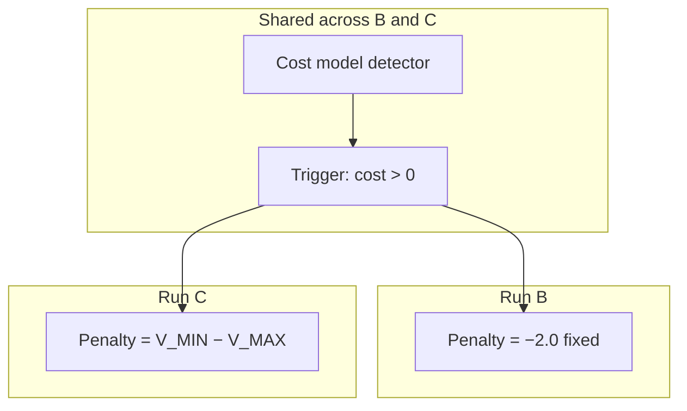

# 1. The research question

## Motivation

Helpfulness-only RLHF can erase refusals that a base model already had. Safe RLHF therefore splits **reward** (helpfulness) from **cost** (harmlessness). The open design question is *how* to fold cost into the learning signal.

This project isolates one mechanism: the **MinMax / ROSARL-style penalty**

\[
R_{\text{unsafe}} = V_{\MIN} - V_{\MAX}
\]

where \(V_{\MIN}\) and \(V_{\MAX}\) are running extrema of observed value (here: reward-model scores). When a harmlessness detector fires, the response’s reward is **replaced** by that bound — not blended, not Lagrange-multiplied.

## What would count as success

MinMax is interesting only if it beats a **matched fixed penalty** that uses the **same detector** and the **same trigger**. Otherwise “MinMax helped” collapses to “you added a cost model.”

## Thesis-shaped claim (target)

> On Qwen2.5-1.5B-Instruct + LoRA, under PKU Safe RLHF plumbing, a cost-gated MinMax penalty improves harmlessness relative to an otherwise identical fixed gate, without merely collapsing to reward hacking or empty refusals.

Run A exists so we know what *no* safety signal does. Run B exists so MinMax cannot take credit for “having a detector.” Run C is the thesis condition.

## Why not jump straight to Minmax?

Phase 1 already showed that under a **bounded, gameable** detector (Detoxify), MinMax and plain PPO+KL looked essentially tied. The binding constraint was the reward, not the algorithm. Phase 2 restarts the question with PKU’s **unbounded cost model** as the detector — a different scientific bet.
