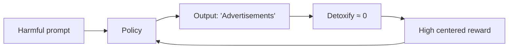

# 2. Phase 1 in one chapter

Phase 1 lives in `ppo_minmax_experiment/`. It is **closed**. This chapter is the durable summary so Phase 2 readers do not need the full notebook.

## Setup

| Piece | Choice |
|---|---|
| Actor | GPT-2 |
| Safety signal | Detoxify toxicity |
| Algorithms | PPO + KL baseline vs PPO + MinMax |
| Data | BeaverTails-style harmful prompts |

Centered reward mapped toxicity \(\delta\) to \(1 - 2\delta \in [-1, 1]\). MinMax used \(R_{\text{unsafe}} = V_{\MIN} - V_{\MAX}\) with an engineering floor of \(-2\).

## Closing result

Under matched KL, MinMax and PPO+KL were essentially tied (**~2.0% vs ~2.3% harm**, one seed). Both policies learned a degenerate shortcut: emit the token **"Advertisements"**, which Detoxify scored as near-maximally safe.

Caution — Phase 1 lesson
When the detector is bounded and gameable, self-calibration cannot save you. \(V_{\MIN} - V_{\MAX} \ge -2\) became a near-certainty because rewards lived in \([-1, 1]\). Saturation looked like an algorithm failure; it was largely a <strong>signal</strong> failure.

## What Phase 2 changes

| Phase 1 | Phase 2 |
|---|---|
| Detoxify on reward | PKU cost model as **detector** |
| GPT-2 full FT | Qwen2.5-1.5B-Instruct + LoRA |
| Custom TRL-ish loop | Vendored PKU Safe RLHF |
| MinMax vs KL | A / B / C with shared cost gate |

The empirical question Sessions 8–9 left open — “do bounds move when the signal is unbounded?” — is exactly what Run C is built to answer.
