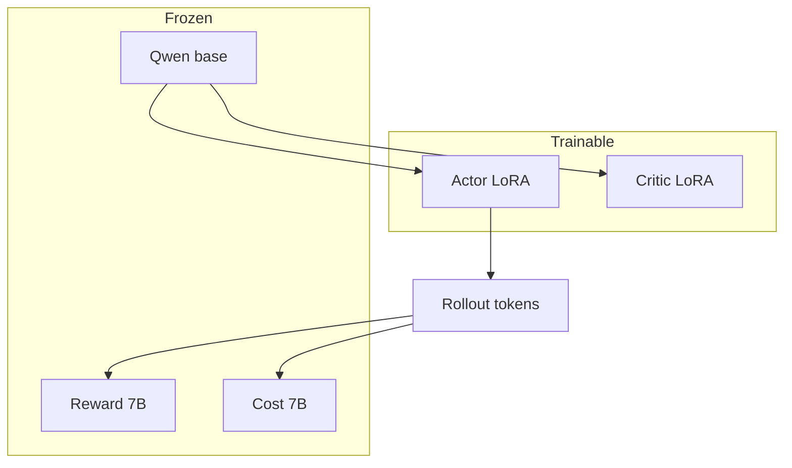

# 3. Framework and LoRA

## Starting point

`safe-rlhf/` is a vendored copy of PKU-Alignment’s Beaver / Safe RLHF framework. Session 1 reset it to pristine upstream so every later diff is an intentional Phase 2 deviation.

## The LoRA substitution

Full fine-tuning of even a 1.5B actor plus 7B reward/cost heads is heavy on available GPUs. Phase 2 trains **LoRA adapters** on actor and critic while freezing the base weights. The reference policy is the actor with adapters disabled — no second full copy.

Adapter snapshots are small (~few MB), so `save_interval` can keep many checkpoints for later qualitative inspection — crucial for comparing Runs A/B/C at matched steps.

## Prompt template (a Phase 2 landmine)

PKU’s default Alpaca-style template does **not** make Qwen emit `<|im_end|>`. Generations ran to `max_length` and decayed into noise. Stage 5 only became valid after forcing ChatML via `SAFE_RLHF_PROMPT_TEMPLATE=chatml` (Session 14).

Caution
Any Stage 5 number from before the ChatML fix is void. The archived Run A results are from the post-fix rerun.

