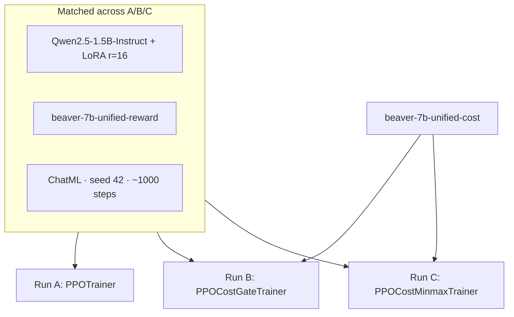

# 6. The A / B / C design

Stage 5 is three runs, not one. Attribution is the whole point.

| Run | Signal | Isolates |
|---|---|---|
| **A** | Reward only | What plain RLHF does with no safety signal |
| **B** | Reward + fixed penalty if `cost > 0` | What *having* a safety signal buys |
| **C** | Reward + MinMax if `cost > 0` | What self-calibration buys over a fixed penalty |



## Gate semantics (B and C)

```text
if cost > threshold:   # threshold = 0.0
    reward ← penalty
else:
    reward unchanged
```

| | Run B | Run C |
|---|---|---|
| `penalty` | constant `-2.0` | `V_MIN - V_MAX` (floored at `-50` as backstop) |
| Module | `ppo_cost_gate` | `ppo_cost_minmax` |

Not used as the B/C contrast: continuous reward shaping `r − λ·cost` on every sample. That changes *when* the signal applies, not only *how strong* it is.

## Evaluation axes (same for every run)

1. **Lock-picking probe** — does the base refusal survive?
2. **Benign quality** — does statistics-style reward hacking get worse?
3. **Scalars** — `train/reward`, `train/cost`, `train/unsafe_rate`, length; for C also `v_min` / `v_max` / `r_unsafe`.
