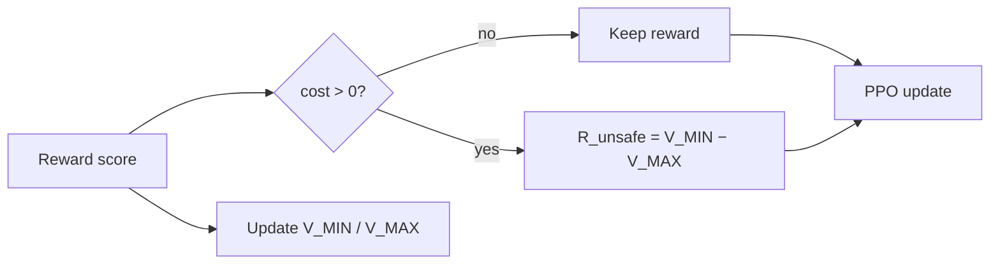

# 9. Run C — MinMax

**Algorithm:** `ppo_cost_minmax` (Session 18).  
**Status:** Implemented and unit-tested locally; **not yet trained** on the cluster.

## Mechanism

Identical to Run B until the replacement value:

Bounds expand from **reward-model end scores** after the pre-batch penalty is applied (Algorithm 1 order). Optional `--bound_source reward_and_value` folds critic terminals in after warmup; the Stage 5 launch uses `reward` only.

## Deliberate differences from Phase 1

| Knob | Phase 1 | Run C |
|---|---|---|
| Detector | Detoxify on reward | Cost model, `cost > 0` |
| Init | \(V_{\MIN}=0, V_{\MAX}=1\) | Both `0` (no invented Detoxify scale) |
| Floor | `-2.0` | `-50.0` (backstop ≈ `clip_range_score`) |
| Scope | Per-category option | Global (v1) |

Flooring at `-2` would make “do bounds move past Run B’s fixed penalty?” unanswerable. TensorBoard should show `train/v_min`, `train/v_max`, `train/r_unsafe`.

## Code map

| Path | Role |
|---|---|
| `safe_rlhf/algorithms/ppo_cost_minmax/` | Trainer + `CostMinmaxState` |
| `scripts/stage5-runC-cost-minmax.sbatch` | Matched launch vs B |
| `scripts/inspect-runC.sbatch` | Same prompts/seeds as A/B |
| `output/.../minmax_state.json` | Latest bounds snapshot |

## What to measure once it finishes

1. Does `r_unsafe` go **more negative than −2**, or stick near B?
2. Lock-picking trajectory vs B at 50/250/500/750/950.
3. Mean `train/cost` drift — does adaptive magnitude arrest what B could not?
4. Benign reward-hacking — better, worse, or unchanged vs B?
