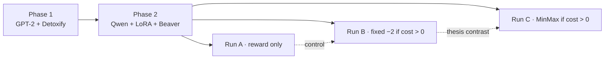

Research textbook · living document

# Safe Reinforcement Learning with a MinMax Penalty

This site is the **textbook form** of the research log: curated chapters, diagrams, and durable claims — not a dump of every debugging session.

The chronological source of truth remains the worklogs. When a conclusion changes, the worklog gains a **new** entry; this book is rewritten in place so a reader always gets the best current explanation.

| Layer | Path | Role |
|---|---|---|
| Phase 1 lab notebook | `ppo_minmax_experiment/worklog.md` | Did / Found / Concluded (closed) |
| Phase 2 lab notebook | `safe-rlhf/worklog.md` | Did / Found / Concluded (Sessions 1–18+) |
| **This textbook** | `docs/book/` | Narrative for a supervisor, examiner, or future-you |

## What this project is

We study whether a **self-calibrating MinMax penalty** \(R_{\text{unsafe}} = V_{\MIN} - V_{\MAX}\) improves safety over a **fixed cost gate**, when both fire on the same harmlessness detector.

**Phase 1** closed under matched KL: MinMax ≈ PPO+KL (~2.0% vs ~2.3% harm, one seed). The binding constraint was the *reward* — Detoxify is bounded and gameable; both policies learned to emit `"Advertisements"`. Full narrative: [/book/phase1/](/book/phase1/README.md). Short summary: [/book/02-phase1.md](/book/02-phase1.md).

**Phase 2** rebuilds the official Safe RLHF shape on Qwen2.5-Instruct + LoRA, then runs the A / B / C design with PKU’s cost model as detector. Session-by-session narrative: [/book/phase2/](/book/phase2/README.md).

## Status at a glance

| Stage / run | Status | Where to read |
|---|---|---|
| Phase 1 (GPT-2 + Detoxify) | **Closed** — algorithm ≈ KL baseline; reward was the bottleneck | [/book/phase1/](/book/phase1/README.md) |
| Phase 2 Stages 0–3 (env, LoRA, smoke PPO) | **Done** | [/book/phase2/01](/book/phase2/01-reset-and-cluster.md)–[03](/book/phase2/03-template-and-ppo-loop.md) |
| Phase 2 Stage 4 (reward vs cost probe) | **Done** — detector must be cost | [/book/phase2/04-reward-cost-and-gpu.md](/book/phase2/04-reward-cost-and-gpu.md) |
| Run A (reward only) | **Complete** — refusal eroded; reward hacking visible | [/book/phase2/05-run-a.md](/book/phase2/05-run-a.md) |
| Run B (fixed gate) | **Complete** — helps on probe; average cost still drifts | [/book/phase2/06-run-b.md](/book/phase2/06-run-b.md) |
| Run C (MinMax) | **Implemented; not yet trained** | [/book/phase2/07-run-c.md](/book/phase2/07-run-c.md) |
| Durable claims (A+B only) | Current verdict | [/book/10-claims.md](/book/10-claims.md) |
| Open questions | Blocking science + eng debt | [/book/11-open-questions.md](/book/11-open-questions.md) |

## Navigation by phase

### Phase 1 — full session textbook

| Chapter | Sessions | Topic |
|---|---|---|
| [Phase 1 map](/book/phase1/README.md) | — | Setup, closing verdict, reading order |
| [1 — Pilot & pipeline bugs](/book/phase1/01-pilot-and-bugs.md) | 1–7 | Proposal number, centering, eval bugs, PPO stability, hard switch |
| [2 — Saturation](/book/phase1/02-saturation.md) | 8–9 | Bounded Detoxify → \(V_{\MIN}-V_{\MAX}\) freezes; log-odds rejected |
| [3 — Design choices](/book/phase1/03-design-choices.md) | 10–13 | Category bounds, KL asymmetry, Path 1 vs 2, diagnostics |
| [4 — “Advertisements” collapse](/book/phase1/04-advertisements-collapse.md) | 14–18 | Reward hacking, entropy collapse, fair matched-KL close |

### Phase 2 — full session textbook

| Chapter | Sessions | Topic |
|---|---|---|
| [Phase 2 map](/book/phase2/README.md) | — | Stages 1–5 and A/B/C overview |
| [1 — Reset and cluster](/book/phase2/01-reset-and-cluster.md) | 1–3 | Upstream wipe, inventory, five env failures |
| [2 — LoRA and MKL](/book/phase2/02-lora-and-mkl.md) | 4–7 | Trainer asymmetry, LoRA plumbing, MKL sidestep, verify |
| [3 — Template and PPO](/book/phase2/03-template-and-ppo-loop.md) | 8–10 | Alpaca decision (+ later reversal), CUDA JIT, Stage 3 |
| [4 — Reward, cost, GPU](/book/phase2/04-reward-cost-and-gpu.md) | 11–13 | Probe numbers, Blackwell confusion, Quadro correction |
| [5 — Run A](/book/phase2/05-run-a.md) | 14–15 | ChatML bugs; refusal erosion; reward hacking |
| [6 — Run B](/book/phase2/06-run-b.md) | 16–17 | Preamble; cost rescoring; partial success |
| [7 — Run C](/book/phase2/07-run-c.md) | 18 | `ppo_cost_minmax` design; not trained |

## Start here

1. [How to read this book](/book/00-how-to-read.md)  
2. [Phase 1 map](/book/phase1/README.md) → then [Phase 2 map](/book/phase2/README.md)  
3. Or jump to [What we can claim](/book/10-claims.md) for the current A+B verdict  

**Someone continuing Run C:** [/book/phase2/06-run-b.md](/book/phase2/06-run-b.md) → [/book/phase2/07-run-c.md](/book/phase2/07-run-c.md) → [/book/11-open-questions.md](/book/11-open-questions.md).
