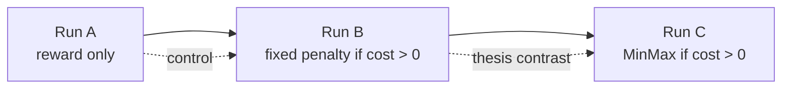

Research textbook · living document

# Safe Reinforcement Learning with a MinMax Penalty

This site is the **textbook form** of the research log: curated chapters, diagrams, and durable claims — not a dump of every debugging session.

The chronological source of truth remains the worklogs. When a conclusion changes, the worklog gains a new entry; this book is rewritten in place so a reader always gets the best current explanation.

| Layer | Role |
|---|---|
| `safe-rlhf/worklog.md` | Phase 2 lab notebook (Did / Found / Concluded) |
| `ppo_minmax_experiment/worklog.md` | Phase 1 lab notebook |
| **This textbook** | Narrative a supervisor, examiner, or future-you can read cover-to-cover |

## What this project is

We study whether a **self-calibrating MinMax penalty** (`R_unsafe = V_MIN − V_MAX`) improves safety over a **fixed cost gate**, when both fire on the same harmlessness detector.

## Status at a glance

| Stage | Status |
|---|---|
| Phase 1 (GPT-2 + Detoxify) | Closed — algorithm ≈ KL baseline; reward was the bottleneck |
| Phase 2 plumbing (Qwen + LoRA + Safe RLHF) | Working end-to-end |
| Run A | Complete — refusal eroded; reward hacking visible |
| Run B | Complete — gate helps on probe; average cost still drifts |
| Run C | Implemented; not yet trained on cluster |

## Start here

1. [How to read this book](00-how-to-read.md)
2. [The research question](01-research-question.md)
3. Or jump to [What we can claim](10-claims.md) if you only want the current verdict
