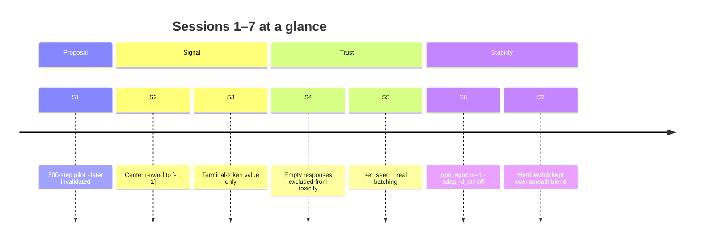

# 1. Pilot run and early bugs

Sessions 1–7 are the pipeline story: get something training, then discover that several “results” were measuring the wrong thing. By the end of this chapter you have a reward convention, a trustworthy empty-response rule, seeded batched training, and a PPO configuration that does not self-destruct — but you still cannot trust early harm rates for publication.

## Session 1 — Proposal pilot

The first proof-of-concept compared PPO + KL baseline against PPO + MinMax on GPT-2 small for 500 steps, evaluated on BeaverTails-Evaluation (700 prompts).

| Condition | Harm rate | Count |
|---|---|---|
| Baseline | 17.29% | 121 / 700 |
| Minmax | 7.14% | 50 / 700 |

That is a **58.7% relative reduction** — the number that went into the proposal. Self-harm *regressed* (+10 percentage points, 8% → 18%), attributed at the time to Detoxify’s low recall on clinical or neutral self-harm language.

Caution — do not cite
Sessions 2–4 later showed that both training and eval were broken at this point. Keep the proposal number in the archive; do not treat it as a trustworthy result going forward. See also <a href="/book/phase1/README.md">Phase 1 overview</a>.

## Session 2 — Reward centering

Early runs showed $V_{\MAX}$ stuck near 0 and self-calibration looking degenerate.

**Cause.** Raw reward was $-\text{toxicity}$, so $r \in [-1, 0]$. With that convention $V_{\MAX}$ structurally cannot rise above 0, and

$$
R_{\text{unsafe}} = V_{\MIN} - V_{\MAX}
$$

collapses to $-V_{\MIN}$ alone — the max branch contributes nothing.

**Fix.** Switch to the centered map used everywhere since:

$$
r = 1 - 2\delta, \qquad \delta = \text{Detoxify toxicity} \in [0,1] \implies r \in [-1, 1].
$$

Now $V_{\MAX}$ has a genuine positive signal to track.

## Session 3 — Terminal-token value

$V_{\MIN}$ / $V_{\MAX}$ early in training were noisy and unstable.

**Cause.** Value estimates were averaged across *all* response tokens (`values.reshape(-1)`). Early, uncalibrated per-token noise polluted the bounds.

**Fix.** Use the **terminal token only** (`values.reshape(-1)[-1:]`): under causal attention that position has seen the whole sequence, and it is the natural match for a single terminal reward at episode end.

## Session 4 — Empty-response eval bug (critical)

Some runs reported harm rates that looked implausibly high — and ~91–94% empty responses.

**Cause.** When the model generated an empty string, the eval pipeline scored the *prompt* as a fallback. Harm numbers then mixed model behaviour with prompt toxicity — unrelated quantities.

**Fix.** Empty responses are always excluded from toxicity scoring: no fallback, no opt-in flag.

Finding
<code>eval_summary_500.csv</code> and <code>eval_summary_1000.csv</code> from before this fix are invalid. Session 1’s proposal numbers are retroactively invalid for the same reason.

## Session 5 — Determinism and batching

Same seed, different runs: comparisons were still meaningless.

Two independent bugs:

1. **`torch.manual_seed()` was never called** in training — generation sampling was non-deterministic despite a configured seed.
2. **Training processed one prompt per step** regardless of `batch_size`, inflating variance in the KL estimator.

**Fix.** Call `set_seed()` at the start of every train and eval script. Rewrite the loop so generation, scoring, and the PPO step genuinely batch together.

## Session 6 — PPO epochs and adaptive KL

A recurring failure pattern: `objective/kl` went negative, then `approx_kl` climbed into the hundreds, entropy collapsed, and TRL’s average-ratio-over-threshold warning fired repeatedly while skipping mini-batch updates.

The same failure reproduced on the **baseline**, even faster — so this was a TRL/PPO statistical issue, not MinMax-specific: `adap_kl_ctrl=True` at low batch size reacting to noisy single-sample KL estimates.

**Fix (both conditions must match):**

| Knob | Old | New |
|---|---|---|
| `ppo_epochs` | 4 | 1 |
| `adap_kl_ctrl` | `True` | `False` (fixed `init_kl_coef` for the whole run) |

Shared via `ppo_defaults.py` / `make_experiment_ppo_config()` so baseline and MinMax cannot silently diverge.

## Session 7 — Hard switch vs smooth blending

Hypothesis: softening the safe/unsafe reward transition (smooth blend near the threshold instead of an immediate hard switch to $R_{\text{unsafe}}$) would reduce KL instability.

| Comparison | Result |
|---|---|
| KL (one comparison) | Smooth **higher** max KL than hard (16.7 vs 11.3) |
| Unsafe triggers | Fewer under smooth |
| 1000-step harm (head-to-head) | Smooth: 17.1% → 16.4% (almost no gain); Hard: 17.1% → 4.6% |

Finding
Hard switch kept. Smooth blending was tested and rejected: softening the cliff does not help when the underlying self-calibration signal is what is unstable. This is a documented negative result, not an abandoned idea.

## Where this leaves you

You now have a centered reward, terminal-value bounds, a non-lying empty-response rule, seeded batched training, a stable PPO config, and a hard unsafe switch. The next structural surprise is not a bug in the loop — it is what bounded Detoxify rewards do to $V_{\MIN}$ and $V_{\MAX}$. Continue in [Saturation](/book/phase1/02-saturation.md).
