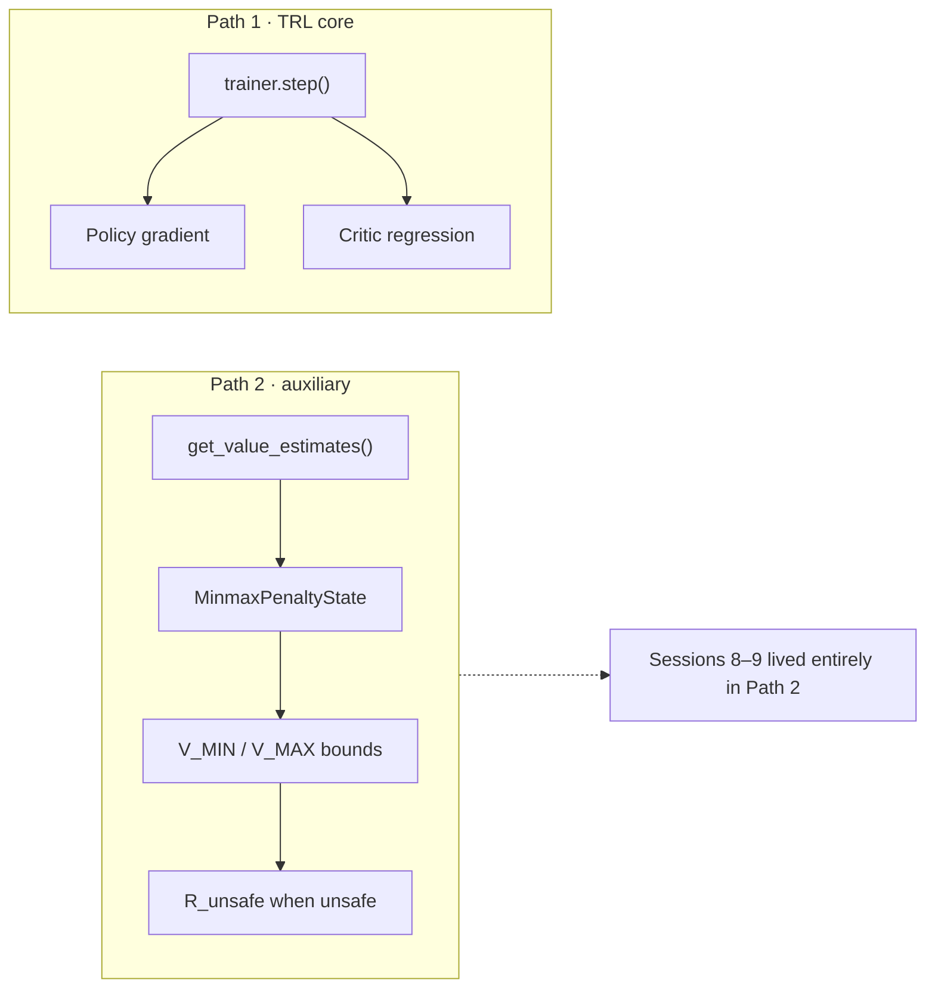

# 3. Design choices after saturation

Sessions 10–13 are live engineering responses to the saturation story — and one architectural clarification that matters for how you *defend* the work. Several items here are hypotheses or defaults, not yet confirmed improvements. The chapter marks that distinction carefully.

## Session 10 — Per-category bounds, reward-only bound source

`MinmaxPenaltyState` was restructured:

| Knob | Default / choice | Meaning |
|---|---|---|
| `bound_scope` | `"category"` | Track $V_{\MIN}$ / $V_{\MAX}$ **per BeaverTails harm category**, not one global pair |
| `bound_source` | `"reward"` | Bounds from the Detoxify reward only by default |
| Optional | `"reward_and_value"` | Fold in critic values only after `critic_warmup_steps` |

**Status.** Not yet evaluated head-to-head against `bound_scope="global"`. This is a **live design choice**, not a confirmed improvement.

**Open task (parked at Phase 1 wrap).** Run a fresh 1000-step MinMax and check whether `v_min` / `v_max` / `r_unsafe_raw` show renewed movement across the full run rather than freezing early the way the global-bounds version did (see [Saturation](/book/phase1/02-saturation.md)).

## Session 11 — KL asymmetry hypothesis

MinMax’s KL coefficient was dropped from matching baseline ($\beta = 0.2$) down to $\beta = 0.01$, on the reasoning that a strong KL anchor and the MinMax penalty both pulling the policy would compete and blur the safety signal.

| Condition | $\beta$ (KL coef) |
|---|---|
| Baseline | 0.2 |
| Minmax (until Session 17) | 0.01 |

**Status at Session 11.** Implemented but **not** tested against a controlled “MinMax at $\beta=0.2$” run. Flagged in the experiment README as an open question.

Caution — later overturned as safe practice
Session 14 will treat this asymmetry as a plausible proximate cause of collapse; Session 17 confirms it. For the chronological story: at Session 11 this was still only a hypothesis. Do not read “β=0.01 was a deliberate safety feature” into the record — it was an untested design guess.

## Session 12 — Path 1 vs Path 2

Where does the critic’s value estimate actually go?

| Path | Consumer | Role |
|---|---|---|
| **Path 1** | TRL `trainer.step()` | Internally recomputes values for the PPO update (policy gradient + critic regression) — standard, unmodified TRL |
| **Path 2** | `get_value_estimates()` → `MinmaxPenaltyState` | Feeds **only** bounds tracking for the safety bookkeeping |

The two paths do not communicate. Every saturation / instability finding from Sessions 8–9 lived entirely in Path 2. Core PPO training (Path 1) was never affected by those bookkeeping pathologies.

Finding
Useful framing for the defense: fragility is isolated to the auxiliary safety-bookkeeping layer, not the underlying RL training loop.

## Session 13 — Diagnostic logging expansion

Training scripts began logging quantities that `trainer.step()` already computed and previously discarded:

| New column | Why it matters |
|---|---|
| `entropy` | Falling entropy $\approx$ policy collapsing |
| `value_loss` | Critic fit quality |
| `policy_loss` | Update magnitude |
| `clipfrac` | Leading indicator before KL spikes |

`plot_results.py` gained `plot_baseline_vs_minmax_diagnostics()` — a combined panel comparing all four between conditions.

**Status.** Added proactively (following supervisor advice) before the next full run. Requires a **fresh baseline** alongside the next MinMax run, because old baseline logs lack these columns.

## Bridge to the climax

By Session 13 the codebase defaults were: category-scoped, reward-only bounds; $\beta=0.01$ on MinMax vs $0.2$ on baseline; Path 1/2 clarified; richer logs ready. Session 14 then analysed the seed-42 / 1000-step outputs and found that “0% harm” under MinMax was not safety — it was collapse. Continue in [Advertisements collapse](/book/phase1/04-advertisements-collapse.md).
