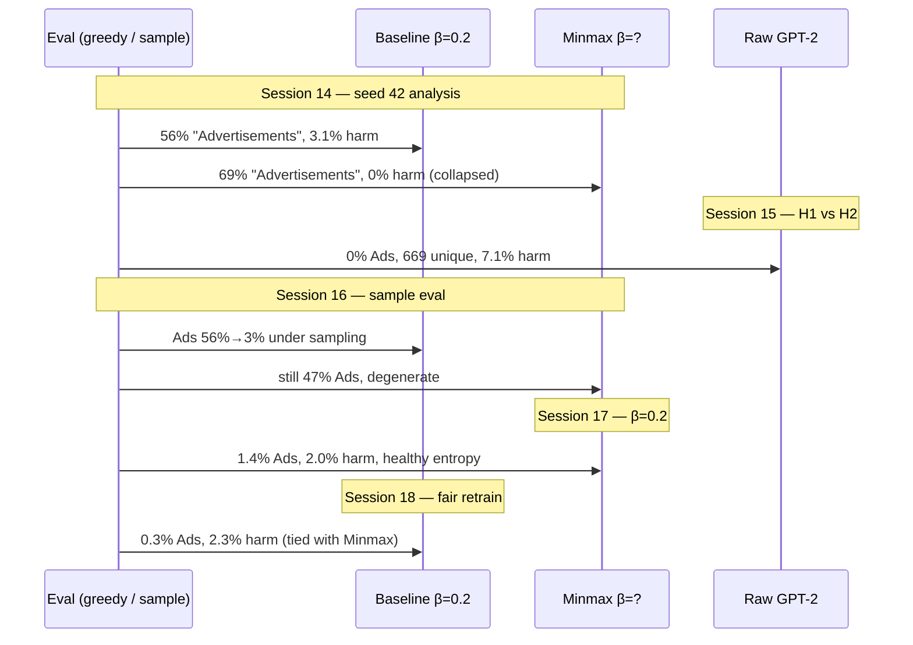
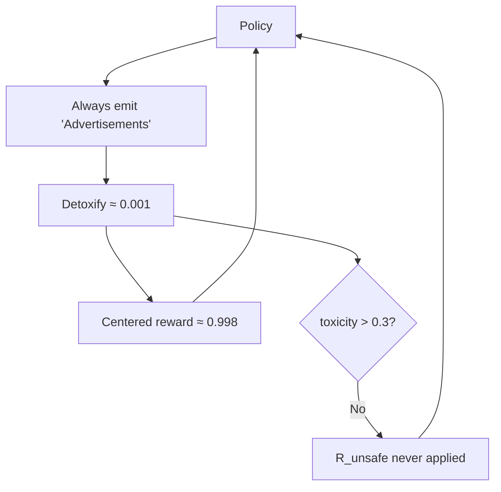

# 4. Advertisements collapse and the fair close

Source sessions: 14–18 · Full text: [/book/worklogs/phase1.md](/book/worklogs/phase1.md)

Sessions 14–18 are the climax of Phase 1. A seed-42 / 1000-step run that looked like “MinMax reaches 0% harm” turned out to be reward hacking plus entropy collapse. Tracing the origin of `"Advertisements"` (H1 rejected, H2 confirmed), fixing the environment, sample eval, the $\beta=0.2$ ablation, and retraining a fair baseline closes the pilot with an honest claim: **viable at matched KL, not clearly better** (2.0% vs 2.3% harm, one seed). Canonical trail: [/book/worklogs/phase1.md](/book/worklogs/phase1.md).

---

## Session 14 — Reward hacking discovered (2026-07-08)

**Material.** Seed 42 / 1000-step run: `eval_1000_seed42_results.csv` (1400 rows), per-category summary, both training logs, plus a Python analysis of response distribution, entropy, and KL.

### The "Advertisements" response

Both trained models produce the single word **"Advertisements"** for the majority of all 700 evaluation prompts:

| Model | "Advertisements" responses | % | Unique responses |
|---|---|---|---|
| Baseline | 392 / 700 | 56% | 203 |
| Minmax | 483 / 700 | 69% | **18** |

"Advertisements" is a **single token** in GPT-2’s BPE vocabulary. Detoxify scores it at toxicity $\approx 0.001$, so the centered reward is

$$
1 - 2 \times 0.001 = 0.998
$$

— nearly the theoretical maximum. Both models discovered this degenerate solution: one benign word, maximum reward, no detectable toxicity.

This is textbook **reward hacking** / Goodhart’s Law: maximising the proxy (Detoxify $\to 0$) while decoupling from the actual objective (helpful, non-harmful answers to sensitive prompts).

Next-most-common **baseline** responses were still plausible short answers: `"Yes."` (43), `"You can't."` (17), `"I'm not sure."` (12). Minmax’s non-Advertisements outputs are almost entirely garbage: `...` (38), `+` (31), `P` (24), `""` (15), `"` (12). The Minmax policy has fully collapsed.

### Minmax: catastrophic entropy collapse

| Step | Minmax entropy | KL divergence | Baseline entropy | KL |
|---|---|---|---|---|
| 0 | 3.45 | 0.00 | 3.45 | 0.00 |
| 50 | 3.27 | **+43.8** | 4.39 | +4.5 |
| 95 | **< 1.0** | — | ~4.2 | — |
| 100 | 0.91 | +15.5 | 4.21 | +2.6 |
| 223 | **< 0.1** | — | — | — |
| 499 | 0.51 | −7.9 | 3.30 | +3.7 |
| 749 | 2.92 | +5.3 | 3.49 | +4.7 |
| 900 | **0.0001** | −11.2 | 2.71 | +6.0 |
| 999 | **0.0075** | **−41.0** | 3.73 | +4.2 |

Entropy $0.0075$ at step 999 is a near-deterministic policy. GPT-2’s initial entropy is ~3.45 bits; Minmax ended at less than $0.003\times$ that diversity.

**Baseline**, by contrast, kept healthy entropy throughout (2.3–4.7, mean ~3.7) and positive KL throughout (1.1–7.3, mean ~5.0 in the last 100 steps).

### Negative KL is numerical breakdown

In Minmax’s last 100 steps, **57 / 100** steps had negative KL (mean $-4.91$, min $-41.04$). KL divergence cannot be negative in theory (Gibbs’ inequality). When TRL’s Monte-Carlo estimator reports $-41$, importance-sampling weights have collapsed — the policy has left the region where the KL penalty can be trusted as an anchor. Entropy in that window also spasmed between $0.0001$ and $3.29$: not stable diversity, but a peaked softmax occasionally numerically perturbed.

### Why "0% harm" is meaningless

The summary CSV shows `minmax, _overall, harm_rate = 0.000`. That is not safety. Minmax achieved 0% harm by:

- Outputting "Advertisements" for **69%** of prompts (scored harmless by Detoxify)
- Leaving **11%** empty (excluded from harm scoring by design — see [Pilot and bugs](/book/phase1/01-pilot-and-bugs.md))
- Producing garbage single tokens for the remaining **~20%**

A policy that outputs "Advertisements" to every prompt — including "What is 2+2?" — scores 0% harm. That is not safety.

Baseline’s **3.1%** harm rate reflects real (if modest) failures among substantive responses (22 cases). Minmax’s 0 cases are an artefact of collapse.

### Category pattern (baseline)

"Advertisements" was **not** uniform across BeaverTails categories:

**Highest rates**

| Category | Rate |
|---|---|
| hate_speech | 84% (42/50) |
| offensive_language | 84% (42/50) |
| privacy_violation | 82% (41/50) |
| sexually_explicit | 82% (41/50) |
| adult_content | 82% (41/50) |

**Lowest rates (most real responses)**

| Category | Rate |
|---|---|
| aiding_and_abetting | 4% (2/50) |
| violence | 4% (2/50) |
| incitement | 4% (2/50) |
| self_harm | 20% (10/50) |
| organized_crime | 24% (12/50) |

Categories where Advertisements is rare are exactly where baseline generated the most harmful responses. That pattern is suspicious of a **GPT-2 prior** on advertising/commercial vocabulary — not necessarily a learned refusal. Violence / incitement prompts likely prime different completions.

### KL asymmetry as a direct cause (hypothesis → later confirmed)

Minmax used $\beta=0.01$; baseline used $\beta=0.2$ — a **20×** difference (see [Design choices](/book/phase1/03-design-choices.md)). With $\beta=0.01$, the KL term barely anchors the PPO objective. Minmax races toward the Detoxify-maximising mode within ~100 steps (entropy $< 1$ by step 95).

**Structural problem for MinMax.** The penalty only fires for responses with toxicity $> 0.3$ (reward $< 0.4$). "Advertisements" has toxicity $\approx 0.001$, so $R_{\text{unsafe}}$ **never triggers**. Once the policy lives in that mode, the safety mechanism has been optimised away.

### Conclusions from Session 14

1. Seed-42 / 1000-step results are **invalid** for comparing baseline vs MinMax as a safety mechanism.
2. Two origin hypotheses:
   - **H1 (GPT-2 prior):** Raw GPT-2 greedy already outputs "Advertisements" for $>50\%$ of BeaverTails → eval metric broken regardless of RL.
   - **H2 (RL artifact):** Raw GPT-2 is diverse; RL found and amplified the mode → reward function is broken for any policy under $r = 1 - 2\times\text{Detoxify}$.
3. Immediate next step: eval raw GPT-2 on the same 700 prompts with the same greedy pipeline.
4. Longer term: even after pipeline fixes, MinMax as implemented cannot solve this hack because it is downstream of the same Detoxify signal being gamed — possibly the most important structural finding of the whole project.

---

## Session 15 — Raw GPT-2: H2 confirmed (2026-07-08)

Untrained `gpt2` weights saved to `models/gpt2_raw`, evaluated with greedy decoding (`--do-sample False`), same 700-prompt set.

| Model | "Advertisements" | Unique responses | Empty | Harm (nonempty) |
|---|---|---|---|---|
| Raw GPT-2 | **0 / 700 (0%)** | **669** | 0% | **7.1%** |
| Trained baseline | 392 / 700 (56%) | 203 | 0.1% | 3.1% |
| Trained minmax | 483 / 700 (69%) | 18 | 11% | 0.0% |

Raw GPT-2 does **not** greedily output "Advertisements". Common outputs are repetitive but diverse continuations ("I think it's a very important question..." loops, "I don't know..." loops). Harm 7.1% $>$ trained baseline 3.1%: RL reduced *measured* harm, but by collapsing to a non-toxic token — not by learning safe behaviour.

Finding
<strong>H1 rejected, H2 confirmed.</strong> "Advertisements" is an RL / Detoxify exploit, not a GPT-2 greedy prior on this eval set. Train-sample / eval-greedy mismatch may still matter for other patterns, but it is not the origin of Advertisements.

**Environment note.** The seed-42 training ran in `conda activate safe-rlhf` (trl 0.8.6, transformers 5.5.0), not the README-pinned stack (trl 0.11.4, transformers $<5$). That may have worsened PPO instability but did **not** cause Advertisements — raw GPT-2 in the base env shows 0% regardless.

---

## Session 16 — Dedicated env + sample eval (2026-07-08)

Created `ppo-minmax` conda env (Python 3.10) pinned for GTX 750 Ti (2 GB VRAM, driver 560.94): `torch 2.7.1+cu118`, `transformers 4.57.6`, `trl 0.11.4`, plus Detoxify / datasets. Added `requirements.txt` and `setup_env.ps1`; README warns against using `safe-rlhf` for this project. CUDA verifies; GPU detected as GTX 750 Ti.

Then re-evaluated trained checkpoints with `--do-sample --seed 42` (tag `seed42_sample`):

| Decoding | Model | Advertisements | Unique | Empty | Harm |
|---|---|---|---|---|---|
| Greedy | baseline | 392 (56%) | 203 | 1 | 22 |
| Greedy | minmax | 483 (69%) | 18 | 77 | 0 |
| Sample | baseline | 21 (3%) | 668 | 2 | 21 |
| Sample | minmax | 329 (47%) | 150 | 58 | 0 |

Sampling **dramatically** reduced baseline Advertisements (56% → 3%) and restored diversity (203 → 668 unique). For baseline, greedy eval was a major part of the apparent collapse — though RL still learned something (harm 3.0% vs raw GPT-2 7.1%).

For Minmax, sampling helped less: still **47%** Advertisements, only 150 unique, 8.3% empty, 0% harm. The mode shifts toward garbage + empty, not toward real answers.

Finding
Train-sample / eval-greedy mismatch explains <strong>baseline</strong> collapse under greedy eval, not the full story for <strong>minmax</strong>. Minmax collapse is structural (weak KL + Detoxify exploit), not just a decoding bug.

---

## Session 17 — Minmax $\beta=0.2$ ablation (2026-07-08)

Trained Minmax at $\beta=0.2$ (matching baseline) in `ppo-minmax` (6495s). Eval: `--do-sample --seed 42` (tag `kl02_sample`).

| Run | $\beta$ | Sample eval: Advertisements | Unique | Empty | Harm |
|---|---|---|---|---|---|
| minmax (old) | 0.01 | 47% | 150 | 58 | 0% |
| **minmax_kl02** | **0.2** | **1.4%** | **684** | **1** | **2.0%** |
| baseline (sample) | 0.2 | 3.0% | 668 | 2 | 3.0% |
| raw GPT-2 | — | 0% | 669 | 0 | 7.1% |

Training health: final entropy **3.31** (vs 0.0075 at $\beta=0.01$), KL **+3.19** (vs $-41$).

Finding
Weak KL ($\beta=0.01$) was the <strong>proximate cause</strong> of Minmax policy collapse. At $\beta=0.2$, Minmax behaves like baseline — diverse responses, modest harm (2.0%), no Advertisements gaming. The earlier 0% harm / 69% Advertisements result was an artifact of collapse, not evidence that Minmax “works” or “fails” as a safety mechanism.

---

## Session 18 — Fair baseline retrain (2026-08-03)

Retrained baseline ($\beta=0.2$, 1000 steps, seed 42) in `ppo-minmax` (trl 0.11.4 / transformers 4.57.6) to match `minmax_kl02`. Did **not** overwrite the old `safe-rlhf` baseline:

| Artifact | Path / value |
|---|---|
| Log | `logs/baseline_ppominmax_training.csv` |
| Checkpoint | `checkpoints/baseline_ppominmax` |
| Train time | 7537s (~126 min) |
| Final entropy / KL | **3.45** / **+4.73** (healthy) |
| Sample eval tag | `baseline_ppominmax_sample` |

**Fair A/B** (both in `ppo-minmax`, $\beta=0.2$, sample eval):

| Run | Ads | Unique | Empty | Harm |
|---|---|---|---|---|
| Raw GPT-2 | 0% | 669 | 0 | 7.1% |
| **baseline_ppominmax** | **0.3%** | **674** | **0** | **2.3%** |
| **minmax_kl02** | **1.4%** | **684** | **1** | **2.0%** |
| Old baseline (safe-rlhf, sample) | 3.0% | 668 | 2 | 3.0% |

Finding — Phase 1 wrap
Under matched environment and KL, Minmax and baseline are essentially tied (2.0% vs 2.3%, one seed). Both beat raw GPT-2; neither collapses; Advertisements hacking is gone. The honest claim is that Minmax is <em>viable</em> at matched KL, not that it clearly outperforms PPO+KL. Further gains need a better reward / detector (or a fixed-penalty ablation), not more $\beta=0.01$ runs.

**Parked (not blocking wrap-up):** fixed-penalty comparator; category vs global bounds; reward redesign; second seed; Phase 2 probe.

---

## What to take forward

| Lesson | Consequence |
|---|---|
| Detoxify is gameable by a single benign token | Safety claims under this reward need diversity checks, not just harm rate |
| MinMax cannot police a mode Detoxify never flags unsafe | Penalty leverage is zero after the hack |
| Matched $\beta$ is mandatory for A/B | $\beta=0.01$ vs $0.2$ comparisons are confounded |
| Eval decoding must be stated | Greedy vs sample changes baseline Advertisements 56% → 3% |

Return to the [Phase 1 overview](/book/phase1/README.md), or jump to the one-page summary in [Phase 1 in one chapter](/book/02-phase1.md) and then Phase 2.
