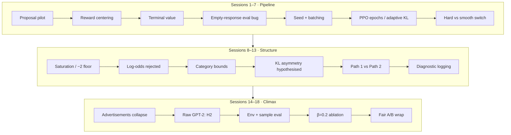

# Phase 1 — GPT-2 + Detoxify pilot

Phase 1 lives in `ppo_minmax_experiment/`. It is **closed**. These chapters expand the one-page summary in [Phase 1 in one chapter](/book/02-phase1.md) into a full narrative of what was tried, what broke, and what you can honestly claim.

The chronological source remains [`ppo_minmax_experiment/worklog.md`](../../../ppo_minmax_experiment/worklog.md) (Sessions 1–18). This folder is the textbook rewrite: same facts, pedagogical order.

## Setup at a glance

| Piece | Choice |
|---|---|
| Actor | GPT-2 (small) |
| Safety signal | Detoxify toxicity $\delta \in [0, 1]$ |
| Centered reward | $r = 1 - 2\delta \in [-1, 1]$ |
| Algorithms | PPO + KL baseline vs PPO + MinMax |
| Eval set | BeaverTails-Evaluation (700 prompts) |
| MinMax core | $R_{\text{unsafe}} = V_{\MIN} - V_{\MAX}$ (engineering floor $-2$) |

## Closing verdict

Under matched KL ($\beta = 0.2$), environment, and sample eval, MinMax and PPO+KL were essentially tied (**2.0% vs 2.3% harm**, one seed). Both beat raw GPT-2 (7.1%). Neither collapsed. The honest claim is that MinMax is *viable* at matched KL — not that it clearly outperforms the baseline.

The path to that claim runs through invalid proposal numbers, reward-convention bugs, eval bugs, bounded-reward saturation, and a catastrophic "Advertisements" reward-hack under weak KL. Read the chapters in order if you want the methodology; jump to the climax if you only need the collapse story.

## Chapter map

| Chapter | Sessions | What you learn |
|---|---|---|
| [01 — Pilot and bugs](/book/phase1/01-pilot-and-bugs.md) | 1–7 | Proposal number, reward convention, terminal value, eval bug, determinism, PPO stability, hard switch |
| [02 — Saturation](/book/phase1/02-saturation.md) | 8–9 | Why $V_{\MIN}-V_{\MAX}$ freezes near $-2$; why unbounded log-odds still fails |
| [03 — Design choices](/book/phase1/03-design-choices.md) | 10–13 | Category bounds, KL asymmetry hypothesis, Path 1 vs Path 2, diagnostics |
| [04 — Advertisements collapse](/book/phase1/04-advertisements-collapse.md) | 14–18 | Reward hacking, entropy collapse, H2, env mismatch, $\beta=0.2$ fix, fair baseline |

## How to cite these results

Caution
Do <strong>not</strong> cite Session 1’s 17.29% → 7.14% harm reduction, or any pre–Session-4 <code>eval_summary_*.csv</code>. Those numbers reflect a broken eval pipeline. Prefer the Session 18 fair A/B (sample eval, matched β and env).

## Parked after wrap-up

Fixed-penalty comparator; category vs global bounds head-to-head; reward redesign; second seed; Phase 2 probe. None of these block the Phase 1 close.
