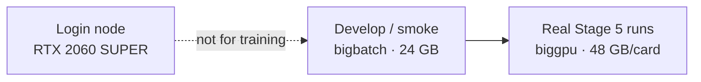
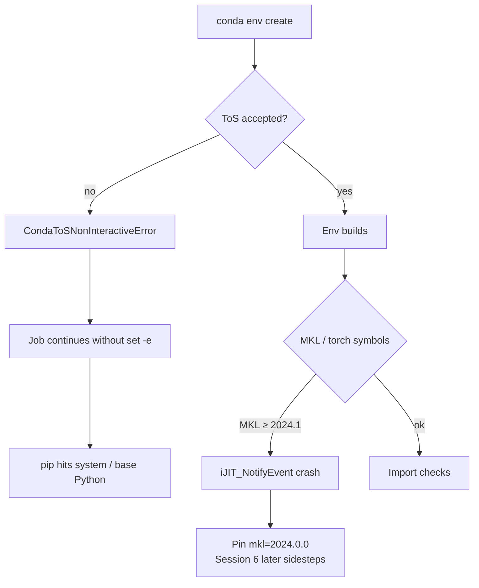

# 01 — Reset and cluster

*Sessions 1–3 · 2026-08-18*

Before any Qwen experiment, Phase 2 had to answer three boring questions honestly: Is the vendored tree pristine? What GPUs can we actually use? Can we even import the stack?

## Session 1 — Wipe the Phase 1 contamination

Phase 1 had claimed that `safe-rlhf/` at the repo root was “left untouched.” A fresh upstream clone and a directory diff showed that was false.

**What Phase 1 had added or wired in:**

| Kind | Examples |
|---|---|
| New algorithm / reward code | `trainer_minmax.py`, `trainer_detoxify.py`, `safe_rlhf/rewards/`, BeaverTails raw dataset, Colab notebook, GPT-2 launch scripts |
| Framework edits | `pyproject.toml` / `requirements.txt` (detoxify, `trl`, peft, tighter pins), PPO `__init__` / `main.py` flags, `rl_trainer.py` max-steps hook, import shims |

One useful discovery while diffing: **`Qwen2ForScore` is native upstream** — Qwen score-model support is not a Phase 1 invention.

The directory was wiped and replaced with a fresh upstream clone (`.git` excluded so it remains a normal tracked tree). Verified byte-identical against a second independent clone. Commit `3b21444 reset safe rlhf` is the pristine baseline: every subsequent `git diff` against that commit is exactly the Phase 2 deviation set the thesis needs.

Caution
The removed import shims (<code>transformers.tokenization_utils</code> → <code>tokenization_utils_base</code>) were a <em>legitimate</em> compatibility fix, unlike the Minmax/Detoxify code. They resurface if <code>transformers</code> moves those symbols again.

## Session 2 — Hardware inventory on `mscluster`

Assumptions were replaced with `nvidia-smi`, `sinfo`, `scontrol`, and the MSS Community Guidelines (Feb 2024).

| Partition | Nodes | GPU / node | VRAM | System RAM |
|---|---|---|---|---|
| stampede | 40 | 2 × GTX 1060 | 6 GB each | 32 GB |
| bigbatch | 48 | 1 × RTX 3090 | 24 GB | 128 GB |
| **biggpu** | 4–7 | 2 × Quadro RTX 8000 *(per guide)* | **48 GB each** | 1 TB |

Critical cluster quirks:

- `sinfo -o "%N %G"` reports `GRES=(null)` everywhere — GPUs are **not** SLURM GRES. You never pass `--gres`; you select a GPU by selecting a **partition**.
- The login node’s RTX 2060 SUPER (8 GB) is not a training resource.
- At check time, biggpu was partly `alloc` / partly `down*`. MSS etiquette: biggpu is for mature, debugged code; Sep–Nov historically has near-zero headroom.

**Policy locked:** development and smoke tests on **bigbatch** first; real runs on **biggpu**. Target weight budget ~20 GB (later revised upward when the cost model entered scope) fits one 48 GB RTX 8000 and does **not** fit bigbatch’s 24 GB with a resident 7B reward model.

Findings were captured in the `mscluster` field guide so they need not be rediscovered. *(Session 12–13 later revise the biggpu hardware picture — see [04](/book/phase2/04-reward-cost-and-gpu.md).)*

## Session 3 — Five ways the environment failed

Built from upstream’s `conda-recipe.yaml`, plus `peft` (which upstream never lists). Failures, in order:

| # | Failure | Fix / lesson |
|---|---|---|
| 1 | No conda on the node | Install Miniconda under `$HOME` (MSS recommendation) |
| 2 | `conda: command not found` inside `sbatch` | Non-interactive shells skip `.bashrc` conda-init — source `$HOME/miniconda3/etc/profile.d/conda.sh` by absolute path |
| 3 | `CondaToSNonInteractiveError` | Accept `pkgs/main` and `pkgs/r` ToS once |
| 4 | Silent cascade into base env | No `set -e` → failed create → failed activate → `pip install peft` hit system Python / polluted base. **`set -euo pipefail` is mandatory** |
| 5 | `libtorch_cpu.so: undefined symbol: iJIT_NotifyEvent` | MKL ≥ 2024.1 dropped ittnotify symbols PyTorch links against → pin `mkl=2024.0.0` |

The solver also pulled **`transformers 5.15.0`** because the recipe says only `transformers >= 4.37`. Upstream still imports `PaddingStrategy` / `TruncationStrategy` from `transformers.tokenization_utils`, which 5.x moved.

**Two deliberate, documented pins** (not Phase-1 leftovers):

- `mkl=2024.0.0`
- `transformers>=4.37.2,<4.47`

This independently re-derives Phase 1’s transformers constraint — the pin was correct; only Detoxify/Minmax alongside it was Phase-1-specific.

At end of Session 3 the fix job was submitted; verification (`torch.cuda.is_available()`, device count, `tokenization_utils` import) was **not yet confirmed**. Confirmation lands in [Session 6](/book/phase2/02-lora-and-mkl.md).

---

**Next:** [02 — LoRA and the MKL wall](/book/phase2/02-lora-and-mkl.md) · [Phase 2 map](/book/phase2/README.md)
