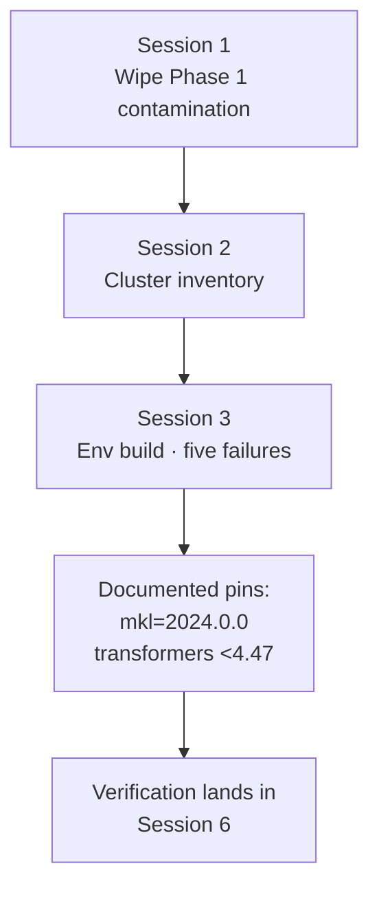
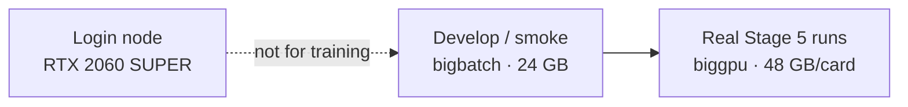
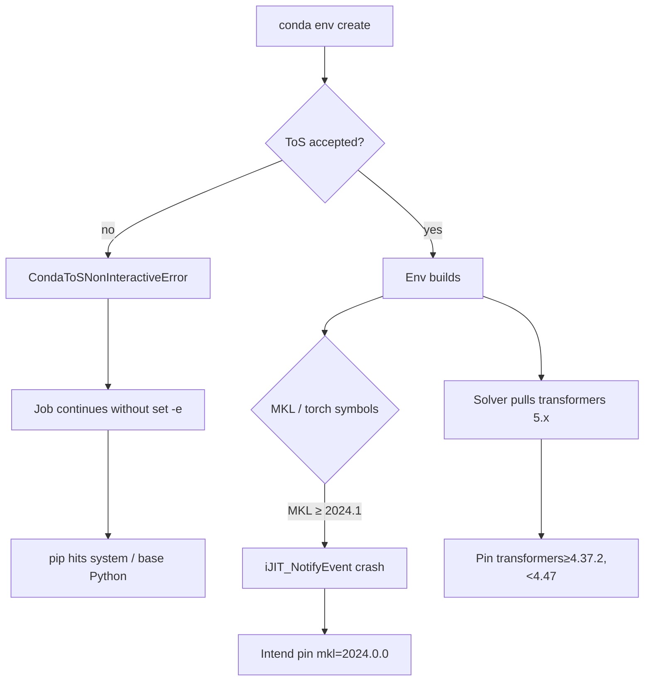

# 01 — Reset and cluster

Source sessions: 1–3 · Full text: [/book/worklogs/phase2.md](/book/worklogs/phase2.md)

*Sessions 1–3 · 2026-08-18*

Before any Qwen experiment, Phase 2 had to answer three boring questions honestly: Is the vendored tree pristine? What GPUs can we actually use? Can we even import the stack? The chronological Did / Found / Concluded trail is in the [Phase 2 worklog mirror](/book/worklogs/phase2.md).

## Session 1 — Resetting the vendored framework to pristine upstream

Phase 1’s README claimed that `safe-rlhf/` at the repo root was “the PKU Safe RLHF framework — left untouched.” Before building anything new, that claim was checked: upstream was cloned fresh into a temp directory and diffed against the local tree.

**It was not untouched.** Phase 1 had reached into it.

| Kind | What was added or wired |
|---|---|
| New files | `algorithms/ppo/trainer_minmax.py`, `trainer_detoxify.py`, `datasets/raw/beavertails.py`, `safe_rlhf/rewards/` (Detoxify wrapper), Colab notebook, four GPT-2 launch scripts |
| Dependency edits | `pyproject.toml` / `requirements.txt` — added `detoxify`, `trl==0.11.4`, `peft`; tightened pins |
| Framework wiring | `algorithms/ppo/__init__.py` and `main.py` (`--use_detoxify_reward` / `--use_minmax` / `--max_training_steps`); `datasets/raw/__init__.py`; `trainers/rl_trainer.py` max-steps early-stop hook |
| Import shims | `datasets/base.py`, `utils.py`, `models/score_model/gpt2/modeling_gpt2.py` |

One useful discovery while diffing: **`Qwen2ForScore` is native to upstream**, not a Phase 1 addition. Qwen support for score models comes for free.

**Action taken.** The directory was wiped and replaced with a fresh upstream clone (`.git` excluded so it stays a normal tracked directory, not a submodule). Verified byte-identical against a second independent clone. Committed as `3b21444 reset safe rlhf`. From that point every `git diff` against that commit is *exactly* the Phase 2 deviation set — which is also what the thesis needs for “deviations from the official implementation.”

Noted for later
The removed import shims (<code>transformers.tokenization_utils</code> → <code>tokenization_utils_base</code>) were a <em>legitimate</em> compatibility fix, unlike the Minmax/Detoxify code. They will be needed again if a <code>transformers</code> version moves that import.

## Session 2 — Cluster inventory

Assumptions about hardware were replaced with measurement: `nvidia-smi`, `sinfo`, `scontrol show partition`, cross-checked against the MSS Community Guidelines (Feb 2024).

| Partition | Nodes | GPU / node | VRAM | System RAM |
|---|---|---|---|---|
| stampede | 40 | 2 × GTX 1060 | 6 GB each | 32 GB |
| bigbatch | 48 | 1 × RTX 3090 | 24 GB | 128 GB |
| **biggpu** | 4–7 | 2 × Quadro RTX 8000 | **48 GB each** | 1 TB |

Critical cluster quirks recorded here:

- `sinfo -o "%N %G"` reports `GRES=(null)` on every node — this cluster does **not** tag GPUs as SLURM generic resources. You never pass `--gres`; you select a GPU by selecting a **partition**.
- The login node has its own RTX 2060 SUPER (8 GB). It is not a training resource.
- At time of checking, biggpu was 4/7 `alloc` and 3/7 `down*`. MSS guidance is explicit that biggpu is for mature debugged code only, and that September–November has historically near-zero headroom.

**Policy locked:** real runs go on **biggpu**; all development and smoke-testing go on **bigbatch** first, per the cluster’s own escalation etiquette. Memory budget for the target architecture (see [Session 4](/book/phase2/02-lora-and-mkl.md)) is ~20 GB of weights, which fits one 48 GB RTX 8000 comfortably and does *not* fit bigbatch’s 24 GB with the 7B reward model resident.

Findings were written up as a reference doc (`mscluster` Field Guide) so this does not have to be rediscovered. *(Sessions [12–13](/book/phase2/04-reward-cost-and-gpu.md) later revise the biggpu hardware picture — the Feb 2024 guide’s Quadro estate is mostly still accurate, with one faulty Blackwell node mixed in.)*

## Session 3 — Environment build, and five ways it failed

Built the `safe-rlhf` conda env on a compute node from upstream’s own `conda-recipe.yaml`, plus `peft` (which upstream does not list anywhere).

Five distinct failures, in order:

| # | Failure | Cause | Fix / lesson |
|---|---|---|---|
| 1 | No conda at all | `which conda` empty | Install Miniconda into `$HOME`, per MSS recommendation |
| 2 | `conda: command not found` inside `sbatch` | Batch jobs run a *non-interactive* shell, which skips the conda-init block in `.bashrc` | Source `$HOME/miniconda3/etc/profile.d/conda.sh` by absolute path at the top of every job |
| 3 | `CondaToSNonInteractiveError` | Recent conda refuses non-interactive env creation until `pkgs/main` and `pkgs/r` ToS are accepted | One-time accept |
| 4 | Silent cascade into the base env | Job script had no `set -e`, so after `conda env create` failed at (3), execution continued: `conda activate` failed, and `pip install peft` ran against the node’s *system* Python — `externally-managed-environment`, later ~3 GB of unpinned CUDA wheels into base | **`set -euo pipefail` is now mandatory in every job script** |
| 5 | `ImportError: libtorch_cpu.so: undefined symbol: iJIT_NotifyEvent` | MKL ≥ 2024.1 removed the ittnotify symbols PyTorch links against | Pin `mkl=2024.0.0` *(Session 6 later shows this pin is not solvable in place — see [02](/book/phase2/02-lora-and-mkl.md))* |

**Also found:** the solver installed `transformers 5.15.0`, because upstream’s recipe says only `transformers >= 4.37` with no upper bound. safe-rlhf imports `from transformers.tokenization_utils import PaddingStrategy, TruncationStrategy`, which 5.x moved.

**Two pins are required** and both are **deliberate, documented deviations**, not leftovers:

- `mkl=2024.0.0`
- `transformers>=4.37.2,<4.47`

This independently re-derives the same `transformers` constraint Phase 1 had applied — the pin was correct then and correct now; only the Detoxify/Minmax code alongside it was Phase-1-specific.

**Status at end of Session 3:** environment fix job submitted; verification (`torch.cuda.is_available()`, device count, the `tokenization_utils` import) **not yet confirmed**. Confirmation lands when the MKL wall is actually cleared in [Session 6](/book/phase2/02-lora-and-mkl.md).

---

**Next:** [02 — LoRA and the MKL wall](/book/phase2/02-lora-and-mkl.md) · [Phase 2 map](/book/phase2/README.md)
