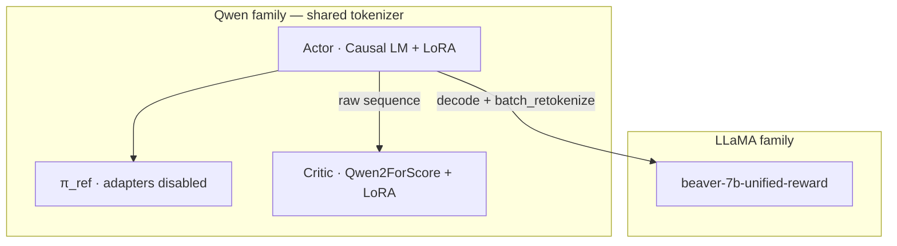
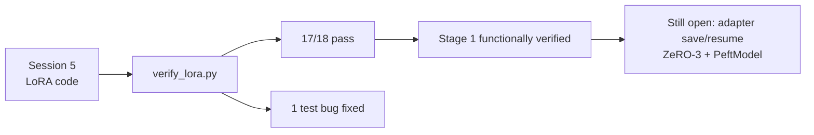

# 02 — LoRA and the MKL wall

*Sessions 4–7 · 2026-08-25 → 2026-08-27*

With a clean tree and a cluster map, the next work is architectural reading, LoRA plumbing, escaping the MKL install wall, and proving the adapters at runtime.

## Session 4 — Read the trainer before designing around it

Question: can a LLaMA-family reward model score a Qwen actor?

The two paths are **asymmetric**:

| Path | Behaviour | Implication |
|---|---|---|
| **Reward** | `post_rollout()` checks `reward_tokenizer is not tokenizer` and calls `batch_retokenize()` | Cross-family RM is **supported upstream** |
| **Critic** | Fed the actor’s raw `sequence`; `rl_trainer.py` raises if critic tokenizer ≠ actor | Critic **must** share the actor family |

Worse: `--reward_critic_model_name_or_path` **defaults to the reward model path**, so leaving it unset with Qwen actor + LLaMA RM crashes at startup.

Generation goes through `self.actor_model.module.generate(...)` — DeepSpeed’s inner module.

**Architecture forced (not merely preferred):**

| Role | Model | Trains? |
|---|---|---|
| Actor | Qwen2.5-1.5B-Instruct + LoRA | adapters only |
| Reference | same actor, adapters disabled | no (free) |
| Reward | `PKU-Alignment/beaver-7b-unified-reward` | frozen |
| Critic | `Qwen2ForScore` on Qwen base + LoRA | adapters + score head |



Scope decisions recorded here:

- **Skip SFT** — Instruct already follows instructions; PKU needed SFT because raw LLaMA-7B does not.
- **Use PKU’s released RM** — removes a training stage; more faithful to “official shape” than a home-trained RM.

Budget: ~20 GB of weights in bf16 on one RTX 8000 *(before the cost model later widens the Stage 5 footprint)*.

## Session 5 — LoRA plumbing (syntax-verified only)

Upstream has **no** `peft` imports; `load_pretrained_models()` loads full weights into DeepSpeed. Four gated changes so `--use_lora False` reproduces upstream byte-for-byte:

1. **`models/pretrained.py`** — optional `lora_config`; wrap with `get_peft_model()` *after* `resize_tokenizer_embedding()`.
2. **`algorithms/ppo/main.py`** — `--use_lora`, `--lora_r` (16), `--lora_alpha` (32), `--lora_dropout` (0.05), `--lora_target_modules` (default `None`).
3. **`trainers/rl_trainer.py`** — actor gets `TaskType.CAUSAL_LM`; critic gets `modules_to_save=['score_head']` and no task type.
4. **`AdapterDisabledReference`** — π_ref is the actor with adapters disabled (no second full copy).

<div class="finding caution">
<span class="label">Highest-risk line</span>
<code>get_peft_model()</code> freezes every non-adapter parameter. Without <code>modules_to_save=['score_head']</code>, the critic’s freshly initialised <code>nn.Linear</code> stays frozen at random init: advantages become noise and PPO appears to “run perfectly” against garbage.
</div>

Other design notes:

- Guard with `getattr(self.args, 'use_lora', False)` so shared `rl_trainer.py` does not break `ppo_lag` / `ppo_reward_shaping` parsers.
- PEFT v0.20.0 Qwen2 default targets are only `["q_proj", "v_proj"]` — original LoRA paper, not full attention + MLP. Widening is an open measurement question.
- Diff vs pristine: **3 files, +108/−13**, plus `scripts/verify_lora.py`.

**Not yet executed** in Session 5: no import check, no model load, no DeepSpeed/ZeRO behaviour observed. The verify script perturbs LoRA `B` before enabled-vs-disabled comparison (untrained `B = 0` would make a naive test pass trivially).

## Session 6 — The MKL wall, and why the “standard fix” failed

Applying Session 3’s pins hit three sequential failures:

1. **`PackagesNotFoundInChannelsError: cuda-toolkit11.8.*.*`** — `conda install` only searched `.condarc`’s `defaults`, not the recipe’s `nvidia/label/cuda-11.8.0` channel.
2. **Solver hang** — 45+ minutes, classic and (nominally) libmamba, with explicit channels.
3. **Root cause:** env had `mkl 2025.0.0` plus `blas`, `mkl-service`, `mkl_fft`, `mkl_random` — numpy is built against MKL. Downgrading MKL forces a combinatorial re-solve of numpy/blas/bindings against a pinned CUDA toolkit. That is not a slow solve; it does not finish.

**Sidestep:** replace conda’s PyTorch with a pip cu118 wheel that bundles its own math libs:

```bash
pip install --force-reinstall --no-deps torch==2.5.1 \
  --index-url https://download.pytorch.org/whl/cu118
```

`--no-deps` then missed cuDNN 9 (`libcudnn.so.9`); re-running **without** `--no-deps` installed only the missing `nvidia-*` wheels.

**Stage 0 gate passed:** `torch 2.5.1+cu118`, `transformers 4.46.3` (inside `<4.47`), `peft 0.20.0`, `deepspeed` imports cleanly.

<div class="finding">
<span class="label">Process lesson</span>
Days were lost debugging package installs <em>through the batch queue</em>. Environment work belongs in an interactive shell. Only jobs that genuinely need a GPU should be queued.
</div>

## Session 7 — `verify_lora.py`: 17/18 pass

Ran against `Qwen/Qwen2.5-0.5B-Instruct` on the `batch` partition.

| Check | Result |
|---|---|
| Actor wraps as `PeftModelForCausalLM` | pass |
| Trainable fraction | **540,672 / 494,330,624 = 0.109%** |
| Adapters injected into | **`['q_proj', 'v_proj']`** |
| `generate()` through wrapper | pass |
| `disable_adapter()` restores base | pass |
| **`score_head` trainable** | **pass — 2 of 4 tensors** |
| Critic forward scores | pass, shape `(1, 4, 1)` |
| No-LoRA control untouched | pass, 100% trainable |

Corroborating arithmetic:

- **48 `lora_B` tensors** = 24 layers × 2 target modules (0.5B has 24 layers).
- Critic trainable − actor trainable = **541,569 − 540,672 = 897** = `score_head` weight (896) + bias (1). `modules_to_save` resolved correctly — the Session 5 risk line is verified, not assumed.

The single failure was a **bug in the test**, not the code: asserting `getattr(module, 'disable_adapters', False)` picks up bound methods (always truthy). Behavioural logit comparison after the proxy call already proved adapters re-enable. **Lesson: assert on observable behaviour, not PEFT internal attribute names.**

Also noted:

- `batch` nodes have GPUs (`cuda: True`) — undocumented in the MSS guide.
- HF downloads on `batch` ~0.3 MB/s vs 7–40 MB/s on login — pre-download or `HF_HUB_DISABLE_XET=1` (critical for Stage 4’s ~14 GB RM).
- Vocab 151,665 vs embedding 151,936 is normal Qwen padding, not misconfiguration.



**Stage 1 functionally verified**, except adapter save/resume (no runtime coverage yet). Remaining unknowns need a real distributed launch — which is [Stage 3](/book/phase2/03-template-and-ppo-loop.md).

---

**Prev:** [01](/book/phase2/01-reset-and-cluster.md) · **Next:** [03 — Template and PPO loop](/book/phase2/03-template-and-ppo-loop.md)
