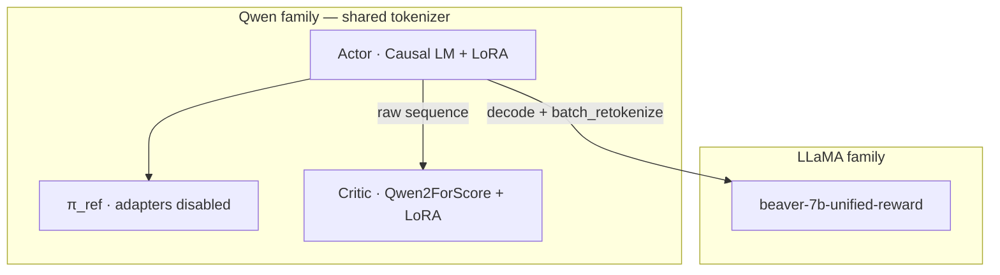
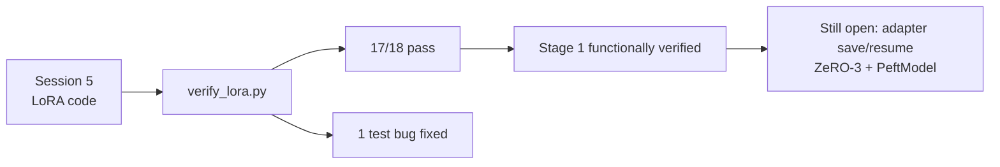

# 02 — LoRA and the MKL wall

Source sessions: 4–7 · Full text: [/book/worklogs/phase2.md](/book/worklogs/phase2.md)

*Sessions 4–7 · 2026-08-25 → 2026-08-27*

With a clean tree and a cluster map, the next work is architectural reading, LoRA plumbing, escaping the MKL install wall, and proving the adapters at runtime. Canonical trail: [/book/worklogs/phase2.md](/book/worklogs/phase2.md).


## Session 4 — Reading the trainer before designing around it

Before committing to an architecture, the question was whether a LLaMA-family reward model can score a Qwen actor’s outputs — traced through how `PPOTrainer` moves tensors between actor, reward model, and critic.

The two paths are **asymmetric**, and this is decisive:

| Path | Behaviour | Implication |
|---|---|---|
| **Reward** | `post_rollout()` (`algorithms/ppo/trainer.py:43-55`) checks `if self.reward_tokenizer is not self.tokenizer` and calls `batch_retokenize()` to decode and re-encode | A LLaMA-family RM scoring a Qwen actor is **supported upstream**, not a hack |
| **Critic** | Fed the actor’s raw `sequence` with no re-tokenization (`trainer.py:61`); `rl_trainer.py:177-193` raises `ValueError` if critic tokenizer ≠ actor | Critic **must** share the actor family |

Worse: `--reward_critic_model_name_or_path` **defaults to the reward model path**, so leaving it unset with a Qwen actor and a LLaMA RM crashes at startup.

Also found: the actor is generated from via `self.actor_model.module.generate(...)` (`rl_trainer.py:411`) — through the DeepSpeed engine’s inner module.

**Architecture settled**, with one decision *forced* rather than chosen:

| Role | Model | Trains? |
|---|---|---|
| Actor | Qwen2.5-1.5B-Instruct + LoRA | adapters only |
| Reference | same actor, adapters disabled | no (free) |
| Reward | `PKU-Alignment/beaver-7b-unified-reward` | frozen |
| Critic | `Qwen2ForScore` on Qwen base + LoRA | adapters + score head |



The critic **must** be Qwen-family — not a design preference but a constraint imposed by the trainer. This is also cheaper than PKU’s RM-initialised 7B critic. Budget: ~20 GB of weights in bf16, which fits one RTX 8000.

Two further scope decisions recorded:

- **Skip SFT** — Qwen2.5-Instruct already ships instruction-tuned; PKU needed SFT only because raw LLaMA-7B cannot follow instructions.
- **Use PKU’s released reward model** rather than training one — removes an entire training stage and is more faithful to “official shape” than a home-trained RM.

*(The cost model enters scope later, in [Session 11](/book/phase2/04-reward-cost-and-gpu.md); the ~20 GB budget then widens.)*

## Session 5 — LoRA plumbing implemented

Upstream lacks LoRA entirely — `peft` appears in no import anywhere in the framework, and `load_pretrained_models()` loads full weights straight into DeepSpeed. Four changes, each gated so that `--use_lora False` reproduces upstream byte-for-byte:

| # | File | Change |
|---|---|---|
| 1 | `models/pretrained.py` | `load_pretrained_models()` takes optional `lora_config: LoraConfig | None` and wraps via `get_peft_model()`, *after* `resize_tokenizer_embedding()` |
| 2 | `algorithms/ppo/main.py` | New `lora` argument group: `--use_lora`, `--lora_r` (default 16), `--lora_alpha` (32), `--lora_dropout` (0.05), `--lora_target_modules` (default `None`) |
| 3 | `trainers/rl_trainer.py` | Actor gets `task_type=TaskType.CAUSAL_LM` so `get_peft_model` returns a `PeftModelForCausalLM` with a proper `generate()`. Critic gets **`modules_to_save=['score_head']`** and no task type |
| 4 | `trainers/rl_trainer.py` | New `AdapterDisabledReference` class replacing the second full model copy |

<div class="finding caution">
<span class="label">Highest-risk line — the <code>score_head</code> trap</span>
<code>get_peft_model()</code> freezes every parameter that is not an adapter. The critic’s <code>score_head</code> is a freshly-initialised <code>nn.Linear</code> created by <code>ScoreModelMixin.init_score_head()</code>. Without <code>modules_to_save</code>, it would stay frozen at random initialisation for the entire run: the critic never learns, advantages become noise, and PPO trains against garbage <strong>while appearing to run perfectly</strong>.
</div>

Further design notes from the session:

- **π_ref is free under LoRA.** LoRA leaves base weights untouched, so the reference policy is just the actor with adapters disabled. `AdapterDisabledReference` wraps the actor engine and calls it inside `with ...disable_adapter():`, saving a full model copy (~3 GB at 1.5B, ~6 GB at 3B) and one DeepSpeed engine. Implemented as a callable proxy so `self.actor_reference_model(...)` keeps working unchanged in `ppo`, `ppo_lag`, and `ppo_reward_shaping` — no algorithm trainer was touched.
- **Guarded with `getattr(self.args, 'use_lora', False)`**, because `rl_trainer.py` is shared with `ppo_lag` and `ppo_reward_shaping`, whose parsers have no LoRA flags. A direct attribute access would break those algorithms.
- **PEFT’s Qwen2 defaults are narrower than assumed.** Checked the v0.20.0 source: `TRANSFORMERS_MODELS_TO_LORA_TARGET_MODULES_MAPPING` contains `"qwen2": ["q_proj", "v_proj"]` — query and value only, following the original LoRA paper. Not `k_proj`, not `o_proj`, nothing in the MLP. So `--lora_target_modules None` resolves without error but is conservative. Whether to widen it is an open question to settle with measurements, not assumption.

**Diff against pristine upstream:** **3 files, +108/−13** (the deletions are re-indentation into `else:` branches, not removals), plus one new file `scripts/verify_lora.py`.

**This is verified as syntax only.** Nothing has been executed. `peft` and `torch` are not installed locally, so no import check, no model load, no runtime behaviour has been observed. Specifically unproven: that `modules_to_save=['score_head']` resolves against `Qwen2ForScore`’s actual module naming; that DeepSpeed accepts a `PeftModel` where it expects a `PreTrainedModel`; and that `AdapterDisabledReference` behaves correctly under ZeRO-3 parameter partitioning.

The verify script exercises the real code path on a small Qwen2 checkpoint and asserts (a) the actor wraps as `PeftModelForCausalLM` and can still generate, (b) the critic’s `score_head` survives as trainable, (c) omitting `lora_config` leaves the model completely untouched, and (d) `disable_adapter()` genuinely restores base behaviour. Note (d) has a subtlety: LoRA initialises the `B` matrix to zeros, so an untrained adapter is a no-op and a naive enabled-vs-disabled comparison passes trivially — the script perturbs `B` first so the test means something.

## Session 6 — The MKL wall, and why the “standard fix” was unsolvable

Tried to apply the two pins from Session 3 (`mkl=2024.0.0`, `transformers<4.47`) to the built env. Three failures in sequence, each with a distinct cause:

| # | Failure | Cause |
|---|---|---|
| 1 | `PackagesNotFoundInChannelsError: cuda-toolkit11.8.*.*` | `conda env create` built from the recipe’s five channels, but a subsequent `conda install` only searches `.condarc` — which is `defaults` alone. The solver could not re-satisfy already-installed `cuda-toolkit 11.8` because that package lives in `nvidia/label/cuda-11.8.0` |
| 2 | Solver hang | Re-running with explicit channels made the solve run for **45+ minutes** without terminating, on both the classic solver and (nominally) libmamba |
| 3 | Root cause via `conda list | grep -i mkl` | Env has `mkl 2025.0.0`, plus `blas 1.0 mkl`, `mkl-service`, `mkl_fft`, `mkl_random` — **numpy is built against MKL**. Downgrading `mkl` to 2024.0.0 therefore requires simultaneously re-solving numpy, blas and three MKL bindings against a pinned CUDA toolkit. That is not a slow solve; it is a combinatorial problem that does not finish |

**Concluded:** The fix cited in every bug report for `undefined symbol: iJIT_NotifyEvent` — downgrade MKL — is **not applicable to this environment**. Sidestepped instead: replaced conda’s PyTorch with a pip cu118 wheel, which bundles its own math libraries and does not link conda’s MKL at all. MKL 2025 stays in place for numpy; torch stops caring.

```bash
pip install --force-reinstall --no-deps torch==2.5.1 \
    --index-url https://download.pytorch.org/whl/cu118
```

`--no-deps` then caused a second, smaller failure — `libcudnn.so.9: cannot open shared object file` — because torch 2.5.1 needs cuDNN 9 and the CUDA runtime packages had been skipped. Re-running the same command *without* `--no-deps` installed only the missing `nvidia-*` wheels (pip saw `2.5.1+cu118` as already satisfying `==2.5.1`, so no re-download).

**Stage 0 gate passed:**

| Package | Version |
|---|---|
| torch | `2.5.1+cu118` |
| transformers | `4.46.3` (inside the `<4.47` pin) |
| peft | `0.20.0` |
| deepspeed | imports cleanly |

<div class="finding">
<span class="label">Process lesson</span>
Several days were lost debugging a package install <em>through the batch queue</em> — submit, wait hours, read one error line, repeat. Environment work belongs in an interactive shell where the feedback loop is seconds. Only jobs that genuinely need a GPU should be queued.
</div>

## Session 7 — LoRA plumbing verified at runtime

Ran `scripts/verify_lora.py` on the `batch` partition against `Qwen/Qwen2.5-0.5B-Instruct`.

**Found: 17/18 checks passed.** The substantive results:

| Check | Result |
|---|---|
| Actor wraps as `PeftModelForCausalLM` | pass |
| Trainable fraction | **540,672 / 494,330,624 = 0.109%** |
| Adapters injected into | **`['q_proj', 'v_proj']`** |
| `generate()` through the wrapper | pass |
| `disable_adapter()` restores base output | pass |
| **`score_head` is trainable** | **pass — 2 of 4 tensors** |
| Critic forward returns scores | pass, shape `(1, 4, 1)` |
| No-LoRA control untouched | pass, 100% trainable |

Three numbers corroborate each other:

| Observation | Arithmetic | What it proves |
|---|---|---|
| **48 `lora_B` tensors** | 24 layers × 2 target modules | Qwen2.5-0.5B has 24 layers; PEFT default targets only |
| Critic trainable − actor trainable | **541,569 − 540,672 = 897** | `score_head` weight (896, the hidden size) + bias (1) — `modules_to_save=['score_head']` resolved correctly |
| Target modules | `['q_proj', 'v_proj']` | PEFT v0.20.0’s Qwen2 default is the original LoRA paper’s narrow choice |

The Session 5 highest-risk line is now **verified, not assumed**.

**The one failure was a bug in the test, not the code.** The check `adapters are re-enabled after the proxy call` used `getattr(module, 'disable_adapters', False)` across all modules, which picks up bound methods and properties on PEFT wrappers — truthy regardless of actual state. The contradiction is visible in the output: `proxy output differs from the adapter-enabled actor` passed, and that comparison uses a forward pass taken *after* the proxy call, so adapters must have been re-enabled. Replaced the introspection with a behavioural comparison of logits.

<div class="finding">
<span class="label">Lesson</span>
Do not assert on a library’s internal attribute names; assert on observable behaviour.
</div>

**Also found:**

| Observation | Detail |
|---|---|
| `batch` partition GPUs | Nodes have GPUs (`cuda: True 1`) — undocumented in the MSS guide |
| HF download speed | ~0.3 MB/s on a `batch` node (514 MB in 31 minutes) vs 7–40 MB/s on the login node; suspected `hf-xet` chunked-transfer backend |
| Workaround | Pre-download on the login node, or `export HF_HUB_DISABLE_XET=1` — relevant for Stage 4, where the reward model is ~14 GB |
| Vocab vs embedding | Qwen tokenizer vocab 151,665 vs embedding matrix 151,936 — normal padding, not a misconfiguration |



**Stage 1 is functionally verified**, except for adapter save/resume, which has no runtime coverage yet. The remaining unknowns are DeepSpeed-specific — whether a `PeftModel` survives ZeRO wrapping, and whether `AdapterDisabledReference` behaves under parameter partitioning — and neither can be tested without a real distributed launch. That is [Stage 3](/book/phase2/03-template-and-ppo-loop.md).

---

**Prev:** [01](/book/phase2/01-reset-and-cluster.md) · **Next:** [03 — Template and PPO loop](/book/phase2/03-template-and-ppo-loop.md)
