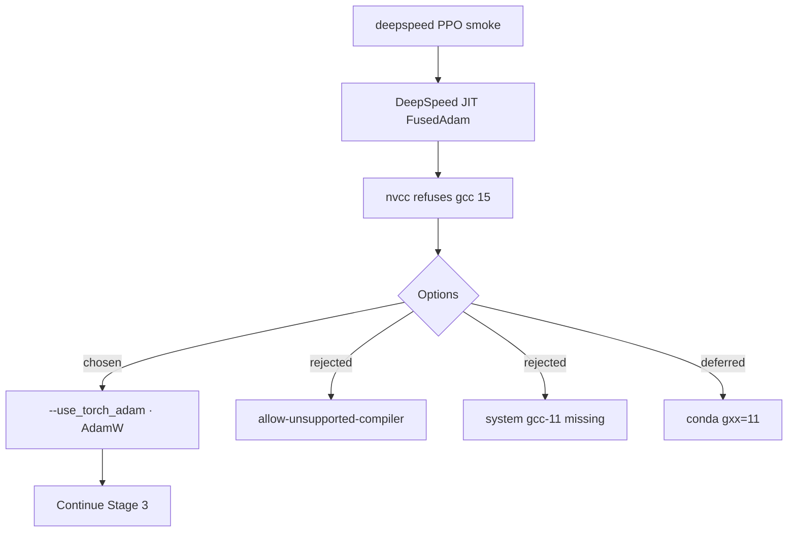

# 03 — Template and PPO loop

*Sessions 8–10 · 2026-08-27*

Stage 2 locks the data path and (temporarily) the prompt template. Stage 3 gets a real DeepSpeed PPO launch through LoRA end to end — after fighting the cluster’s inability to JIT CUDA extensions.

## Session 8 — Stage 2 closed (and a decision later reversed)

Two leftover Stage 1 decisions:

### Interval checkpoints → adapter snapshots

When the actor is PEFT-wrapped, `rl_trainer.py` writes a LoRA adapter into `output_dir/checkpoint-{step}/` at each `--save_interval` instead of a DeepSpeed engine checkpoint.

**Why:** Phase 1’s most valuable findings were trajectory-shaped (entropy collapse, KL sign), but only the *final* policy was loadable. At ~2 MB per adapter (before the embedding-save bug of Session 10), every snapshot of a full run can be kept and evaluated. Upstream cannot restore optimizer state anyway — there is no `load_checkpoint` call in the framework.

### Prompt template → keep Alpaca-style *(Session 8 decision)*

This reversed the original plan’s ChatML recommendation. The deciding fact: `post_rollout()` re-tokenizes for the RM with `skip_special_tokens=True`. ChatML’s structure lives in special tokens (`<|im_start|>`, `<|im_end|>`), which would be stripped before Beaver-7B sees anything — leaving bare `system` / `user` / `assistant` words. The Alpaca template is plain text, survives intact, and matches how PKU trained the RM. Given Phase 1’s lesson that a corrupted reward signal invalidates everything downstream, **reward-path fidelity outranked actor-path fidelity** here.

<div class="finding caution">
<span class="label">Later reversal — Session 14</span>
This decision is reversed on evidence in <a href="05-run-a.md">Run A</a>: under Alpaca, Qwen never emits its eos token, so every generation runs to the length cap and decays into noise. ChatML becomes mandatory for Stage 5. The Session 8 argument about what the RM <em>receives</em> was incomplete about what the actor can <em>produce</em>.
</div>

**`scripts/verify_dataset.py` — 10/10:**

- `PKU-SafeRLHF/train` loads: **38,641 prompts**.
- Prompts render as intended (`BEGINNING OF CONVERSATION: USER: … ASSISTANT:`).
- Exactly one USER and one ASSISTANT turn; terminates at the assistant marker; no doubled BOS.
- After `skip_special_tokens=True`, the decoded string is **byte-identical** to the original including both markers.

**Silent model modification:** Qwen ships with no `bos_token`; `resize_tokenizer_embedding()` injects `DEFAULT_BOS_TOKEN = '<s>'`. Effects: (a) `<s>` registered but never emitted; (b) embeddings shrink **151,936 → 151,666** (unused alignment padding). Under LoRA the embedding is frozen regardless. Recorded so it is not mistaken for a bug.

**Stage 2 complete** at the time — with a conditional: if Stage 4 forced a home-trained Qwen RM, ChatML would flip back to correct. Stage 4 kept Beaver; Session 14 flipped ChatML for the *actor* anyway.

## Session 9 — Stage 3 attempt 1: no CUDA JIT on this cluster

First real launch: `scripts/smoke-ppo-qwen-lora.sbatch` — Qwen2.5-0.5B actor/critic, **`gpt2` as stand-in RM**, `max_length 128`, batch 2, ~19 steps, `save_interval 5`.

**Why gpt2, not a Qwen stand-in RM:** Wendy caught the mistake — if reward and actor share a tokenizer, `rl_trainer.py` collapses `reward_tokenizer` onto `tokenizer` and **skips** `batch_retokenize()`. A Qwen RM would have tested a code path Stage 5 never uses. `gpt2` forces the same bridge Beaver-7B will take, at 124M parameters.

Failure during DeepSpeed JIT of `FusedAdam`:

```text
error: #error -- unsupported GNU version! gcc versions later than 11 are not supported!
```

Nodes report **gcc 15.2.0**; `/usr/bin/` has only `gcc-15`. CUDA 11.8’s `nvcc` supports gcc ≤ 11. **No CUDA extension can be JIT-compiled on this cluster** — not just `FusedAdam`; `DeepSpeedCPUAdam` compiles too.

What *did* work before the failure: LoRA `load_pretrained_models()` under a real distributed launch; DeepSpeed accepted a `PeftModel`. Build step `[2/3]` (plain C++ frontend) succeeded — gcc 15 is fine; only `nvcc` refuses.

**Fix:** `--use_torch_adam` (default `False`) selects `torch.optim.AdamW` instead of either DeepSpeed Adam. Same param groups / `ADAM_BETAS`; checked before the offload branch so it short-circuits both compiled paths. Cost is fusion speed, irrelevant against not running.

Rejected options: `NVCC_PREPEND_FLAGS=-allow-unsupported-compiler` (four-major-version gap), `CC=gcc-11` (does not exist), conda gcc 11 (Session 6 showed conda solves here are unreliable).



**Carry forward:** if a later stage needs a DeepSpeed op with no pure-torch fallback, `--use_torch_adam` will not save you — install gcc 11 deliberately, not mid-biggpu queue.

## Session 10 — Stage 3 closed: PPO loop end to end

Smoke completed: **exit 0:0, 37 PPO steps, ~3 minutes.** Four failures on the way:

| # | Failure | Fix |
|---|---|---|
| 1 | nvcc vs gcc 15 | `--use_torch_adam` (Session 9) |
| 2 | 30-minute silent hang in `poll_schedule_timeout` | `gpt2` not prefetched while Beaver download saturated the link — diagnose via `ps`, not `py-spy` (ptrace blocked) |
| 3 | `HF_HUB_OFFLINE=1` breaks `datasets` Hub module resolution | Bounded timeouts instead: `HF_HUB_ETAG_TIMEOUT=15`, `HF_HUB_DOWNLOAD_TIMEOUT=30` |
| 4 | Adapter snapshots **520 MB**, not ~1 MB | PEFT `save_embedding_layers='auto'` saw vocab resize as “trained embeddings” — force `False`; snapshots drop to **1.1 MB** (= 540,672 × 2 bytes bf16) |

**Evidence the LoRA design is correct, from a real run:**

| Metric | Observed | Proves |
|---|---|---|
| `train/kl_divergence` | **first = 0.0000**, then ±0.5 | `AdapterDisabledReference` works |
| `train/reward_value` | −0.02 → **+2.94** | `modules_to_save=['score_head']` works |
| `train/reward` | 2.4609 → 2.5703 | Qwen→GPT-2 bridge delivers real text |
| snapshot size | **1.1 MB** | only adapter weights saved |

KL at step 0 is the strongest write-up point: LoRA `B` matrices initialise to **zero**, so the actor *is* the base model and KL vs reference is exactly 0. Had the proxy returned adapter-enabled output, KL would stay pinned at zero forever — silent failure. The observed trajectory rules it out.

`reward_value` climbing toward true reward (~2.5) is the critic head learning; frozen, it would have stayed at its random value (Session 5’s silent-failure mode).

**Non-issues:** `actor_lr` printing `+0.0000` was `%f` formatting of `1e-5` in `dump_tb.py` (switched to `%g`). Mildly negative KL (min −0.63) is MC noise on a 2-sequence batch — not Phase 1’s −41 breakdown.

**Unresolved oddity:** `mean_generated_length` equals `max_generated_length` every step (plausible left-padding artefact on batch size 2).

Also added `scripts/dump_tb.py` — TensorBoard metrics never reach the SLURM `.out` file.

**Stage 3 passes:** DeepSpeed accepts `PeftModel`, reference proxy works under a live engine, re-tokenization bridge fires, snapshots are the right size. Iteration time ~3 minutes per attempt — contrast Session 6’s 45-minute conda hangs.

---

**Prev:** [02](/book/phase2/02-lora-and-mkl.md) · **Next:** [04 — Reward, cost, and GPU](/book/phase2/04-reward-cost-and-gpu.md)
