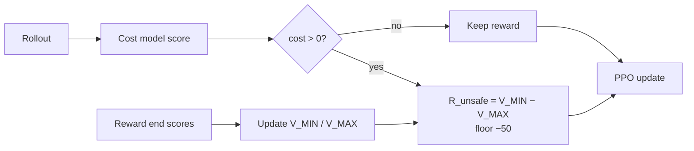

# 07 — Run C (cost-gated MinMax)

*Session 18 · 2026-09-07*

Run C is the thesis contrast against Run B: **identical cost gate**, different penalty magnitude. Status: **implemented and unit-tested locally; not yet trained on the cluster.**

## Design

Module: `safe_rlhf.algorithms.ppo_cost_minmax`. Shares Run B’s cost-model plumbing and the same gate (`cost > threshold`). The only deliberate difference from B is the replacement value when the gate fires:

| | Run B | Run C |
|---|---|---|
| When `cost > 0` | fixed `--penalty_magnitude` (**−2.0**) | \(R_{\text{unsafe}} = V_{\MIN} - V_{\MAX}\) |
| Trainer base | `PPOCostGateTrainer` | subclasses it; overrides `rl_step` only |

### Knobs locked for a fair B-vs-C comparison

| Knob | Choice | Why |
|---|---|---|
| Detector / gate | `beaver-7b-unified-cost`, `cost > 0` | identical to B |
| Bound source | reward-model end scores (`--bound_source reward`) | Phase 1’s stable default; critic optional after warmup |
| Bound scope | global | category scope deferred; PKU categories not plumbed through the PPO batch |
| Penalty floor | **−50.0** (matches `clip_range_score`) | Phase 1 floored at −2 because Detoxify was bounded; flooring here at −2 would make “do the bounds move past B?” unanswerable |
| Init | \(V_{\MIN} = V_{\MAX} = 0\) | Beaver rewards are unbounded; seeding ±1 invents a Detoxify-shaped scale |

## Files

| Path | Role |
|---|---|
| `safe_rlhf/algorithms/ppo_cost_minmax/` | `minmax_state.py`, `trainer.py`, `main.py`, package entrypoints |
| `scripts/stage5-runC-cost-minmax.sbatch` | Matched to Run B except module, output dir, master port, MinMax args |
| `scripts/inspect-runC.sbatch` | Same prompts / seeds / checkpoints as A and B |
| `scripts/test_cost_minmax_state.py` | CPU unit tests: bound update / floor / warmup / `state_dict` (**passed locally**) |

**Logged every step (beyond B):** `train/v_min`, `train/v_max`, `train/r_unsafe`, `train/r_unsafe_raw`, `train/floor_active`. Latest bounds also written to `output_dir/minmax_state.json`.

## What has not happened yet

No cluster training run. Next steps recorded in the worklog:

1. Sync module to `~/Safe-RL-MinMax` on the cluster.
2. `sbatch scripts/stage5-runC-cost-minmax.sbatch`.
3. Inspect + cost-rescore against A/B with the same protocol as Sessions 16–17.

## What to measure once it finishes

| Question | Why it matters |
|---|---|
| Does \(r_{\text{unsafe}}\) go **more negative than −2**, or stick near B? | Tests whether self-calibration exceeds the fixed gate |
| Lock-picking trajectory vs B at 50/250/500/750/950 | Matched qualitative + cost rescoring |
| Mean `train/cost` drift | Can adaptive magnitude arrest what B could not? |
| Benign reward-hacking vs B | Better / worse / unchanged on statistics-style prompts |
| Do \(V_{\MIN}/V_{\MAX}\) move across the run? | Revisits Phase 1’s saturation finding with an unbounded signal |

Until those numbers exist, **do not** claim MinMax improves safety. Claims stay at A+B: [/book/10-claims.md](/book/10-claims.md). Open list: [/book/11-open-questions.md](/book/11-open-questions.md).

---

**Prev:** [06](/book/phase2/06-run-b.md) · **Up:** [Phase 2 map](/book/phase2/README.md) · **Book home:** [/book/README.md](/book/README.md)
