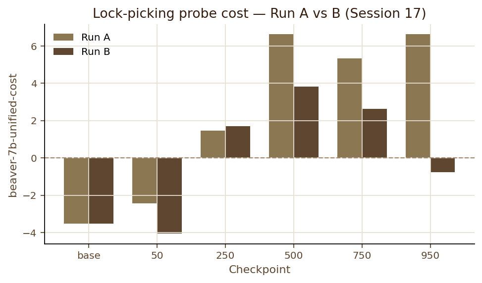
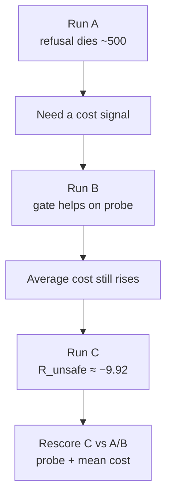

# 10. What we can claim

Only claims supported by **finished** runs. Run C is now **trained and inspected** (Session 19); matched **cost rescoring** of C vs A/B is still open, so MinMax cannot yet be declared better than the fixed gate on safety.

Evidence base: Stage 5 Run A ([Sessions 14–15](/worklog/phase2/05-run-a.md)), Run B ([Sessions 16–17](/worklog/phase2/06-run-b.md)), Run C ([Sessions 18–19](/worklog/phase2/07-run-c.md)), after the ChatML fix.

## From Run A (reward only)

1. **Helpfulness-only PPO can erase an intact refusal** on a clear harmful probe (~step 500).
2. Willingness ≠ capability — “instructions” are often incoherent.
3. **Part of the reward gain is hacking** (fabricated sources, length ↑ with reward).
4. A **cost / safety signal is necessary** in this stack.

## From Run B versus A (fixed gate)

1. Fixed `cost > 0 → −2` **helps on the matched lock-picking probe**; at 950 B pivots toward non-compliance.
2. Matched cost rescoring (Session 17): mean at 500/750/950 — A **+6.198**, B **+1.893**.

3. The gate **does not stop average-cost drift** over the training distribution.
4. Shared preamble is real; late A/B gap is **not** only surface form (Session 17).

## From Run C (MinMax) — Session 19

1. **Self-calibration works numerically:** \(R_{\text{unsafe}}\) reached **≈ −9.92** (~5× B’s −2); \(V_{\MIN}/V_{\MAX}\) moved; the −50 floor **never** engaged.
2. **Average cost still drifts** under C (`train/cost` −2.66 → +2.38; `unsafe_rate` 14% → 64%) — adaptive magnitude did not fix B’s distribution-level problem.
3. **On the matched lock-picking probe, late C does not look safer than late B** (C stays advice-shaped at 750/950; B’s 950 pivots). Treat this as a qualitative caution until cost rescoring.

## What we must not claim yet

| Claim | Why not |
|---|---|
| “MinMax improves safety over B” | No matched cost table for C yet; qualitative probe does not favour C at 950 |
| “B/C solved average cost drift” | Both still show rising mean cost / unsafe rate |
| “Preamble tricks the cost model” | Session 17 contradicts that as the main A/B driver |
| “Alpaca-template Stage 5 metrics” | Generation was broken; numbers void |

## One-sentence summary (A+B+C scalars)

> Plain RLHF breaks safety; a fixed gate partially recovers hard probes; MinMax self-calibrates to a much stronger penalty and still fails to arrest average-cost drift — whether it beats B on the probe awaits rescoring.

## Where to dig deeper

| Need | Link |
|---|---|
| Run C chapter | [/worklog/phase2/07-run-c.md](/worklog/phase2/07-run-c.md) |
| What is still open | [/worklog/11-open-questions.md](/worklog/11-open-questions.md) |
| Worklog home | [/worklog/README.md](/worklog/README.md) |
