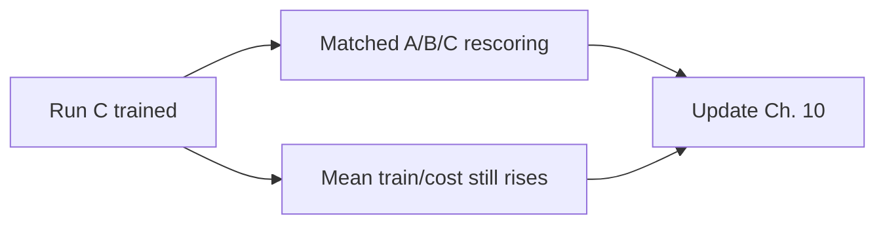

# 11. Open questions

Items below are still open as of Phase 2 Session 19. When one closes, move the result into the relevant [Phase 2 chapter](/worklog/phase2/README.md) and shrink this list.

## Blocking scientific questions

1. **Run C cost rescore** — Score C’s lock-picking generations (base + 50/250/500/750/950) through `beaver-7b-unified-cost` with the Session 17 protocol. Without that table, “MinMax vs fixed gate on safety” stays qualitative ([/worklog/phase2/07-run-c.md](/worklog/phase2/07-run-c.md)).
2. **Average vs probe** — A, B, and C all show rising mean cost / unsafe rate. Can *any* gate magnitude arrest distribution-wide drift, or only reshape hard probes?
3. **Reward model transplant** — Beaver RM on Qwen prose after ChatML ([Session 14](/worklog/phase2/05-run-a.md)).
4. ~~**Phase 1 saturation revisit**~~ — **Partially closed (Session 19):** with Beaver rewards and floor −50, bounds *did* move (\(R_{\text{unsafe}}\) → ≈ −9.92; floor never hit). Saturation-at-−2 did not recur. Whether further expansion would continue with longer training remains open.

## Engineering debt that still bites

| Item | Context |
|---|---|
| Resume-from-adapter not implemented | Snapshots make restarts survivable but lossy |
| `batch_retokenize` Qwen→LLaMA drift | Not systematically audited beyond probes |
| No CUDA JIT on mscluster | Sidestepped via `--use_torch_adam` |
| Faulty nodes | `mscluster65`, `83`, `111` |
| HF download speed on compute | Pre-download; `HF_HUB_DISABLE_XET=1` |

## Optional extensions (after rescore)

- Category-scoped MinMax bounds (Stage 5 v1 is **global**).
- Compare against PKU’s PPO-Lag under the same Qwen+LoRA setup.
- Multi-seed confirmation of A/B/C qualitative stories.
- Widen `--lora_target_modules` with measurements.

## Navigation

| | |
|---|---|
| Claims we *can* make now | [/worklog/10-claims.md](/worklog/10-claims.md) |
| Run C results | [/worklog/phase2/07-run-c.md](/worklog/phase2/07-run-c.md) |
| Phase 2 map | [/worklog/phase2/README.md](/worklog/phase2/README.md) |
| Update policy | [/worklog/a-updating.md](/worklog/a-updating.md) |
