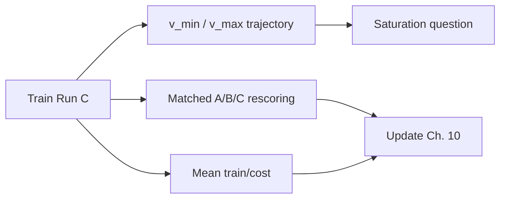

# 11. Open questions

Items below are still open as of Phase 2 Session 18. When one closes, move the result into the relevant [Phase 2 chapter](/worklog/phase2/README.md) (or [Phase 1 summary](/worklog/02-phase1.md)) and shrink this list — do not leave resolved questions here.

## Blocking scientific questions

1. **Run C training** — Launch `ppo_cost_minmax` on biggpu ([design](/worklog/phase2/07-run-c.md)). Do \(V_{\MIN}/V_{\MAX}\) move meaningfully with an unbounded cost-triggered signal? Does \(R_{\text{unsafe}}\) exceed B’s fixed \(-2\)?
2. **Average vs probe** — Can any gate magnitude arrest distribution-wide cost drift, or only reshape hard probes? Run B already shows the split ([/worklog/phase2/06-run-b.md](/worklog/phase2/06-run-b.md)); C asks whether adaptive magnitude changes the answer.
3. **Reward model transplant** — Beaver RM was trained on Alpaca-7B-style responses. How sensible are its rankings on Qwen prose once ChatML termination is fixed? ([Session 14 note](/worklog/phase2/05-run-a.md))
4. **Phase 1 saturation revisit** — With cost as detector and unbounded Beaver rewards, does the Sessions 8–9 (Phase 1) saturation finding still hold, or do bounds move across a full run?

## Engineering debt that still bites

| Item | Context |
|---|---|
| Resume-from-adapter not implemented | Snapshots make restarts survivable but lossy (optimizer state gone). Upstream has no `load_checkpoint` either. |
| `batch_retokenize` Qwen→LLaMA drift | Decode with `skip_special_tokens=True` then re-encode — not systematically audited beyond probes. Fallback: small Qwen RM. |
| No CUDA JIT on mscluster | CUDA 11.8 + gcc 15; sidestepped via `--use_torch_adam`. Later DeepSpeed ops without a pure-torch path need conda gcc 11 ([Session 9](/worklog/phase2/03-template-and-ppo-loop.md)). |
| Faulty nodes | `mscluster65`, `83` (bigbatch), `111` (biggpu): `nvidia-smi` lists GPU, CUDA cannot initialise — still worth a Help Desk ticket ([Sessions 12–13](/worklog/phase2/04-reward-cost-and-gpu.md)). |
| HF download speed on compute | ~0.3 MB/s vs 7–40 MB/s on login — pre-download; `HF_HUB_DISABLE_XET=1`; cache under `/datasets/wmaboa`. |

## Optional extensions (after C)

- Category-scoped MinMax bounds (Phase 1 had this; Stage 5 v1 is **global** — see design table in [/worklog/phase2/07-run-c.md](/worklog/phase2/07-run-c.md)).
- Compare against PKU’s PPO-Lag / reward shaping under the same Qwen+LoRA setup.
- Multi-seed confirmation of the A/B qualitative story (refusal crossing, preamble, 950 pivot).
- Widen `--lora_target_modules` beyond PEFT’s `["q_proj", "v_proj"]` with measurements ([Session 5–7](/worklog/phase2/02-lora-and-mkl.md)).
- Separate flag for full-weight critic with LoRA actor.

## Navigation

| | |
|---|---|
| Claims we *can* make now | [/worklog/10-claims.md](/worklog/10-claims.md) |
| Phase 2 map | [/worklog/phase2/README.md](/worklog/phase2/README.md) |
| Phase 1 closed summary | [/worklog/02-phase1.md](/worklog/02-phase1.md) |
| Worklog home | [/worklog/README.md](/worklog/README.md) |
| Update policy | [/worklog/a-updating.md](/worklog/a-updating.md) |
