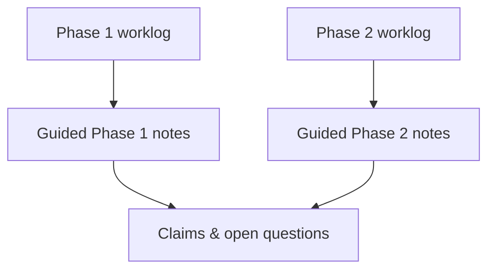

Research worklog · driven by the worklogs

# Safe Reinforcement Learning with a MinMax Penalty

This site is built from two lab notebooks — mirrored in full, then retold as guided notes with diagrams.

## Start with the worklogs

| Phase | Canonical file | On this site |
|---|---|---|
| **1** — GPT-2 + Detoxify + MinMax | `ppo_minmax_experiment/worklog.md` | [Read full Phase 1 worklog](/worklog/worklogs/phase1.md) |
| **2** — Qwen + LoRA + Safe RLHF | `safe-rlhf/worklog.md` | [Read full Phase 2 worklog](/worklog/worklogs/phase2.md) |

Every session (Did / Found / Concluded) is there. Guided notes below are a pedagogical rewrite of **the same record**, not a second set of results.

## Status at a glance

| Stage / run | Status | Worklog | Guided note |
|---|---|---|---|
| Phase 1 closed | MinMax ≈ PPO+KL at matched β; Detoxify gameable | [worklog](/worklog/worklogs/phase1.md) | [phase1/](/worklog/phase1/README.md) |
| Phase 2 Stages 0–4 | Env, LoRA, PPO smoke, cost detector | [worklog](/worklog/worklogs/phase2.md) | [01](/worklog/phase2/01-reset-and-cluster.md)–[04](/worklog/phase2/04-reward-cost-and-gpu.md) |
| Run A | Complete — refusal eroded | Sessions 14–15 | [05](/worklog/phase2/05-run-a.md) |
| Run B | Complete — gate helps on probe; avg cost drifts | Sessions 16–17 | [06](/worklog/phase2/06-run-b.md) |
| Run C | Trained + inspected; cost rescore pending | Sessions 18–19 | [07](/worklog/phase2/07-run-c.md) |
| Claims | A+B solid; C partial (bounds move, drift remains) | — | [10](/worklog/10-claims.md) |

## Guided reading order

0. **Want expertise, not just the lab log?** → [Textbook](/worklog/textbook/README.md) (10 chapters)
0b. **Lost / 10-minute orientation?** → [Foundations](/worklog/fundamentals.md)
1. [How to read this worklog](/worklog/00-how-to-read.md)
2. [Phase 1 worklog](/worklog/worklogs/phase1.md) *or* [Phase 1 chapters](/worklog/phase1/README.md)
3. [Phase 2 worklog](/worklog/worklogs/phase2.md) *or* [Phase 2 chapters](/worklog/phase2/README.md)
4. [What we can claim](/worklog/10-claims.md)

After editing either worklog in the repo: `python scripts/sync_worklogs_to_docs.py` then commit the mirror under `docs/worklog/worklogs/`.
