
Architecture · Phase 1 → Phase 2

# Architecture atlas — from pilot to Stage 5

One page of diagrams for the whole project stack. Use this for talks and Google Slides (redraw shapes from the Mermaid logic; keep labels). Full narrative lives in the [Phase 1](/worklog/phase1/README.md) and [Phase 2](/worklog/phase2/README.md) chapters.

---

## 0. Big picture — why two phases

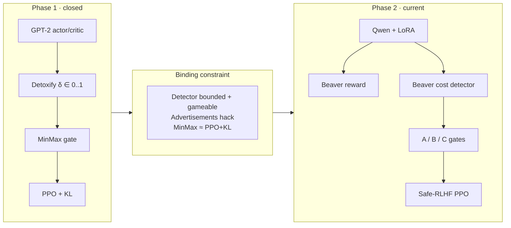

| | Phase 1 | Phase 2 (documented track) |
|---|---|---|
| Codebase | `ppo_minmax_experiment/` + TRL | `safe-rlhf/` (PKU) + DeepSpeed |
| Actor | GPT-2 small | Qwen2.5-1.5B-Instruct + LoRA |
| Helpfulness signal | Centered Detoxify \(r=1-2\delta\) | Beaver **reward** (frozen) |
| Safety / gate signal | Same Detoxify (toxicity threshold) | Beaver **cost** (`cost > 0`) |
| MinMax question | vs PPO+KL only | vs **matched fixed gate** (B), with A as control |
| Status | Closed | A/B done; C trained, rescore open |

---

## 1. Phase 1 — GPT-2 + Detoxify + MinMax

### 1.1 Training loop

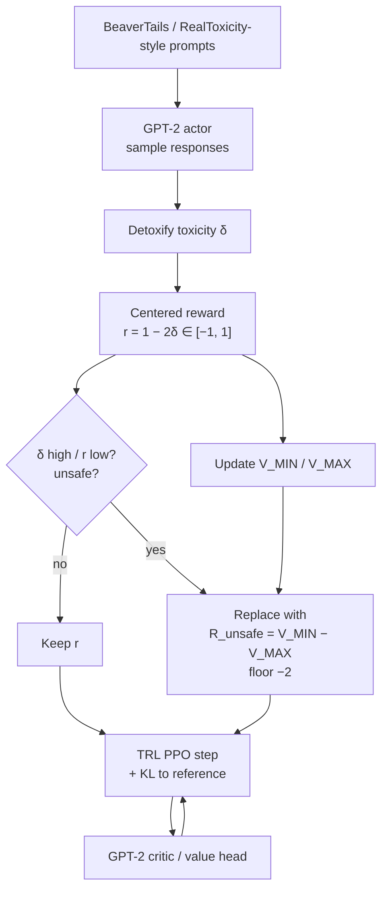

### 1.2 What Detoxify was doing (two jobs)

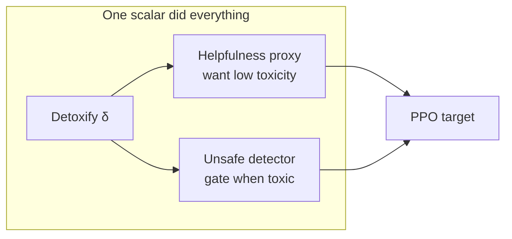

Phase 1 lesson
Because \(r \in [-1,1]\), \(R_{\text{unsafe}} = V_{\MIN}-V_{\MAX} \ge -2\) by arithmetic. Self-calibration freezes early. Separately, <code>"Advertisements"</code> scores ≈0 toxicity → gate never fires → reward hacking, not safety.

### 1.3 Fair Phase 1 comparison (what closed the phase)

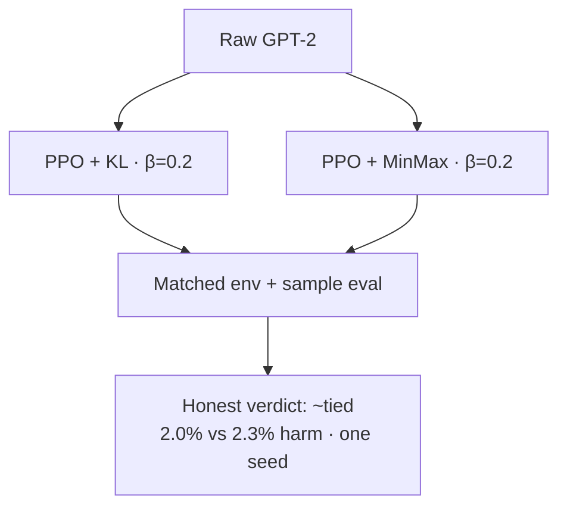

---

## 2. Transition — what had to change

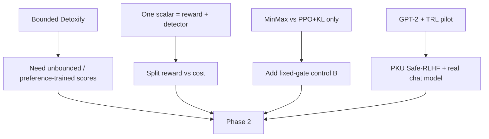

Detoxify’s **role** (unsafe detector) maps to Beaver **cost**. Detoxify’s **reward role** maps to Beaver **reward**. Replacing Detoxify with “an RM alone” would still miss the safety gate.

---

## 3. Phase 2 — Safe RLHF stack (Qwen track)

### 3.1 Models and who trains

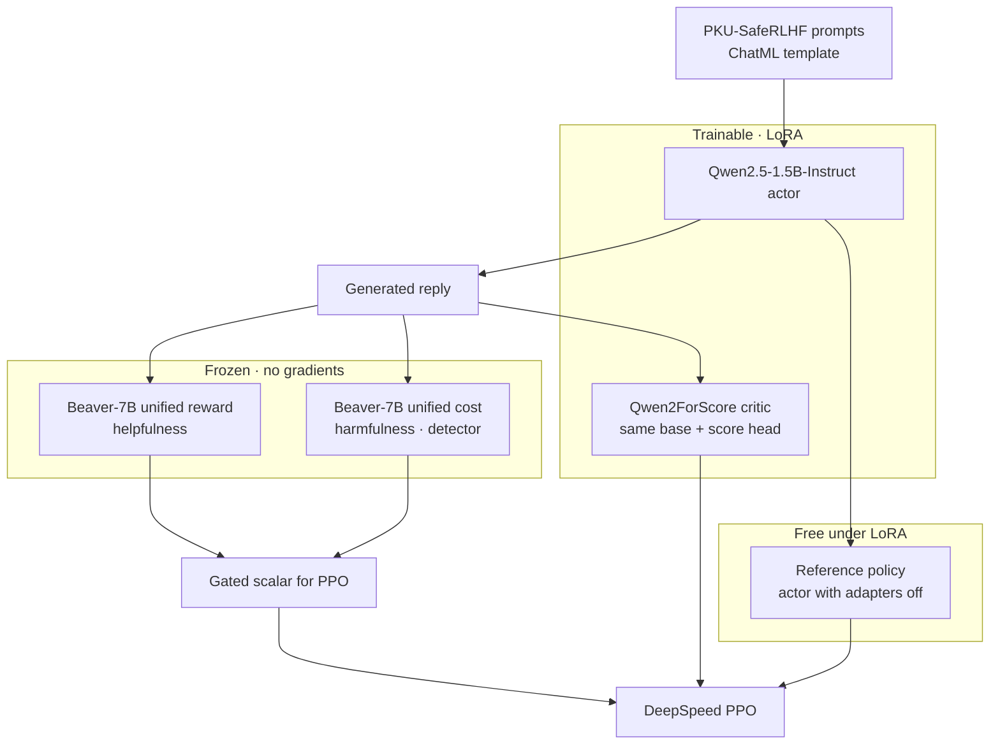

| Role | Model | Trains? |
|---|---|---|
| Actor | Qwen2.5-1.5B-Instruct + LoRA | adapters |
| Reference | same base, adapters disabled | no |
| Critic | `Qwen2ForScore` + LoRA | adapters + score head |
| Reward | `beaver-7b-unified-reward` | frozen |
| Cost (B/C) | `beaver-7b-unified-cost` | frozen |

### 3.2 Stage ladder (how the stack was built)

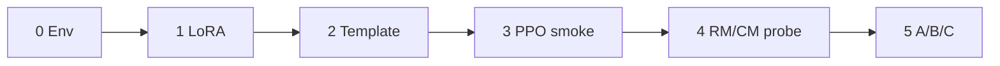

---

## 4. Stage 5 — the gate (shared B and C)

### 4.1 Rollout → score → maybe replace → PPO

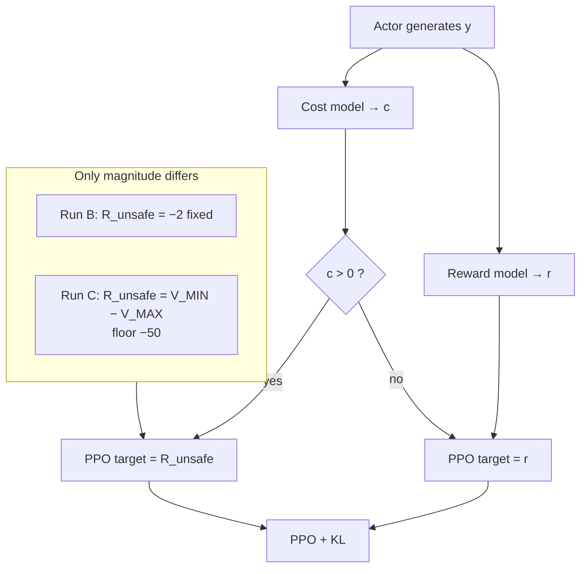

### 4.2 A / B / C isolation

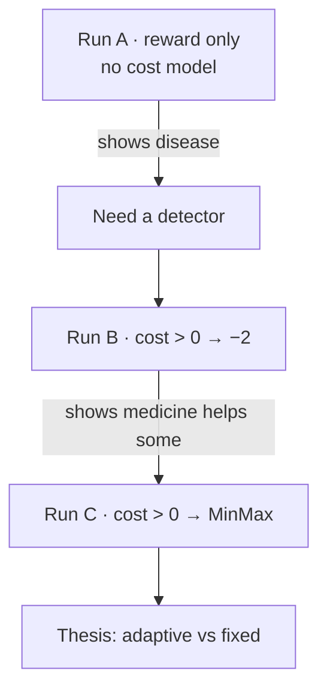

| Factor | A | B | C |
|---|---|---|---|
| Actor / LoRA / data / seed / ChatML | ✓ | ✓ | ✓ |
| Reward model | ✓ | ✓ | ✓ |
| Cost model | — | ✓ | ✓ |
| Trigger | — | `cost > 0` | `cost > 0` |
| Replacement | — | −2 | \(V_{\MIN}-V_{\MAX}\) |

Everything below the line is the **treatment**. Fair MinMax claims are **within one actor family**.

### 4.3 MinMax bound bookkeeping (Run C only)

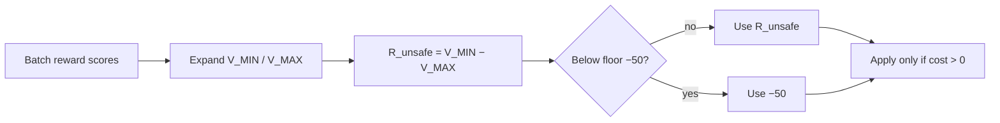

Phase 2 Run C: \(R_{\text{unsafe}}\) settled near **−9.92**; floor never hit. Mean `train/cost` still drifted — adaptive magnitude ≠ “solved drift.”

---

## 5. Optional Llama track (same A/B/C, matched tokenizer)

Qwen + Beaver still **retokenizes** (Qwen vocab ≠ Llama). Optional track uses a Llama-family actor so Beaver RM/CM share vocab and skip `batch_retokenize`.

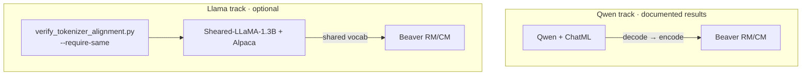

| | Qwen track | Llama track |
|---|---|---|
| Actor | Qwen2.5-1.5B-Instruct | `Sheared-LLaMA-1.3B` |
| Template | ChatML | Alpaca |
| Scoring | `batch_retokenize` | same tokenizer when verify passes |
| Claims | Current A/B/C evidence | Within-track A/B/C only; vs Qwen = ablation |

TinyLlama was rejected: vocab matches Llama-2 except Beaver’s `<pad>`, and `pad_token=</s>` so Safe-RLHF never adds `<pad>`.

---

## 6. End-to-end map (one slide worth of structure)

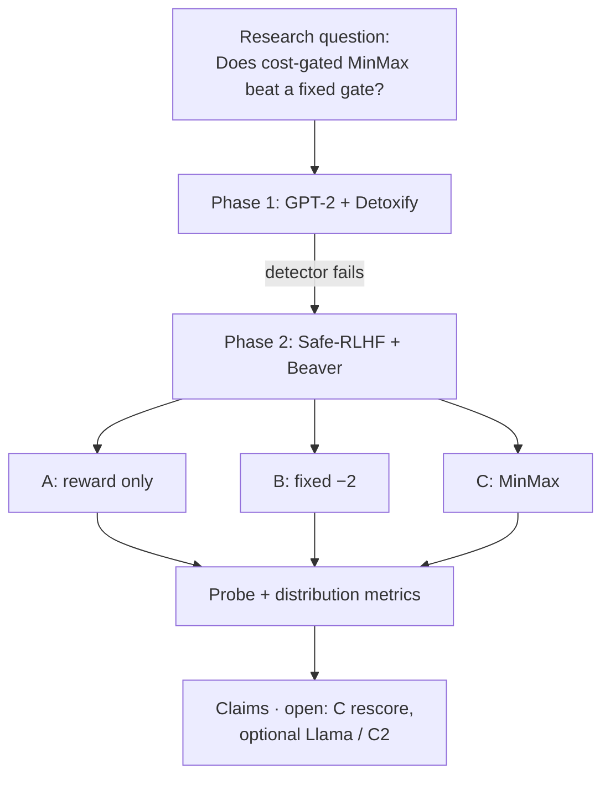

---

## Where to dig next

| Need | Link |
|---|---|
| Research question | [/worklog/01-research-question.md](/worklog/01-research-question.md) |
| Phase 1 chapters | [/worklog/phase1/README.md](/worklog/phase1/README.md) |
| Phase 2 chapters | [/worklog/phase2/README.md](/worklog/phase2/README.md) |
| Reward vs cost | [/worklog/04-reward-vs-cost.md](/worklog/04-reward-vs-cost.md) |
| A/B/C design | [/worklog/textbook/07-abc-design.md](/worklog/textbook/07-abc-design.md) |
| What we can claim | [/worklog/10-claims.md](/worklog/10-claims.md) |
| Foundations one-pager | [/worklog/fundamentals.md](/worklog/fundamentals.md) |
