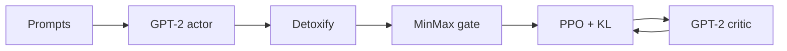
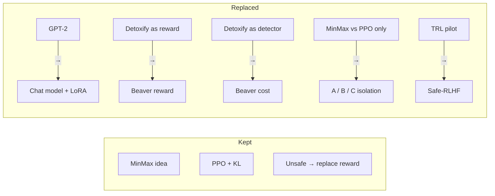
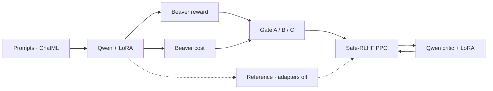
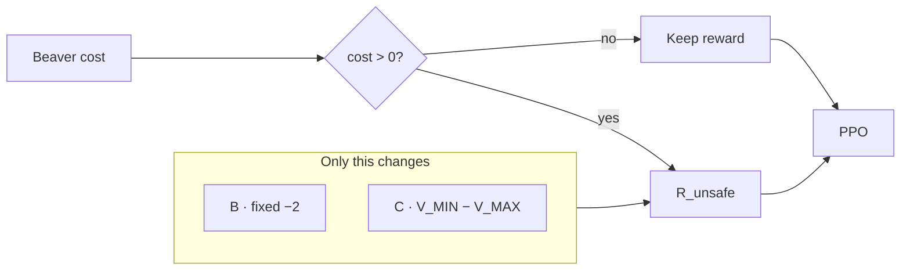
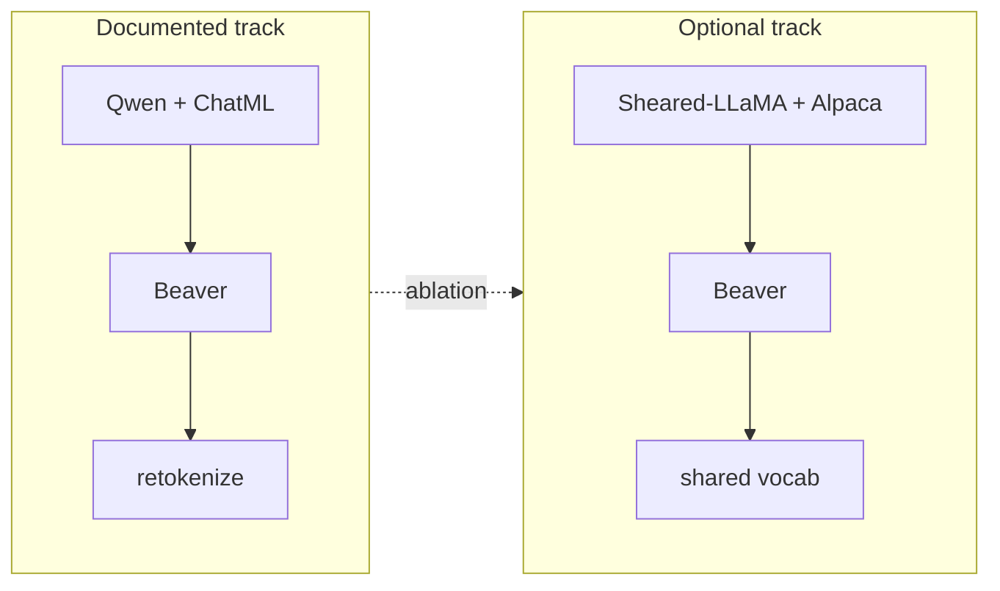

Architecture · stacks for slides

# Architecture — stacks across phases

Wide horizontal pipelines for Google Slides. Each phase is one **stack**; later phases only mark what **replaced** the previous design. Details live in [Phase 1](/worklog/phase1/README.md) and [Phase 2](/worklog/phase2/README.md).

---

## Slide 1 — Phase 1 stack (baseline design)

| Slot | Choice |
|---|---|
| Actor / critic | GPT-2 |
| Signal | Detoxify (reward **and** detector) |
| Safety rule | MinMax vs plain PPO+KL |
| Train loop | TRL |

---

## Slide 2 — What broke → what we replace

---

## Slide 3 — Phase 2 stack (Qwen track)

| Slot | Phase 1 | Phase 2 |
|---|---|---|
| Actor | GPT-2 | **Qwen2.5-1.5B-Instruct + LoRA** |
| Helpfulness | Detoxify \(r=1-2\delta\) | **Beaver reward** |
| Detector | Detoxify | **Beaver cost** (`cost > 0`) |
| Compare | MinMax vs PPO+KL | **A / B / C** |
| Framework | TRL | **Safe-RLHF + DeepSpeed** |

---

## Slide 4 — Gate only (B vs C) — same stack, one swap

| Run | Stack same? | What differs |
|---|---|---|
| **A** | No cost | Reward only |
| **B** | Full stack | \(R_{\text{unsafe}} = -2\) |
| **C** | Full stack | \(R_{\text{unsafe}} = V_{\MIN}-V_{\MAX}\) |

---

## Slide 5 — Optional Llama track (one more swap)

Same A/B/C gate. Only actor family + template + tokenizer path change.

| Slot | Qwen track | Llama track |
|---|---|---|
| Actor | Qwen + ChatML | **Sheared-LLaMA + Alpaca** |
| Scoring | retokenize | **same tokenizer** (verify first) |
| A/B/C | within track | within track |

---

## One-line story for the deck

> Phase 1 proved MinMax under a weak detector. Phase 2 **keeps** the replace-on-unsafe idea and **swaps** the stack: chat actor + Beaver reward + Beaver cost + A/B/C.
