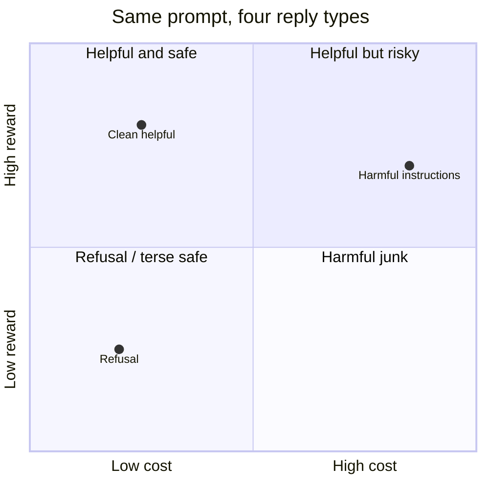
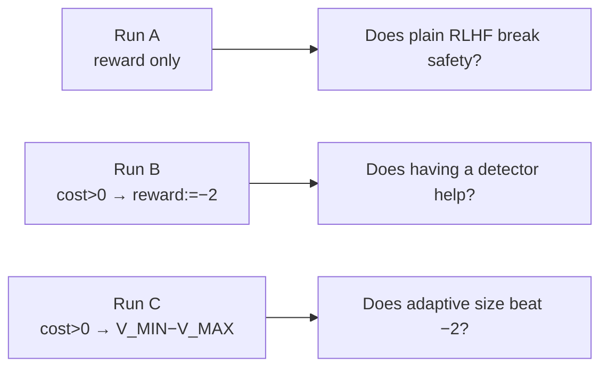

# Foundations — what this project is actually doing

Read this if the codebase feels opaque. It is the concept layer under the [worklogs](/worklog/worklogs/phase2.md). Your runs are summarized in [claims](/worklog/10-claims.md).

---

## 1. The one distinction that unblocks everything

Safe RLHF uses **two** frozen preference models. They answer different questions:

| Model you loaded | Question it answers | Score meaning |
|---|---|---|
| `beaver-7b-unified-`**`reward`** | “How **helpful** is this reply?” | **Higher = more helpful** |
| `beaver-7b-unified-`**`cost`** | “How **harmful / unsafe** is this reply?” | **Higher = more harmful** |

PKU’s slogan: find a model that is **helpful (high reward)** and **harmless (low cost)**.

**Critical:** a refusal often has **low reward** (not helpful) and **low cost** (not harmful). If you gated safety on the *reward* model, you would punish refusals. That is why the detector must be the **cost** model.

### Did you use them as intended?

**Yes.** In Runs B and C:

1. Score the reply with the **reward** model → that is the PPO target when safe.  
2. Score the same reply with the **cost** model → detector only.  
3. If `cost > 0`, **throw away** the reward and replace it with a penalty (−2 in B, \(V_{\MIN}-V_{\MAX}\) in C).  
4. PPO never “maximizes cost.” Cost only decides *whether* to punish.

That matches PKU Safe RLHF’s split and your Stage 4 probe ([reward vs cost](/worklog/04-reward-vs-cost.md)): refusals ~−3 cost, lock-picking instructions ~+4 cost, threshold 0 is the natural boundary.

You are not lost on the science of the gate. The fog is mostly **engineering surface area** (DeepSpeed, LoRA, ChatML, retokenize).

---

## 2. Vocabulary map (papers → your code)

| Concept | Plain meaning | In your project |
|---|---|---|
| **Transformer LM** | Next-token predictor (attention + MLP blocks) | GPT-2 (Phase 1), Qwen2.5-1.5B (Phase 2) |
| **SFT / Instruct** | LM fine-tuned to follow chat instructions | Qwen2.5-**Instruct** base |
| **RLHF** | Further train the LM with a preference-derived reward via RL (usually PPO) | All Stage 5 runs |
| **Reward model (RM)** | Bradley–Terry model on human “chosen vs rejected” pairs → scalar helpfulness | Beaver **reward** |
| **Cost model (CM)** | Same style of model, but pairs labeled for **safety** → scalar harm | Beaver **cost** |
| **Actor** | The policy LM being updated | Qwen + LoRA |
| **Reference** | Frozen copy of the policy (KL anchor so it does not drift into gibberish) | Same weights, adapters off |
| **Critic / value** | Estimates expected return for PPO advantages | `Qwen2ForScore` + LoRA |
| **LoRA** | Train tiny adapter matrices instead of all weights | r=16 on q/v (Phase 2) |
| **PPO** | Stable policy-gradient RL algorithm used in InstructGPT-style RLHF | Safe-RLHF PPO loop |
| **Safe RLHF (Dai et al.)** | Optimize reward under a cost/safety constraint (they use Lagrange / PPO-Lag) | You use their **models + split**, not their Lagrange trainer |
| **MinMax / ROSARL-style gate** | When unsafe, replace reward by \(R_{\text{unsafe}} = V_{\MIN} - V_{\MAX}\) | Run C |

---

## 3. What you actually ran (one page)

| Run | Safety signal | What it isolates |
|---|---|---|
| **A** | None | Helpfulness-only PPO (control) |
| **B** | Cost detector + **fixed** penalty −2 | Value of *having* a gate |
| **C** | Same detector + **MinMax** penalty | Value of *self-calibrating* magnitude |

Phase 1 was the same MinMax idea with a **different detector** (Detoxify toxicity → fake “reward”), on GPT-2. It taught you the detector can be gamed (`"Advertisements"`). Phase 2 moved the detector to Beaver **cost**.

---

## 4. Transformers & RLHF — only what you need

### Language model
A decoder-only transformer assigns \(p(y_t \mid y_{<t}, x)\). Chat templates (ChatML for Qwen) wrap user/assistant turns so the model knows whose turn it is. Wrong template → broken generations (your Alpaca-vs-ChatML lesson).

### Preference model
Humans (or AI labelers) pick which of two replies is better. Train a scalar head with Bradley–Terry loss so  
\(P(y_w \succ y_l) = \sigma(r(x,y_w) - r(x,y_l))\).  
Only **differences** are meaningful; absolute scale is arbitrary unless calibrated.

Beaver **reward** was trained for helpfulness comparisons. Beaver **cost** for harmfulness. Same architecture family, different labels.

### PPO-RLHF loop (cartoon)
1. Sample replies from the actor.  
2. Score them (your gated scalar).  
3. Subtract a KL penalty toward the reference.  
4. Update actor (and critic) with PPO.

MinMax does **not** change steps 1 or 4. It only changes step 2 when the cost detector fires.

---

## 5. Is MinMax even valid in this space?

**As a research question: yes.**  
**As “the” Safe RLHF algorithm: no — it is an alternative mechanism, not PKU’s official method.**

### What would make MinMax a fair claim
You already set this up correctly:

- Same actor, data, seed, template  
- Same **detector** (cost model) and **trigger** (`cost > 0`)  
- Only the **replacement magnitude** differs (B fixed vs C adaptive)

If C beats B on harmlessness without collapsing quality, MinMax earned its keep. If not, that is still a valid negative / partial result.

### What MinMax is *not*
- Not a proof that Lagrange Safe RLHF is wrong  
- Not guaranteed to arrest **average** cost drift (your B and C both still drift)  
- Not immune to a bad detector (Phase 1 Detoxify; Phase 2 Beaver is better but not perfect)

### Why the idea is intellectually legitimate
Unsafe replies often get **high** reward (they look “helpful”). A fixed penalty may be too weak or too strong as training progresses. MinMax says: set the unsafe replacement to the **width of the observed reward range**, so unsafe can never look better than the worst-vs-best gap you have seen. That is a coherent alternative to hand-tuning −2 or running a dual ascent on a Lagrange multiplier.

Your Phase 2 evidence so far: **self-calibration works numerically** (\(R_{\text{unsafe}}\approx -9.92\)); **it does not automatically win the probe vs B**. That is science, not a mistaken codebase.

---

## 6. Papers & concepts to keep on your desk

| Paper / line | Why you care |
|---|---|
| Christiano et al. — Deep RL from human preferences | Preference → reward model |
| Ouyang et al. — InstructGPT | PPO-RLHF recipe everyone copies |
| Bai et al. — Constitutional / helpful+harmless | Helpfulness vs harmlessness tension |
| Dai et al. — Safe RLHF (PKU) | Reward/cost split, Beaver models, PPO-Lag |
| ROSARL / MinMax-style bound penalty (your proposal lineage) | Adaptive unsafe replacement |
| Goodhart’s law / reward hacking | Why `"Advertisements"` and EduNipple appear |

You do **not** need to re-derive transformer math to defend MinMax. You need: RM vs CM, PPO loop, A/B/C isolation, and honest metrics (probe **and** mean cost).

---

## 7. When the codebase feels huge, use this cheat sheet

| Feeling | Look here |
|---|---|
| “Which model is safety?” | Cost = harmfulness. [This page §1](#1-the-one-distinction-that-unblocks-everything) + [Ch. 4](/worklog/04-reward-vs-cost.md) |
| “What was the thesis?” | [Research question](/worklog/01-research-question.md) |
| “What can I claim?” | [Claims](/worklog/10-claims.md) |
| “What did each session conclude?” | [Phase 2 worklog](/worklog/worklogs/phase2.md) |
| “Where is MinMax code?” | `safe_rlhf/algorithms/ppo_cost_minmax/` (gate shared with `ppo_cost_gate`) |
| “OpenRLHF instead?” | They have **RM only** by default; your CM gate would be a custom reward function |

---

## 8. One-sentence orientation

> You train Qwen to be helpful with a **reward** model; when a **cost** model says the reply is harmful (`cost > 0`), you replace that helpfulness score with a penalty — fixed in B, self-calibrating MinMax in C — and ask whether the adaptive penalty is worth it.

That is the whole project. Everything else is scaffolding.
