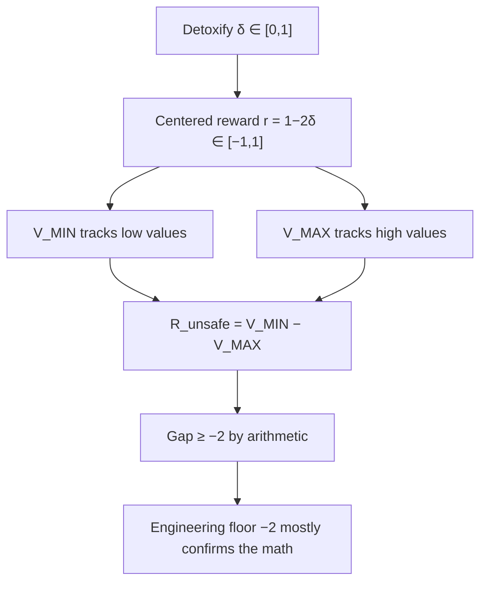
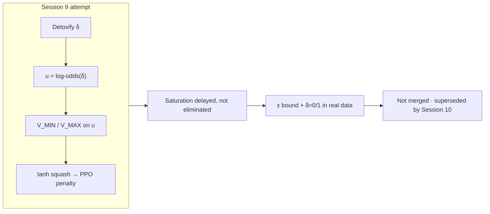

# 2. Bounded reward and saturation

Source sessions: 8–9 · Full text: [/worklog/worklogs/phase1.md](/worklog/worklogs/phase1.md)

Sessions 8–9 answer a question that looks like “why is the floor clipping?” and turns out to be “why can’t self-calibration grow when the detector is bounded?” This is the first deep structural finding of Phase 1 — and the reason Phase 2 moved to a different safety signal. Read the raw session text in [/worklog/worklogs/phase1.md](/worklog/worklogs/phase1.md) if you need the exact wording of the negative result.

## Session 8 — Long-run saturation and the $-2.0$ floor

A 1000-step MinMax run was watched step-by-step: $v_{\min}$, $v_{\max}$, $r_{\text{unsafe}}$, `floor_active`. The goal was diagnostic, not a new algorithm: see whether self-calibration still “grows more negative” the way the ROSARL story suggests.

**Observation.** `r_unsafe_raw` ($V_{\MIN} - V_{\MAX}$) reached $\approx -1.996$ by step ~150 and stayed essentially frozen for the rest of the run.

At first glance that looks like the engineering floor of $-2$ “clipping” the penalty. It is not (mostly). With reward bounded to $[-1, 1]$,

$$
V_{\MIN} - V_{\MAX} \ge -2
$$

is a **mathematical fact**, independent of any clip. The floor mostly confirms that ceiling; it does little independent work once the bounds have approached their extremes.

| Quantity | What the run showed |
|---|---|
| `r_unsafe_raw` by ~step 150 | $\approx -1.996$ |
| Behaviour after that | Essentially frozen through step 1000 |
| Engineering floor $-2$ | Mostly confirming arithmetic, not independently clipping a growing gap |
| Detoxify domain | $\delta \in [0,1]$ by construction |

Finding
Unlike ROSARL’s original dense / unbounded task reward, the LLM adaptation’s reward is bounded by construction (Detoxify ∈ [0,1]). $V_{\MIN}$ / $V_{\MAX}$ inevitably approach their limits early, and self-calibration — “$R_{\text{unsafe}}$ growing more negative over training” — stops meaning anything after that point.

This is structural, not a coding bug. The bookkeeping is doing what the math allows; the math does not allow unbounded growth of the gap under a bounded reward.

**What “self-calibration” was supposed to mean.** In the ROSARL story, $R_{\text{unsafe}}$ grows more negative over training as $V_{\MIN}$ and $V_{\MAX}$ keep separating — a running estimate of how bad “unsafe” looks relative to “safe.” Under Detoxify that story ends by step ~150: once both extremes of $[-1,1]$ have been seen often enough, the gap is stuck at the arithmetic bound. Watching `floor_active` thereafter mostly reports that you are sitting on that bound, not that a new mechanism is clipping a still-growing signal.

Phase 2’s later cost-model probe ([/worklog/phase2/04-reward-cost-and-gpu.md](/worklog/phase2/04-reward-cost-and-gpu.md), then Stage 5) matters partly because Beaver cost scores are *not* trapped in $[0,1]$ the same way — Session 11 of Phase 2 records observed costs roughly in $[-4, +4.3]$, which reopens the empirical question of whether bounds can move across a full run. Run C’s floor of $-50$ ([/worklog/phase2/07-run-c.md](/worklog/phase2/07-run-c.md)) is deliberately chosen so that question stays answerable.

## Session 9 — Unbounded log-odds transform (tried, not merged)

If the problem is the bounded scale, maybe track bounds on an unbounded transform while leaving the PPO reward alone. Session 9 is the controlled attempt to rescue self-calibration without changing Detoxify itself.

**Attempt.** Compute $V_{\MIN}$ / $V_{\MAX}$ on a log-odds transform of implied toxicity

$$
u = \log\frac{1-\delta}{\delta}, \qquad \delta \text{ clipped to } [\varepsilon, 1-\varepsilon],
$$

keep the actual PPO reward unchanged, and squash the derived penalty back for PPO via

$$
\text{penalty} = \texttt{penalty\_floor} \times \tanh\!\left(\frac{-\text{gap}}{\texttt{calibration\_scale}}\right).
$$

**Result.** Saturation was delayed and softened, but not eliminated.

| Why it still fails | Detail |
|---|---|
| $\varepsilon$ re-bounds $u$ | Hard range $\pm\log((1-\varepsilon)/\varepsilon)$ |
| Real data hits extremes | Clean GPT-2 + Detoxify responses routinely score $\delta \approx 0.99+$ |
| Timing | Both $V_{\MIN}$ and $V_{\MAX}$ still hit the $\varepsilon$-ceiling within ~100–150 steps in synthetic tests matched to the real ~12% unsafe-trigger rate |

Caution — Algorithm 1 deviation
The value fed into $V_{\MIN}$ / $V_{\MAX}$ bookkeeping was a synthetic proxy, not the critic’s literal output. That is a real deviation from Algorithm 1. The change was <strong>not</strong> merged into the live codebase; it was superseded by the category-scoped approach in <a href="/worklog/phase1/03-design-choices.md">Design choices</a>. Keep the negative result for the limitations chapter.

**Second structural finding.** No reparameterization of a bounded detector output produces genuinely unbounded self-calibration, because the detector itself (Detoxify) is fundamentally bounded. Re-expressing $\delta$ as log-odds only moves the hard wall to $\varepsilon$; it does not invent information the detector never had.

**Why keep a negative result.** Session 9 is easy to delete from a polished methods chapter — “we tried a transform; it didn’t work.” Keep it. The thesis needs evidence that saturation was *investigated*, not merely noticed: the failure mode is the detector’s range, not a missing tanh. That is also why Phase 2’s move to an unbounded cost detector is a response to a documented limitation, not a random architecture change.

## Why this matters for the rest of Phase 1

Saturation explains why “watch $R_{\text{unsafe}}$ grow more negative” stopped being a useful training diagnostic after ~150 steps. It does *not* yet explain the later Advertisements collapse — that is a separate failure mode (weak KL + gameable proxy) documented in [Advertisements collapse](/worklog/phase1/04-advertisements-collapse.md).

What Sessions 8–9 *do* motivate next:

1. Change how bounds are scoped and sourced (Session 10).
2. Isolate whether fragility lives in PPO itself or only in the auxiliary bookkeeping (Session 12).
3. Treat “bounded detector ⇒ dead self-calibration” as a limitation claim, not a temporary bug.

Full session prose: [/worklog/worklogs/phase1.md](/worklog/worklogs/phase1.md).
