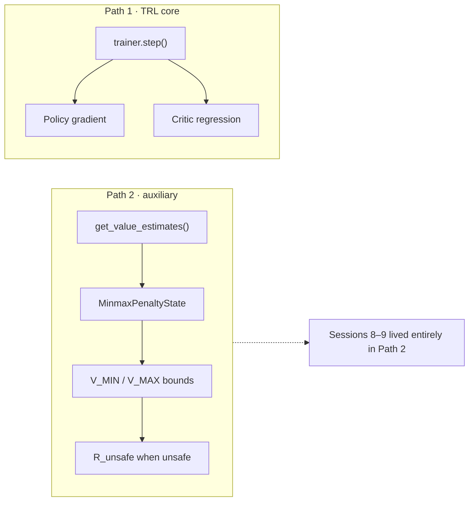
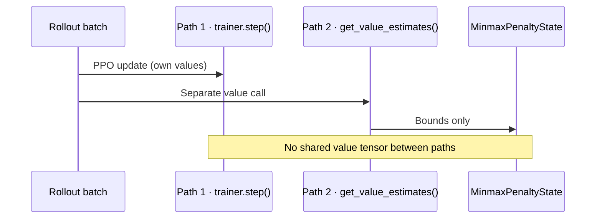

# 3. Design choices after saturation

Source sessions: 10–13 · Full text: [/worklog/worklogs/phase1.md](/worklog/worklogs/phase1.md)

Sessions 10–13 are live engineering responses to the saturation story — and one architectural clarification that matters for how you *defend* the work. Several items here are hypotheses or defaults, not yet confirmed improvements. The chapter marks that distinction carefully. Canonical session text: [/worklog/worklogs/phase1.md](/worklog/worklogs/phase1.md).

## Session 10 — Per-category bounds, reward-only bound source (current default)

After Sessions 8–9 showed that a single global pair of bounds freezes early under Detoxify, `MinmaxPenaltyState` was restructured to give the bookkeeping more degrees of freedom — without claiming that this restores ROSARL-style growth.

| Knob | Default / choice | Meaning |
|---|---|---|
| `bound_scope` | `"category"` | Track $V_{\MIN}$ / $V_{\MAX}$ **per BeaverTails harm category**, not one global pair |
| `bound_source` | `"reward"` | Bounds from the Detoxify reward only by default |
| Optional | `"reward_and_value"` | Fold in critic values only after `critic_warmup_steps` |

**Status.** Not yet evaluated head-to-head against `bound_scope="global"`. This is a **live design choice**, not a confirmed improvement.

**Open task (parked at Phase 1 wrap).** Run a fresh 1000-step MinMax and check whether `v_min` / `v_max` / `r_unsafe_raw` show renewed movement across the full run rather than freezing early the way the global-bounds version did (see [Saturation](/worklog/phase1/02-saturation.md)). Until that ablation exists, treat category scope as “current default in code,” not “proven cure for saturation.”

The design intuition is straightforward: a single global pair mixes categories with very different Detoxify behaviour (Session 14 later shows “Advertisements” rates of 84% on hate_speech vs 4% on violence for baseline). Per-category bounds might keep some categories from freezing while others saturate. That remains a hypothesis until the head-to-head exists. Phase 2 Run C deliberately stays on **global** scope ([/worklog/phase2/07-run-c.md](/worklog/phase2/07-run-c.md)) because PKU categories are not plumbed through the PPO batch — a different engineering constraint, same honesty requirement: say what is default vs what is proven.

## Session 11 — KL asymmetry (baseline $\beta=0.2$, Minmax $\beta=0.01$)

MinMax’s KL coefficient was dropped from matching baseline ($\beta = 0.2$) down to $\beta = 0.01$, on the reasoning that a strong KL anchor and the MinMax penalty both pulling the policy would compete and blur the safety signal.

| Condition | $\beta$ (KL coef) |
|---|---|
| Baseline | 0.2 |
| Minmax (until Session 17) | 0.01 |

**Status at Session 11.** Implemented but **not** tested against a controlled “MinMax at $\beta=0.2$” run. Flagged in the experiment README as an open question.

The hypothesis was plausible: if KL and MinMax fight, the policy might ignore the safety signal. The chronological trap is reading Session 11 as if that story had already been confirmed. It had not. Session 14 later treats the asymmetry as a *candidate* proximate cause of collapse; Session 17 confirms it empirically — MinMax at $\beta=0.2$ recovers diversity and modest harm without Advertisements gaming (see [Advertisements collapse](/worklog/phase1/04-advertisements-collapse.md)).

Caution — later overturned as safe practice
At Session 11 this was still only a hypothesis. Do not read “β=0.01 was a deliberate safety feature” into the record — it was an untested design guess that became the proximate cause of collapse.

## Session 12 — Path 1 vs Path 2 (architectural clarification)

Where does the critic’s value estimate actually go? Session 12 traced every consumer of “value” per step and found two separate, non-communicating paths:

| Path | Consumer | Role |
|---|---|---|
| **Path 1** | TRL `trainer.step()` | Internally recomputes values for the PPO update (policy gradient + critic regression) — standard, unmodified TRL |
| **Path 2** | `get_value_estimates()` → `MinmaxPenaltyState` | Feeds **only** bounds tracking for the safety bookkeeping |

The two paths do not communicate. Every saturation / instability finding from Sessions 8–9 lived entirely in Path 2. Core PPO training (Path 1) was never affected by those bookkeeping pathologies.

Finding
Useful framing for the defense: fragility is isolated to the auxiliary safety-bookkeeping layer, not the underlying RL training loop. Saturation is a Path-2 phenomenon; Advertisements collapse later is a reward-hacking + KL-anchor phenomenon that Path 1 still experiences as ordinary PPO.

## Session 13 — Diagnostic logging expansion

Training scripts began logging quantities that `trainer.step()` already computed and previously discarded. The motivation (supervisor advice): explain *why* KL moves, not only that it did.

| New column | Why it matters |
|---|---|
| `entropy` | Falling entropy $\approx$ policy collapsing |
| `value_loss` | Critic fit quality |
| `policy_loss` | Update magnitude |
| `clipfrac` | Leading indicator before KL spikes |

`plot_results.py` gained `plot_baseline_vs_minmax_diagnostics()` — a combined panel comparing all four between conditions.

**Status.** Added proactively before the next full run. Requires a **fresh baseline** alongside the next MinMax run, because old baseline logs lack these columns. Session 14’s analysis then uses entropy and KL trajectories heavily — exactly the columns this session made durable.

The pedagogical point is the same as Path 1/2: if you only log `reward` and `kl`, you see *that* training went wrong; `entropy` and `clipfrac` are the early fingerprints of *how*. Falling entropy toward 0 is collapse; rising clipfrac is a leading indicator before KL spikes. Session 14’s table (entropy 3.45 → 0.0075 on MinMax vs healthy baseline entropy) is what this instrumentation was for.

## Bridge to the climax

By Session 13 the codebase defaults were: category-scoped, reward-only bounds; $\beta=0.01$ on MinMax vs $0.2$ on baseline; Path 1/2 clarified; richer logs ready. Session 14 then analysed the seed-42 / 1000-step outputs and found that “0% harm” under MinMax was not safety — it was collapse. Continue in [Advertisements collapse](/worklog/phase1/04-advertisements-collapse.md). Full Did / Found / Concluded blocks: [/worklog/worklogs/phase1.md](/worklog/worklogs/phase1.md).
