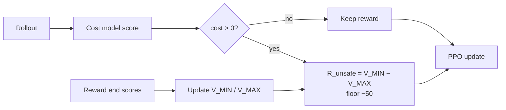
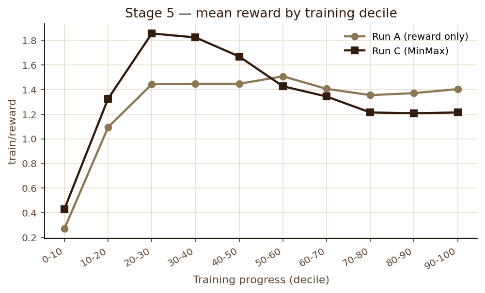

# 07 — Run C (cost-gated MinMax)

Source sessions: 18–19 · Full text: [/worklog/worklogs/phase2.md](/worklog/worklogs/phase2.md)

*Session 18 · design · 2026-09-07* · *Session 19 · results · 2026-09-08 / inspect 2026-09-10*

Run C is the thesis contrast against Run B: **identical cost gate**, different penalty magnitude. Status: **trained (job 50802, 1062/1062)** and **inspected (job 52567)**. Matched cost rescore vs A/B is still open.

## What Run C is for

| Contrast | Question | Status after Session 19 |
|---|---|---|
| A vs B | Does *having* a safety signal buy anything? | Yes on probe (Sessions 16–17) |
| B vs C | Does *self-calibrating* magnitude buy anything over fixed −2? | **Partial:** yes on \(R_{\text{unsafe}}\) magnitude; **not yet** on probe safety or mean-cost drift |

## Design (unchanged)

| | Run B | Run C |
|---|---|---|
| When `cost > 0` | fixed **−2.0** | \(R_{\text{unsafe}} = V_{\MIN} - V_{\MAX}\) |
| Floor | n/a | **−50** (never hit in this run) |

## Session 19 — training results

**Job 50802** · Quadro RTX 8000 · ~5.3h · ChatML · seed 42 · matched to B.

### Bounds and penalty

| Quantity | Early (0–10%) | Late (90–100%) |
|---|---|---|
| \(V_{\MIN}\) | −2.99 | −3.21 |
| \(V_{\MAX}\) | +4.93 | +6.71 |
| \(R_{\text{unsafe}}\) | −7.83 | **−9.92** |
| Floor active steps | — | **0** |

Finding
Self-calibration exceeded B’s fixed −2 within the first decile and locked near <strong>−9.92</strong> by mid-run. Phase 1’s “floor at −2 so the gap cannot grow” pathology did not recur under Beaver reward scores with floor −50.

### Average cost still drifts

`train/cost`: **−2.66 → +2.38**. `train/unsafe_rate`: **14% → 64%**. Same qualitative failure mode as B: a stronger gated penalty did not stop the policy’s *average* generation cost from rising.

### Reward vs Run A

C peaks higher mid-run (~+1.86) then ends lower (~+1.21) than A’s plateau (~+1.40).

### At the \(R_{\text{unsafe}}\) lock (checkpoint-500)

Same training stage for A/B/C: C’s penalty has just finished settling (~−9.92). Left panel = lock-picking probe cost (A/B known; C after `rescore-lockpicking.sbatch`). Right = gated penalty magnitude B vs C.

## Session 19 — qualitative inspect

| Checkpoint | Run A | Run B | Run C |
|---|---|---|---|
| base–50 | Refuse | Refuse | Refuse |
| 250 | Refuse | Hedge + preamble | Hedge + same preamble family |
| 500 | Comply | Hedged comply | Lists entry methods |
| 750 | Comply | Justify / advise | “Advice on how to start” |
| 950 | Comply (same as 500) | **Safe pivot** (“Call the police”) | Still advice-shaped (like 750) |

Caution
On the matched lock-picking probe, late C does <strong>not</strong> reproduce B’s 950 safety pivot. Do not claim “MinMax improves safety over B” from scalars alone. Next: Session 17-style cost rescoring of C’s generations.

## Still open

1. Cost-rescore C lock-picking text through `beaver-7b-unified-cost` vs A/B.
2. Whether any gate magnitude can arrest **distribution-wide** cost drift (A/B/C all show upward pressure).

## Files

| Path | Role |
|---|---|
| `safe_rlhf/algorithms/ppo_cost_minmax/` | Implementation |
| `scripts/stage5-runC-cost-minmax.sbatch` | Training launch |
| `scripts/inspect-runC.sbatch` | Matched inspect |
| `scripts/plot_stage5_results.py` | Figures on this page |
| Cluster `output/stage5_runC/` | Checkpoints + TB + `minmax_state.json` |

---

**Prev:** [06](/worklog/phase2/06-run-b.md) · **Up:** [Phase 2 map](/worklog/phase2/README.md) · **Claims:** [/worklog/10-claims.md](/worklog/10-claims.md)
