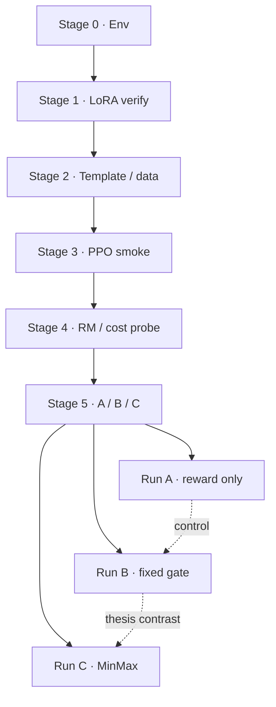

Phase 2 · worklog map

# Phase 2 — Safe RLHF on Qwen + LoRA

Phase 2 reproduces the **official Safe RLHF algorithm shape** (reward model + actor-critic PPO) on **Qwen2.5-Instruct + LoRA**, then adds a cost-gated safety path for the A / B / C comparison. It does **not** adopt PPO-Lag or Lagrangian multipliers for the Stage 5 design — the cost model is used as a **detector**, the role Detoxify played in [Phase 1](/worklog/02-phase1.md).

**Full chronological source (Docsify mirror):** [/worklog/worklogs/phase2.md](/worklog/worklogs/phase2.md) — Sessions 1–18+, Did / Found / Concluded. Edit the repo file `safe-rlhf/worklog.md`, then run `python scripts/sync_worklogs_to_docs.py` before push (see [/worklog/a-updating.md](/worklog/a-updating.md)).

This map is the curated reading order. Prefer chapters for narrative; prefer the worklog for audit.

## Stages → chapters

| Stage | What it closes | Chapter |
|---|---|---|
| **0** | Conda env that imports (`torch`, `transformers`, `peft`, `deepspeed`) | [01](/worklog/phase2/01-reset-and-cluster.md), [02](/worklog/phase2/02-lora-and-mkl.md) |
| **1** | LoRA plumbing verified at runtime | [02](/worklog/phase2/02-lora-and-mkl.md) |
| **2** | Prompt template + dataset path | [03](/worklog/phase2/03-template-and-ppo-loop.md) *(later reversed)* |
| **3** | End-to-end PPO smoke with LoRA | [03](/worklog/phase2/03-template-and-ppo-loop.md) |
| **4** | Reward vs cost probe | [04](/worklog/phase2/04-reward-cost-and-gpu.md) |
| **5** | Runs A / B / C | [05](/worklog/phase2/05-run-a.md)–[07](/worklog/phase2/07-run-c.md) |

## Stage 5 design (A / B / C)

| Run | Signal | Isolates | Status | Chapter |
|---|---|---|---|---|
| **A** | Reward only | Plain RLHF with no safety signal | Complete | [05-run-a](/worklog/phase2/05-run-a.md) |
| **B** | Reward + fixed `−2` when `cost > 0` | What *having* a safety signal buys | Complete + rescored | [06-run-b](/worklog/phase2/06-run-b.md) |
| **C** | Reward + MinMax when `cost > 0` | What self-calibration buys over a fixed penalty | **Trained + inspected**; cost rescore pending | [07-run-c](/worklog/phase2/07-run-c.md) |

A alone cannot support a claim about MinMax. Without B, “Minmax improved safety” is answerable with “you added a harm detector.”

## Chapter index

1. [Reset and cluster](/worklog/phase2/01-reset-and-cluster.md) — Sessions 1–3  
2. [LoRA and the MKL wall](/worklog/phase2/02-lora-and-mkl.md) — Sessions 4–7  
3. [Template and PPO loop](/worklog/phase2/03-template-and-ppo-loop.md) — Sessions 8–10  
4. [Reward, cost, and GPU estate](/worklog/phase2/04-reward-cost-and-gpu.md) — Sessions 11–13  
5. [Run A](/worklog/phase2/05-run-a.md) — Sessions 14–15  
6. [Run B](/worklog/phase2/06-run-b.md) — Sessions 16–17  
7. [Run C](/worklog/phase2/07-run-c.md) — Sessions 18–19  

## Architecture snapshot (locked by Session 4)

| Role | Model | Trains? |
|---|---|---|
| Actor | Qwen2.5-1.5B-Instruct + LoRA | adapters only |
| Reference | same actor, adapters disabled | no (free under LoRA) |
| Reward | `PKU-Alignment/beaver-7b-unified-reward` | frozen |
| Critic | `Qwen2ForScore` on Qwen base + LoRA | adapters + `score_head` |
| Detector (B/C) | `beaver-7b-unified-cost` | frozen |

Skip SFT (Instruct already ships tuned). Skip training a home reward model — use PKU’s released RM.

## Status at a glance

| Milestone | Status |
|---|---|
| Upstream reset + LoRA + smoke PPO | Done |
| Cost model as safety detector | Done (Stage 4 → Stage 5 design change) |
| ChatML template (Session 14 reversal) | Locked for Stage 5 |
| Run A / Run B | Archived; claims in [/worklog/10-claims.md](/worklog/10-claims.md) |
| Run C | Code ready; cluster training pending |

## Related reading

- **Worklog mirror:** [/worklog/worklogs/phase2.md](/worklog/worklogs/phase2.md)  
- Worklog home: [/worklog/README.md](/worklog/README.md)  
- Phase 1 summary: [/worklog/02-phase1.md](/worklog/02-phase1.md)  
- Durable claims (A+B only): [/worklog/10-claims.md](/worklog/10-claims.md)  
- Open questions: [/worklog/11-open-questions.md](/worklog/11-open-questions.md)  
