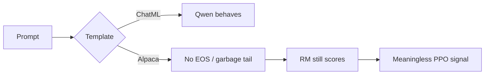

# 1. Language models & transformers

## What a decoder-only LM is

Modern chat models (GPT-2, Llama, Qwen) are **decoder-only transformers**: given tokens \(x_1,\ldots,x_{t-1}\), they predict a distribution over the next token \(x_t\).

\[
p_\theta(x_t \mid x_{<t})
\]

Training (pretrain / SFT) maximizes likelihood of real text. **Generation** samples or argmaxes from that distribution, then feeds the new token back in (autoregression).

You do not need to re-derive multi-head attention to do Safe RLHF. You *do* need:

1. The model is a **conditional distribution over strings**.  
2. Fine-tuning changes that distribution.  
3. Chat **templates** change which tokens the model sees as “user” vs “assistant.”

## Anatomy (expert-minimal)

| Piece | Role |
|---|---|
| Tokeniser | String ↔ integer ids (Qwen’s vocab ≠ Llama’s — this bites Beaver scoring) |
| Embedding | id → vector |
| Blocks | Self-attention + MLP, repeated |
| LM head | Hidden state → vocab logits |
| KV cache | Speeds decoding; irrelevant to your science claims |

**Instruct / chat models** (e.g. `Qwen2.5-1.5B-Instruct`) are base LMs further trained so that, under a chat template, they answer questions instead of continuing web text.

## Why ChatML was load-bearing in your project

Qwen Instruct expects **ChatML** (`<|im_start|>user...`). Alpaca-style `"### Instruction"` is a different dialect.

Under the wrong template your actor:

- may never emit EOS,  
- runs to `max_length`,  
- fills the tail with noise — and the reward model still scores *something*.

That made early Stage 5 numbers **void**. Experts treat template mismatch as a **validity threat**, not a cosmetic bug.

## LoRA in one paragraph

Full fine-tuning of even 1.5B + a 7B RM on one 48 GB GPU is painful. **LoRA** freezes base weights \(W\) and learns low-rank updates \(BA\) so \(W' = W + BA\). You train megabytes of adapters, not the full model. In Phase 2 the **actor** and **critic** use LoRA; Beaver RM/CM stay frozen.

Expert check: LoRA does not change *what* RLHF means — only *what is trainable*. Claims about “Qwen+LoRA Safe RLHF” are still about the RL objective, not about LoRA theory.

## Two tokenisers, one nasty detail

Beaver models are Llama-family. Your actor is Qwen. Safe-RLHF often **decodes** Qwen text then **re-encodes** with the Llama tokeniser for RM/CM (`batch_retokenize`). That can drift. Experts flag it as a measurement caveat whenever scores look weird.

## Expert checklist

- [ ] I can explain autoregressive sampling in one sentence.  
- [ ] I can say why Instruct ≠ base.  
- [ ] I can explain why wrong chat template invalidates RLHF metrics.  
- [ ] I know actor≠RM tokeniser is a real risk in my stack.

**Next:** [Preferences → scalar models](/worklog/textbook/02-preferences-and-scores.md)
