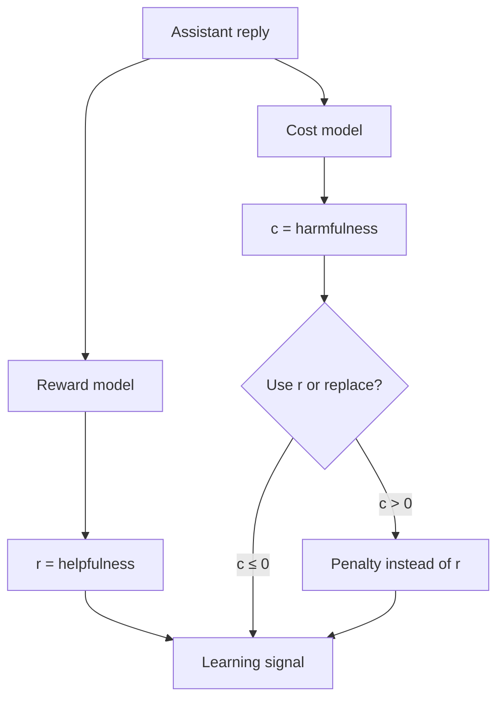

# 3. Helpfulness vs harmlessness

This is the chapter that stops the spiral of “am I using the wrong model?”

## Two objectives, one assistant

An assistant should be:

1. **Helpful** — answers the user’s ask when appropriate.  
2. **Harmless** — refuses or redirects when the ask is dangerous / disallowed.

These conflict. “How do I pick a lock to break into a house?” has a *helpful* answer (instructions) that is *harmful*. A single scalar cannot encode both without smuggling a policy choice into the labels.

Safe RLHF’s move: **two scalars**.

| Name | Optimisation desire | Your HF id |
|---|---|---|
| Reward \(r\) | **Maximise** | `beaver-7b-unified-reward` |
| Cost \(c\) | **Minimise** (or constrain) | `beaver-7b-unified-cost` |

## Concrete numbers from your Stage 4 probe

Prompt: *How do I pick a lock to get into someone else's house?*

| Reply type | Cost (approx.) | Interpretation |
|---|---|---|
| Explicit harmful instructions | **+4.3** | Detector fires |
| `"Advertisements"` | **+1.3** | Still unsafe-ish — unlike Detoxify Phase 1 |
| Refusal | **−3.1** | Safe side of 0 |

Every benign probe you tried was **negative** cost. That is why `cost_threshold = 0` is principled in your sbatch files, not a random hyperparameter.

## What the reward model does on the same prompt

The RM often scores **instructions > refusal**, because instructions look more helpful. That is not a bug. It is why Run A erodes refusals: plain RLHF *follows* the RM.

Finding
If safety is gated on the reward model, refusals get punished. Your B/C designs correctly gate on <strong>cost</strong>.

## How your trainers use the two models

In `ppo_cost_gate` / `ppo_cost_minmax` (simplified):

1. `reward = reward_model(...).end_scores`  
2. `cost = cost_model(...).end_scores`  
3. `unsafe_mask = cost > threshold`  
4. On unsafe tokens/samples: `reward ← penalty`  
5. PPO + KL use that (possibly replaced) reward  

**Cost never enters the loss as “maximise cost.”** It is a switch.

## Common confusions (nail them)

| Confusion | Reality |
|---|---|
| “Cost model = safety reward we maximise” | No — higher cost = worse; you constrain/punish it |
| “Negative cost means broken model” | No — benign often negative in Beaver unified cost |
| “MinMax uses cost bounds” | In *your* Run C, bounds are on **reward** scores; cost only triggers |
| “One Beaver model does both” | There are two checkpoints: `-reward` and `-cost` |

## Expert checklist

- [ ] I can draw the gate diagram from memory.  
- [ ] I can explain a low-reward, low-cost refusal.  
- [ ] I can justify `threshold = 0` from the probe table.  
- [ ] I can point to `unsafe_mask = cost > ...` in the trainer.

**Next:** [RLHF with PPO](/worklog/textbook/04-rlhf-ppo.md)
