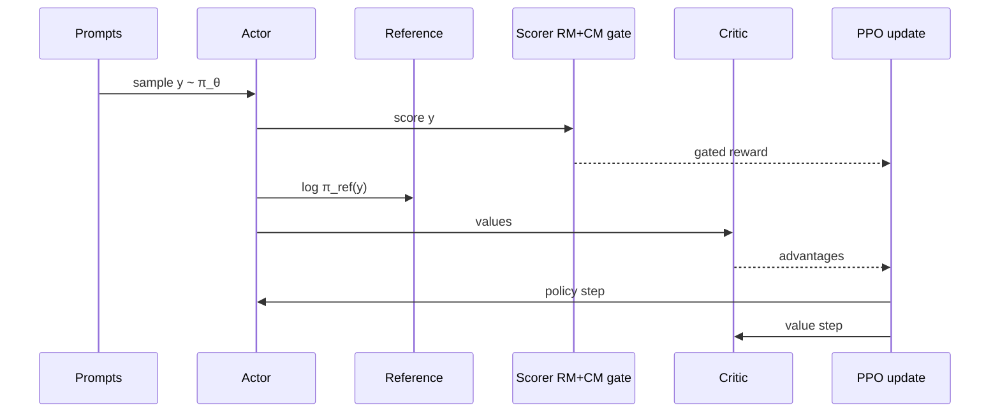

# 4. RLHF with PPO

## The problem RLHF solves

SFT teaches imitation. It does not directly optimise “what humans prefer among many possible replies.” **RLHF** adds a second stage: sample from the policy, score with a preference model, update the policy to raise expected score — with a brake so it does not leave the language manifold.

## Four networks (your Stage 5 cast)

| Name | Trainable? | Job |
|---|---|---|
| **Actor** \(\pi_\theta\) | Yes (LoRA) | Generate replies |
| **Reference** \(\pi_{\text{ref}}\) | No | KL anchor = “stay near SFT/Instruct” |
| **Reward (or gated scalar)** | No (frozen Beaver) | Provides \(r\) (possibly replaced) |
| **Critic** \(V_\phi\) | Yes (LoRA + head) | Estimates value for advantages |

## The scalar that PPO sees

For each prompt–reply, form a reward. In vanilla RLHF that *is* the RM score (often shaped). In your B/C runs:

\[
\tilde{r} =
\begin{cases}
r_{\text{RM}}(x,y) & \text{if } c(x,y) \le 0 \\
R_{\text{unsafe}} & \text{if } c(x,y) > 0
\end{cases}
\]

Then add a **KL penalty** toward the reference (coefficient \(\beta\)):

\[
r_{\text{total}} = \tilde{r} - \beta \big(\log \pi_\theta(y\mid x) - \log \pi_{\text{ref}}(y\mid x)\big)
\]

(Exact placement of KL varies by codebase; the idea is universal: without it, policies chase RM quirks into gibberish.)

## PPO in one screen

1. Collect a batch of on-policy samples.  
2. Compute advantages \(\hat{A}\) (GAE from critic residuals).  
3. Policy loss: clipped importance-ratio times advantage (PPO clip).  
4. Value loss: critic matches returns.  
5. Repeat.

You do not need to re-implement PPO to be an expert on *your* thesis. You need to know: **MinMax only changes \(\tilde{r}\) on unsafe samples.** Actor/critic/KL machinery is shared across A/B/C.

## Why Run A still matters

Run A sets \(R_{\text{unsafe}}\) unused — pure RM. If refusals die and reward rises via verbosity/fabrication, that demonstrates the **RM incentive**, not a bug in MinMax. Experts always show this control before claiming a safety method “worked.”

## Hyperparameters that actually bite

| Knob | Why experts care |
|---|---|
| \(\beta\) / `kl_coeff` | Too small → hacking/collapse; too large → no learning |
| `max_length` / EOS behaviour | Template bugs masquerade as algorithms |
| Batch size | Noisy advantages; unstable KL controllers (Phase 1 lesson) |
| LoRA rank / targets | Capacity; rarely the first place safety fails |

## Expert checklist

- [ ] I can name actor, reference, critic, scorer and say what is frozen.  
- [ ] I can write \(\tilde{r}\) for A vs B vs C.  
- [ ] I know MinMax does not replace PPO — it replaces unsafe rewards.  
- [ ] I can explain KL as a trust-region / stay-near-prior idea in one sentence.

**Next:** [Safe RLHF (PKU)](/worklog/textbook/05-safe-rlhf.md)
