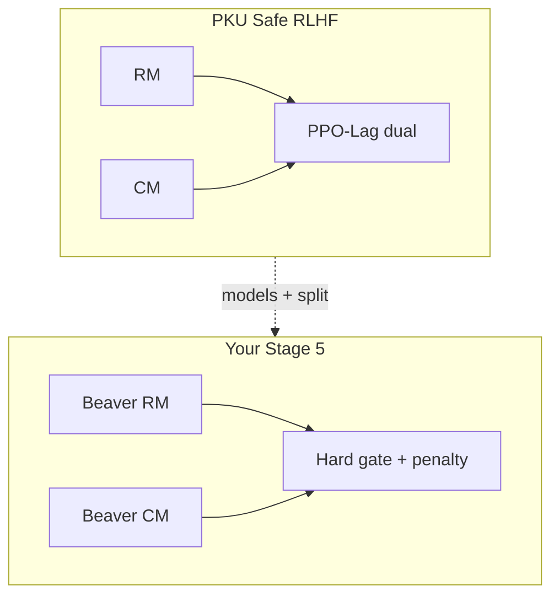

# 5. Safe RLHF (PKU) — what you inherited

## The paper’s problem statement

**Safe RLHF** (Dai et al., PKU-Alignment) argues that a single reward model conflates helpfulness and harmlessness. They collect **separate** preference data and train:

- a **reward model** for helpfulness,  
- a **cost model** for harmfulness,

then optimise the policy to raise reward while **constraining** cost (their main algorithm family: **PPO-Lag** / Lagrangian).

Beaver-7B and the `unified-reward` / `unified-cost` checkpoints are artifacts of that line of work.

## What you reused

| Inherited | Role in your thesis |
|---|---|
| Reward / cost **split** | Conceptual backbone |
| Beaver **unified** RM & CM | Frozen scorers |
| PKU SafeRLHF **prompts/data** | Stage 5 training distribution |
| Safe-RLHF **codebase** (PPO plumbing, DeepSpeed) | Engineering host |

## What you did *not* copy

| PKU default | Your Stage 5 |
|---|---|
| PPO-Lag (learn a Lagrange multiplier for the cost constraint) | **Hard gate**: if `cost > 0`, replace reward |
| Often Alpaca-7B-centric actors | **Qwen2.5-Instruct + LoRA** |
| Cost as continuous constraint in the dual | Cost as **detector** for MinMax / fixed penalty |

So a reviewer can say: “This is Safe-RLHF **models and data**, with a **ROSARL-style gated penalty** instead of PPO-Lag.” That is accurate and strong — do not claim you “reimplemented Safe RLHF entirely.”

## Why a hard gate is still “Safe RLHF flavoured”

Both approaches agree on:

1. Two scalars with different semantics.  
2. Harmfulness must limit unchecked helpfulness.  
3. Evaluation should watch **safety and helpfulness**, not reward alone.

They disagree on the **mechanism** that couples the scalars. Your contribution lives in that disagreement: fixed vs MinMax **replacement**, not dual ascent.

## Beaver on Qwen — the transplant caveat

Beaver was trained in a Llama / Alpaca-response world. You score **Qwen** prose (after retokenize). Stage 4 probes suggested the **cost** ordering still worked on your lock-picking strings. Experts still say out loud: absolute scale and fine-grained rankings may shift under domain transfer. That is why matched **A/B/C** comparisons (same scorer) are more trustworthy than cross-paper absolute numbers.

## Expert checklist

- [ ] I can contrast PPO-Lag vs hard gating in two sentences.  
- [ ] I never say “we ran Safe RLHF” when I mean “we used Beaver + a gate.”  
- [ ] I can name what was inherited vs invented.  
- [ ] I can list one risk of RM/CM transplant to Qwen.

**Next:** [MinMax — mechanism & validity](/worklog/textbook/06-minmax.md)
