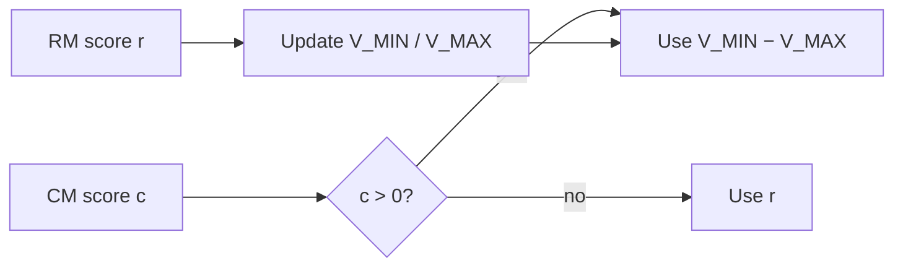

# 6. MinMax — mechanism & validity

## The mechanism (your Run C)

Maintain running bounds on a value signal — in your launch, **reward-model end scores**:

\[
V_{\MIN} \leftarrow \min(V_{\MIN}, r_{\text{batch}}),\quad
V_{\MAX} \leftarrow \max(V_{\MAX}, r_{\text{batch}})
\]

When the **cost** detector fires (`cost > 0`), replace the sample’s reward with

\[
R_{\text{unsafe}} = V_{\MIN} - V_{\MAX}
\]

(optionally floored, e.g. at \(-50\)). Safe samples keep \(r_{\text{RM}}\).

Intuition: \(V_{\MAX} - V_{\MIN}\) is the **width** of observed rewards. Setting unsafe reward to the negative width makes “being unsafe” as bad as the gap between the best and worst helpful scores seen so far — and the penalty **deepens** if the RM range expands.

## What must be true for MinMax to be a fair test

| Requirement | Your design |
|---|---|
| Same detector as the fixed-penalty baseline | Beaver cost, both B and C |
| Same trigger | `cost > 0` |
| Only magnitude differs | B: −2 · C: \(V_{\MIN}-V_{\MAX}\) |
| Floor does not secretly force C≈B | Floor −50, not −2 |
| Bounds can move | Beaver rewards unbounded enough; they did move |

If any row fails, “MinMax helped” collapses into “we changed the detector” or “we clamped C to look like B.”

## Validity: when the research question is real

**Valid question:**  
*Given this cost detector, does an adaptive replacement beat a fixed −2 on harmlessness (and not destroy helpfulness)?*

**Invalid overclaim:**  
*MinMax is the correct solution to Safe RLHF / replaces PPO-Lag / solves reward hacking.*

Phase 1 already showed invalidity of a stronger claim under **Detoxify**: when the detector is gameable, MinMax and PPO+KL look alike because the policy escapes the gate (`"Advertisements"`). Phase 2 asks whether a **better detector** resurrects the mechanism.

## What your Run C numbers say (expert reading)

| Observation | Interpretation |
|---|---|
| \(R_{\text{unsafe}} \to \approx -9.92\) | Self-calibration **fires**; exceeds B’s −2 |
| Floor never hit | −50 backstop did not dominate |
| Mean `train/cost` still rises | Adaptive magnitude ≠ solved average drift |
| Probe text at 950 not clearly better than B | **Do not** claim MinMax wins on safety from scalars alone |

So: MinMax is **empirically operative** and **scientifically contestable** — exactly where a thesis contribution should sit.

## Bounds on reward vs bounds on cost

Your code updates bounds from **reward** scores (`bound_source=reward`). Cost only gates. A different design could bound cost or advantage; that would be another paper. When speaking, say “reward-bounded MinMax penalty triggered by cost,” not “MinMax on the cost model.”

## Expert checklist

- [ ] I can write \(R_{\text{unsafe}}\) and say what is updated each step.  
- [ ] I can state the matched B-vs-C null hypothesis.  
- [ ] I can explain why floor −2 would invalidate the contrast.  
- [ ] I can separate “penalty moved” from “policy got safer.”

**Next:** [Your A/B/C instrument](/worklog/textbook/07-abc-design.md)
