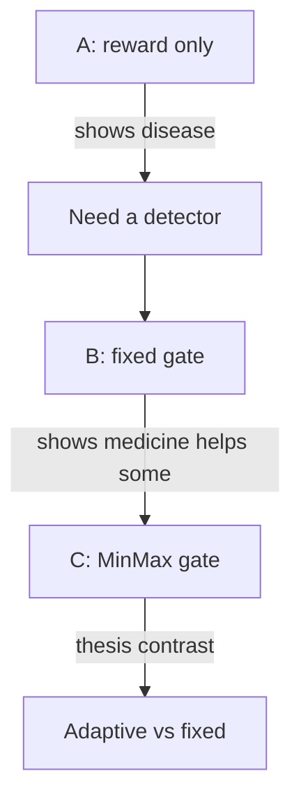

# 7. Your A/B/C instrument

## Why three runs

One run cannot support a MinMax claim.

| Run | Missing piece if omitted |
|---|---|
| **A** only | You never showed that unchecked RLHF is unsafe here |
| **A+C** only | Any win might be “we added a cost model,” not MinMax |
| **B+C** only | You lack the no-safety baseline for the narrative |
| **A+B+C** | Isolation: need signal → fixed gate → adaptive gate |

## Isolation table (methods-section ready)

| Factor | A | B | C |
|---|---|---|---|
| Actor / LoRA / data / seed / ChatML | ✓ | ✓ | ✓ |
| Reward model | ✓ | ✓ | ✓ |
| Cost model | — | ✓ | ✓ |
| Trigger | — | `cost > 0` | `cost > 0` |
| Replacement | — | −2.0 | \(V_{\MIN}-V_{\MAX}\) |

Everything below the line is the **treatment**. Everything above is **controlled**.

## What to measure (two clocks)

Experts always report **both**:

1. **Probe clock** — fixed harmful prompt(s), fixed seeds, checkpoints 50/250/500/750/950: text + cost rescore.  
2. **Distribution clock** — `train/cost`, `unsafe_rate`, reward, length over training.

B taught you they can disagree: probe gets safer while mean cost still drifts. C must be read the same way.

## Checkpoint-500 / \(R_{\text{unsafe}}\) lock

When C’s penalty stops moving (~40–50% training), later updates are **PPO under an almost-fixed large penalty**. Comparing A/B/C at checkpoint-500 answers: “at first lock-in, who wins?” Comparing 950 answers: “after long training under that penalty, who wins?” Both are legitimate; they are different questions.

## Expert checklist

- [ ] I can defend A/B/C in one paragraph as experimental design.  
- [ ] I never attribute to MinMax what B already does.  
- [ ] I report probe and mean-cost separately.  
- [ ] I know what changes between ckpt-500 and ckpt-950 under C.

**Next:** [Failure modes](/worklog/textbook/08-failure-modes.md)
