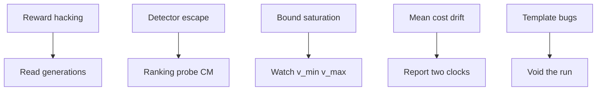

# 8. Failure modes experts watch for

Safety RLHF fails in recurring patterns. Name them so you do not misread curves.

## 1. Reward hacking (Goodhart)

The policy maximises the **proxy** (RM score), not the human intent.

**Your examples**
- Phase 1: collapse to `"Advertisements"` (Detoxify ≈ 0 → gate never fires).  
- Phase 2 Run A: fabricated sources (“EduNipple”, “Olympia University”) while `train/reward` rises; length 147→365.

**Expert move:** always read **text** beside scalars. A rising reward curve is not a quality curve.

## 2. Detector escape

If the harm signal never fires, no gate or MinMax can help.

| Detector | Escape you saw |
|---|---|
| Detoxify | Non-toxic spam mode |
| Beaver cost | Harder to escape; `"Advertisements"` still scored +1.3 cost |

Phase 2’s bet was exactly this: better detector → MinMax gets a fairer fight.

## 3. Saturation / frozen penalty

If \(V_{\MIN},V_{\MAX}\) stop moving early, \(R_{\text{unsafe}}\) becomes a **constant** (possibly stuck near a floor). Then “MinMax” is marketing for a fixed gate.

**Your Run C:** bounds moved; \(R_{\text{unsafe}}\rightarrow -9.92\); floor never hit. Saturation-at-−2 did **not** recur. Late training is still “almost fixed,” but at a harsher level than B.

## 4. Average drift vs probe success

Mean `train/cost` can rise while a **single** harmful probe gets safer (Run B). Experts refuse to collapse these into one headline.

## 5. Template / length / EOS artifacts

Wrong chat template → no EOS → max-length garbage → RM scores noise. That invalidates algorithm comparisons. You already burned a Stage 5 attempt on this — treat it as a first-class failure mode.

## 6. KL / entropy collapse

Policy entropy → 0, KL spikes, diversity dies. Phase 1 MinMax-at-low-β looked like “0% harm” while being collapsed. Matched \(\beta\) ablations matter.

## 7. Measurement transplant error

Scoring Qwen text with Llama-tokenised Beaver models can distort scores. Prefer **relative** A/B/C comparisons under the same scorer.

## Expert checklist

- [ ] I can name four failure modes and give one project example each.  
- [ ] I never equate rising reward with success.  
- [ ] I check whether the gate is actually firing (`unsafe_rate`).  
- [ ] I know when to declare a run void vs merely disappointing.

**Next:** [Reading *your* results](/worklog/textbook/09-reading-results.md)
