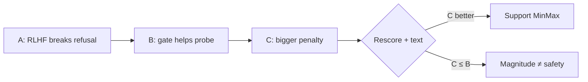

# 9. Reading *your* results like an expert

Narrate Stage 5 the way a careful reviewer would — not the way a hype deck would.

## Run A — disease confirmed

- Reward ↑ then plateaus; length tracks it.  
- Lock-picking: refuse → **comply at ~500** and stay compliant.  
- Benign answers degrade (fabrication) while RM applauds.

**Claimable:** helpfulness-only PPO erodes refusal here; a cost signal is motivated.  
**Not claimable:** anything about MinMax.

## Run B — medicine helps on the probe

- Same probe: late B lower **cost** than A; 950 pivots toward non-compliance.  
- Shared safety preamble exists; Session 17 showed the A/B gap is **not** only phrasing.  
- Mean generation cost still drifts up across training.

**Claimable:** fixed gate helps on this probe; does not arrest average drift.  
**Not claimable:** “B solved Safe RLHF.”

## Run C — mechanism worked; superiority unproven

- \(R_{\text{unsafe}}\approx -9.92\) (≫ B’s −2); floor unused; bounds moved.  
- `train/cost` −2.7→+2.4; `unsafe_rate` 14%→64% — drift persists under a harsher penalty.  
- Qualitative 950: still advice-shaped; **does not** clearly beat B’s police pivot.  
- Cost rescore of C vs A/B still the missing quantitative nail.

**Claimable:** self-calibration operates; Phase-1-style floor freeze did not bind.  
**Not claimable (yet):** “MinMax improves safety over B.”

## How to say it in a talk (safe wording)

> Plain RLHF removes refusals. A cost gate recovers some probe safety but average cost still rises. MinMax grows a much stronger penalty than our fixed −2 baseline; whether that improves harmlessness over the fixed gate is still judged by matched cost rescoring and qualitative inspection — scalars alone are not enough.

## Figures to keep in the appendix

| Figure | Point |
|---|---|
| [Reward A vs C](/worklog/assets/figures/stage5_reward_A_vs_C.png) | Different reward trajectories |
| [C cost + unsafe](/worklog/assets/figures/stage5_runC_cost_unsafe.png) | Drift under MinMax |
| [Bounds vs −2](/worklog/assets/figures/stage5_runC_minmax_bounds.png) | Calibration worked |
| [At lock A/B/C](/worklog/assets/figures/stage5_at_runC_lock.png) | Matched stage comparison |
| [Probe A vs B](/worklog/assets/figures/stage5_probe_cost_A_vs_B.png) | B helps on probe |

## Expert checklist

- [ ] I can give the three-run story in under two minutes without overclaiming C.  
- [ ] I separate “penalty moved” from “safer policy.”  
- [ ] I know which figure supports which sentence.  
- [ ] I can list what result would falsify a MinMax win.

**Next:** [Papers & further study](/worklog/textbook/10-papers.md)
