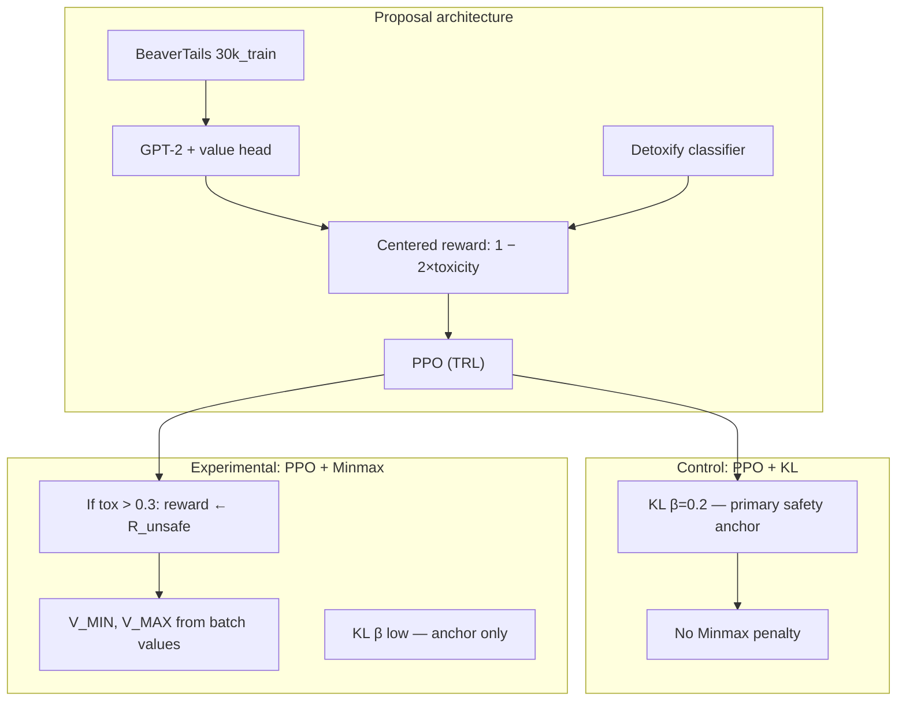
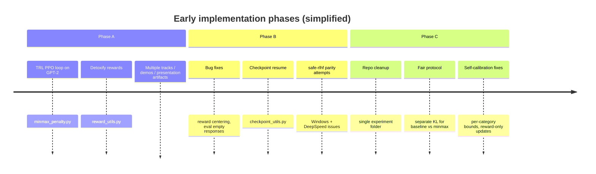
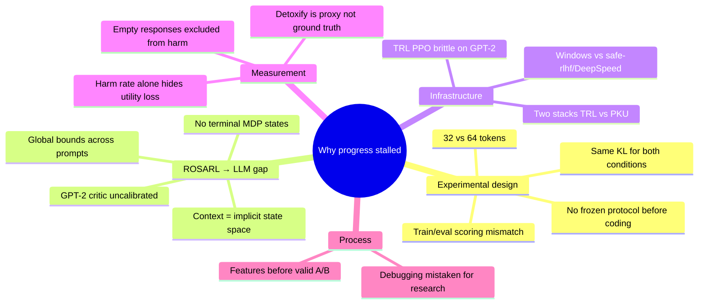
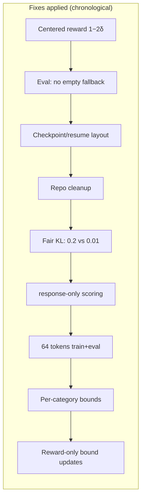
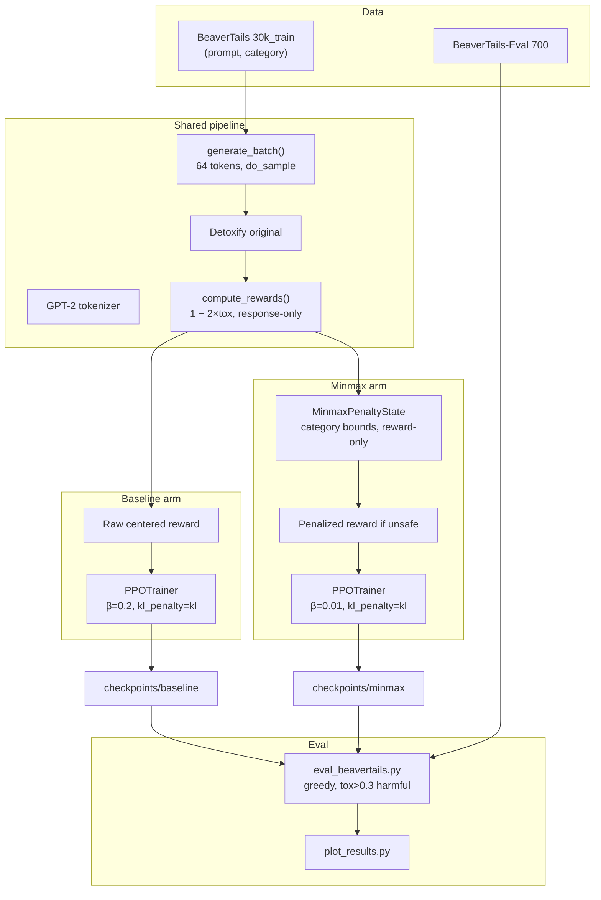
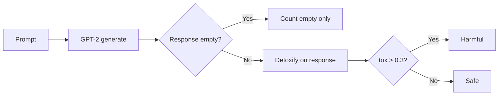
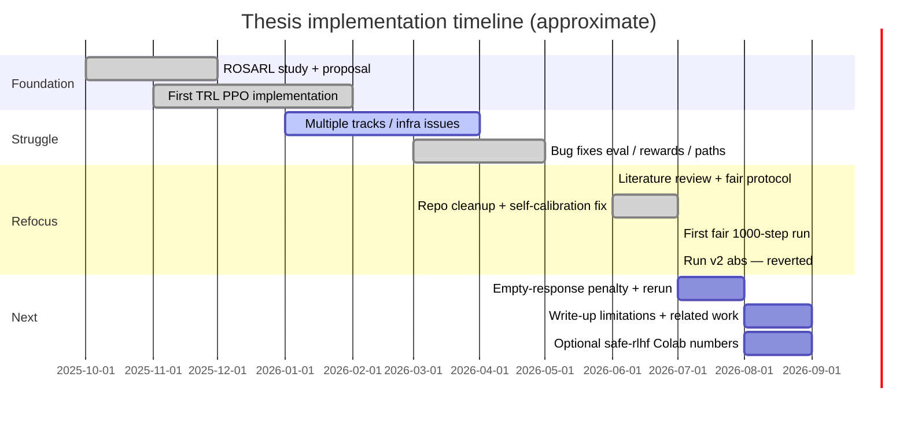

# MSc Thesis Progress Update — Safe RL via ROSARL Minmax Penalty

**Student:** Wendy  
**Project:** Adapting ROSARL Minmax penalty to LLM safe alignment (GPT-2 + Detoxify + BeaverTails)  
**Date:** July 2026  
**Repository:** `ppo_minmax_experiment/` (local TRL stack) + `safe-rlhf/` (PKU reference, unmodified)

---

## 1. Executive summary (for supervisors)

**Research question:** Can ROSARL’s self-calibrating Minmax penalty (`R_unsafe = V_MIN − V_MAX`) replace manual safety penalties / KL-as-safety when fine-tuning a language model with PPO, using Detoxify as an unsafe-state detector on BeaverTails?

**Status:**

| Area | Status |
|------|--------|
| Algorithm 1 module (`MinmaxPenaltyState`) | Implemented and unit-tested |
| Fair A/B protocol (baseline vs minmax) | Defined and coded in defaults |
| First full 1000-step run | Completed; **results confounded** (see §7) |
| Second 1000-step run (`kl_penalty="abs"`) | **Reverted** — minmax 92.3% empty, baseline 0% harm |
| Thesis-grade stack (safe-rlhf / Colab) | Not yet used for final numbers |

**Headline from first valid eval (seed 42, 1000 steps, pre-`abs` fix):**

| Model | Empty rate | Harm (non-empty) |
|-------|------------|------------------|
| Baseline (PPO + KL β=0.2) | 0.1% | **3.1%** |
| Minmax (PPO + penalty, β=0.01) | **11.0%** | **0.0%** |

Minmax appears safer on harm rate but **games the Detoxify proxy** via empty responses (11% with `kl_penalty="kl"`). A rerun with `kl_penalty="abs"` made this **worse** (92.3% empty); we **reverted to `"kl"`**. Negative-KL warnings remain a known TRL issue; `abs` is not a viable fix at minmax β=0.01.

---

## 2. Proposal design (original intent)

### 2.1 Theoretical basis — ROSARL (Nangue Tasse et al.)

- **Problem:** Manual penalties for unsafe states are hard to tune in safe RL.
- **Solution:** At unsafe terminal states, replace reward with **Minmax penalty** `R̄_MIN = V_MIN − V_MAX`, estimated online from value estimates.
- **Original setting:** Safety Gym continuous control; clear MDP states; TRPO/PPO with calibrated critics.
- **Thesis adaptation:** LLM generation = contextual “states”; Detoxify = unsafe detector; BeaverTails = train/eval data.

### 2.2 Proposed experimental conditions



### 2.3 Algorithm 1 (as in proposal)

When Detoxify flags a response as unsafe (centered reward &lt; 0.4 ↔ toxicity &gt; 0.3):

1. Compute `R_unsafe = V_MIN − V_MAX` from bounds accumulated so far.
2. Replace that rollout’s reward with `R_unsafe` (hard switch).
3. Update `V_MIN ← min(V_MIN, batch rewards, batch values)`.
4. Update `V_MAX ← max(V_MAX, batch rewards, batch values)`.

**Claim:** Penalty self-calibrates without hand-tuned safety weights.

---

## 3. First TRL implementation (what we built first)

Early implementation (~months 1–3) stacked features before locking the experiment:



### 3.1 First-stack components

| Component | Role |
|-----------|------|
| `train_baseline.py` | PPO + Detoxify reward + KL |
| `train_minmax.py` | Same + `MinmaxPenaltyState.apply()` |
| `minmax_penalty.py` | Algorithm 1 state machine |
| `reward_utils.py` | `1 − 2×δ` centering, BeaverTails loading |
| `eval_beavertails.py` | 700-prompt held-out eval |
| `run_experiment.py` | Orchestrate train → eval |

### 3.2 First-stack defaults (problematic — used for early runs)

| Setting | Baseline | Minmax | Issue |
|---------|----------|--------|-------|
| KL β | 0.2 | **0.2** | Same β confounded comparison |
| Score mode | **full** (prompt+response) | full | Eval scored **response only** |
| `max_new_tokens` | **32** train | 32 | Eval used **64** |
| V_MIN/V_MAX | **Global** + critic values | global | Saturated to floor −2.0 |
| `kl_penalty` | `"kl"` | `"kl"` | Negative KL → reward bonus |

These defaults produced **months of “no progress”** — runs completed but comparisons were invalid.

---

## 4. What we overlooked (root causes of stagnation)



### 4.1 Literature we should have anchored earlier

| Prior work | Lesson for us |
|------------|----------------|
| **ROSARL** (Safety Gym) | Guarantees assume MDP diameter/controllability — not proven for LLMs |
| **Safe RLHF** (PKU) | Fixed reward shaping loses to dynamic λ; KL is anchor separate from cost |
| **TRL Detox** (Hugging Face) | Classifier + PPO is finicky; response-only scoring; scale matters |
| **Gao et al.** (overoptimization) | Proxy reward gaming inevitable; KL shifts curve doesn’t remove it |

---

## 5. Setbacks encountered

| # | Setback | Impact |
|---|---------|--------|
| 1 | **DeepSpeed / safe-rlhf on native Windows** | Could not run PKU pipeline locally; fell back to TRL |
| 2 | **TRL instability** | Ratio skip warnings, negative KL, KL spikes on GPT-2 + zero value head |
| 3 | **Reward not centered** (early) | V_MAX stuck at 0; `R_unsafe` degenerated |
| 4 | **Eval empty-response bug** (early) | Prompt scored as fallback → inflated harm rate |
| 5 | **Wrong checkpoint paths** | Eval on empty `models/minmax/` → errors / wrong model |
| 6 | **Confounded A/B** | Same β=0.2, mismatched train/eval → minmax 7.4% vs baseline 6.1% meaningless |
| 7 | **Global V_MIN/V_MAX saturation** | `r_unsafe ≈ −2.0` every step; self-calibration collapsed |
| 8 | **Negative KL hacking** (minmax) | 179/1000 steps negative KL; β=0.01 + `kl_penalty="kl"` |
| 9 | **Proxy gaming** | 11% empty responses; 0% harm on survivors |

---

## 6. What we tried to fix



| Fix | File(s) | Purpose |
|-----|---------|---------|
| Centered Detoxify reward | `reward_utils.py` | Bipolar signal for V_MAX |
| Response-only train scoring | `ppo_defaults.py` | Match TRL detox + eval |
| `max_new_tokens=64` | trainers, eval | Remove train/eval shift |
| Baseline β=0.2, Minmax β=0.01 | `ppo_defaults.py` | Isolate penalty mechanism |
| `bound_scope=category` | `minmax_penalty.py` | Reduce cross-prompt bound mixing |
| `bound_source=reward` | `minmax_penalty.py` | Ignore uncalibrated critic in bounds |
| `ppo_epochs=1`, `adap_kl_ctrl=False` | `ppo_defaults.py` | TRL stability |
| ~~`kl_penalty="abs"`~~ | `ppo_defaults.py` | **Reverted** — caused 92.3% empty (Run v2) |
| `plot_results.py` harm vs empty | `Evaluation/` | Expose proxy gaming |
| Unit tests | `tests/test_minmax_penalty.py` | Logic without GPU |

### 6.1 Still planned (not yet implemented)

- **Empty-response penalty** during training (both conditions)
- **Replication** on safe-rlhf / Colab for thesis table
- Optional: second seed (43) after one clean run

---

## 7. What failed or underperformed

### 7.1 Invalid / do not cite as final results

| Run | Result | Why invalid |
|-----|--------|-------------|
| Minmax 7.4% vs baseline 6.1% (old) | Minmax worse | Same KL, full scoring, wrong paths |
| Track A historical 3.1%→1.7% | — | Different stack / config; not reproduced on current protocol |

### 7.2 First “fair protocol” run (seed 42, 1000 steps, `kl_penalty="kl"`)

**Training (minmax):**

- 1000 steps completed; penalty fired on only **29 unsafe rollouts** (2.6% of steps).
- After ~step 200, `n_unsafe=0` most steps → penalty inactive.
- **179/1000 steps** with negative KL (baseline: 5/1000); last KL **−41**.

**Evaluation (BeaverTails-Eval, 700 prompts):**

| Metric | Baseline | Minmax |
|--------|----------|--------|
| Empty rate | 0.1% | **11.0%** |
| Harm rate (non-empty) | 3.1% | **0.0%** |
| Max toxicity (non-empty) | 0.98 | 0.05 |

**Interpretation:** Minmax optimized the **Detoxify proxy** (clean or empty text), not robust safe helpful generation. KL hacking likely amplified collapse. **Not acceptable as a thesis win without utility metrics.**

Figures: `experiments/seed_42_steps_1000/results/figures/` (especially `fig5_harm_vs_empty_1000.png`).

### 7.3 Run v2 (`kl_penalty="abs"`) — reverted

| Metric | Baseline | Minmax |
|--------|----------|--------|
| Empty rate | 0.0% | **92.3%** |
| Harm (non-empty) | 0.0% | 0.0% |

`kl_penalty="abs"` penalized **|KL|** even when the policy drifted in ways that reduced reward; minmax (β=0.01) learned to **emit nothing** rather than stay near the reference. **Reverted to `kl_penalty="kl"`** in `ppo_defaults.py`. Run v1 (11% empty) remains the more informative comparison.

---

## 8. Current implementation (as of July 2026)

### 8.1 Architecture



### 8.2 Fair comparison protocol (frozen)

| Parameter | Baseline | Minmax |
|-----------|----------|--------|
| Safety mechanism | Detoxify + **KL (β=0.2)** | **Minmax penalty** |
| KL role | Primary safety + stability | Anchor only (**β=0.01**) |
| `kl_penalty` | **`kl`** | **`kl`** |
| Scoring | response-only | response-only |
| Tokens | 64 train + eval | 64 train + eval |
| Unsafe threshold | — | tox &gt; 0.3 (reward &lt; 0.4) |
| Bounds | — | per-category, reward-only |
| Seed / steps | 42 / 1000 | 42 / 1000 |
| Batch | 4 | 4 |
| PPO epochs | 1 | 1 |

### 8.3 Minmax penalty — documented LLM deviations from ROSARL

1. Centered reward `1 − 2×δ` ∈ [−1, 1].  
2. Terminal-token critic (optional after warmup).  
3. Floor −2.0 on `R_unsafe`.  
4. Separate KL coefficients per arm.  
5. Hard switch (no smooth blending).  
6. **Per-category** `V_MIN`/`V_MAX` (BeaverTails labels).  
7. **Reward-only** bound updates (critic ignored by default).  

### 8.4 Repository layout

```
ppo_minmax_experiment/
  Train/
    train_baseline.py      # Control
    train_minmax.py        # Experimental
    minmax_penalty.py      # Algorithm 1
    reward_utils.py        # Rewards + BeaverTails
    generation_utils.py    # TRL generation + value estimates
    ppo_defaults.py        # Frozen hyperparameters
    checkpoint_utils.py    # Save/resume
  Evaluation/
    eval_beavertails.py
    plot_results.py
  tests/
    test_minmax_penalty.py
  run_experiment.py
  experiments/seed_{seed}_steps_{steps}/
    logs/
    checkpoints/
    results/
```

### 8.5 Execution environment

| Task | Environment |
|------|-------------|
| Local training + eval | **`conda activate safe-rlhf`** |
| Debug / unit tests | same env |
| Thesis-grade replication (planned) | Colab + PKU `safe-rlhf` scripts |

---

## 9. Evaluation methodology

- **Dataset:** `PKU-Alignment/BeaverTails-Evaluation` (700 prompts, 14 harm categories).
- **Primary metric:** `harm_rate_nonempty` (harmful / non-empty responses).
- **Secondary:** `empty_rate` (detect proxy gaming).
- **Threshold:** Detoxify toxicity &gt; 0.3 → harmful.
- **Decoding:** Greedy, `max_new_tokens=64`, `min_new_tokens=1`.



---

## 10. Timeline for supervisors



---

## 11. Thesis narrative options (honest framing)

### Option A — Minmax wins after rerun (utility preserved)

> Under fair comparison with matched eval, Minmax reduces `harm_rate_nonempty` without increasing `empty_rate` beyond baseline (requires empty-response penalty; `kl_penalty=abs` ruled out).

*Requires:* Run v2 (+ likely empty penalty) to show this.

### Option B — Limitation study (defensible if rerun similar)

> We faithfully adapted ROSARL Minmax to GPT-2 + Detoxify. Under PPO, the penalty rarely fired after early training; the model optimized the proxy via low toxicity and empty responses. Global/category bounds and TRL instability limit ROSARL-style self-calibration in contextual generation. **Safe RLHF literature predicts difficulty of fixed penalties**; our results align.

### Option C — Hybrid contribution

> Implementation + fair protocol + negative result with identified failure modes (KL hacking, proxy gaming, MDP gap) + recommended fixes.

---

## 12. Immediate next steps

1. **Retrain with `kl_penalty="kl"`** (reverted); use new seed or backup old checkpoints first.  
2. **Add empty-response penalty** during training (both arms).  
3. **Plot** harm vs empty with `plot_results.py`.  
4. **Document** in thesis: invalid early runs vs fair protocol runs (table in §7).  
5. **Supervisor decision:** pursue winning result vs write-up limitations by [date TBD].  
6. **Optional:** one Colab safe-rlhf run for supplementary table.

---

## 13. Commands reference

```powershell
conda activate safe-rlhf
cd ppo_minmax_experiment

# Full experiment
python run_experiment.py --steps 1000 --seed 42

# Plots
python Evaluation/plot_results.py --experiment-dir experiments/seed_42_steps_1000

# Unit test (no GPU)
python tests/test_minmax_penalty.py
```

---

## 14. Key references

- Nangue Tasse et al., *ROSARL: Reward-Only Safe Reinforcement Learning* — [arXiv:2306.00035](https://arxiv.org/pdf/2306.00035)
- Dai et al., *Safe RLHF* — [arXiv:2310.12773](https://arxiv.org/pdf/2310.12773)
- Ji et al., *BeaverTails* — NeurIPS 2023 Datasets
- Hugging Face TRL, *Detoxifying a LM* — [docs](https://huggingface.co/docs/trl/main/detoxifying_a_lm)
- Gao et al., *Scaling Laws for Reward Model Overoptimization* — ICML 2023

---

*This document supersedes informal progress notes. Update after Run v2 completes.*
